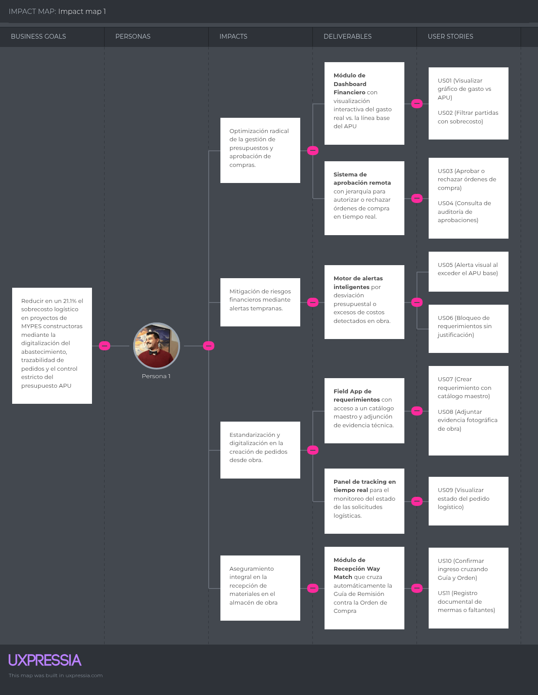
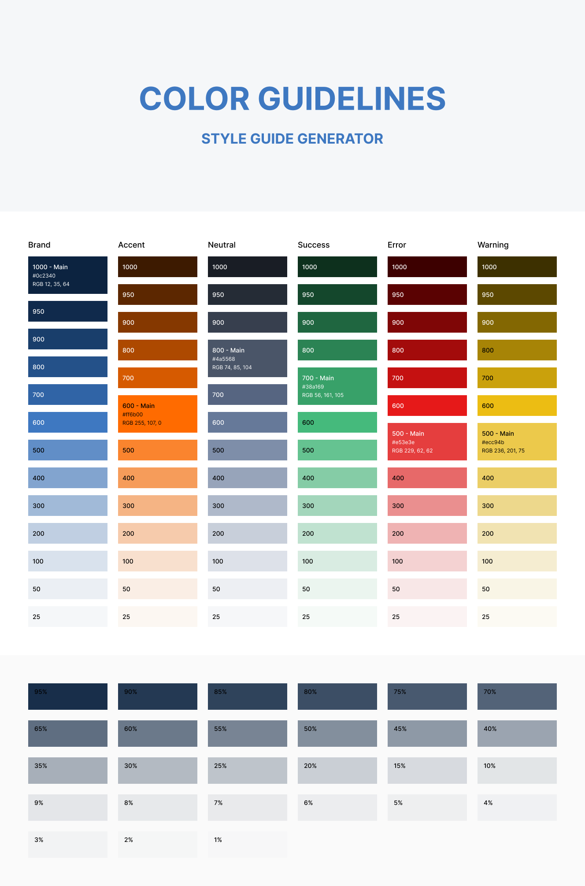
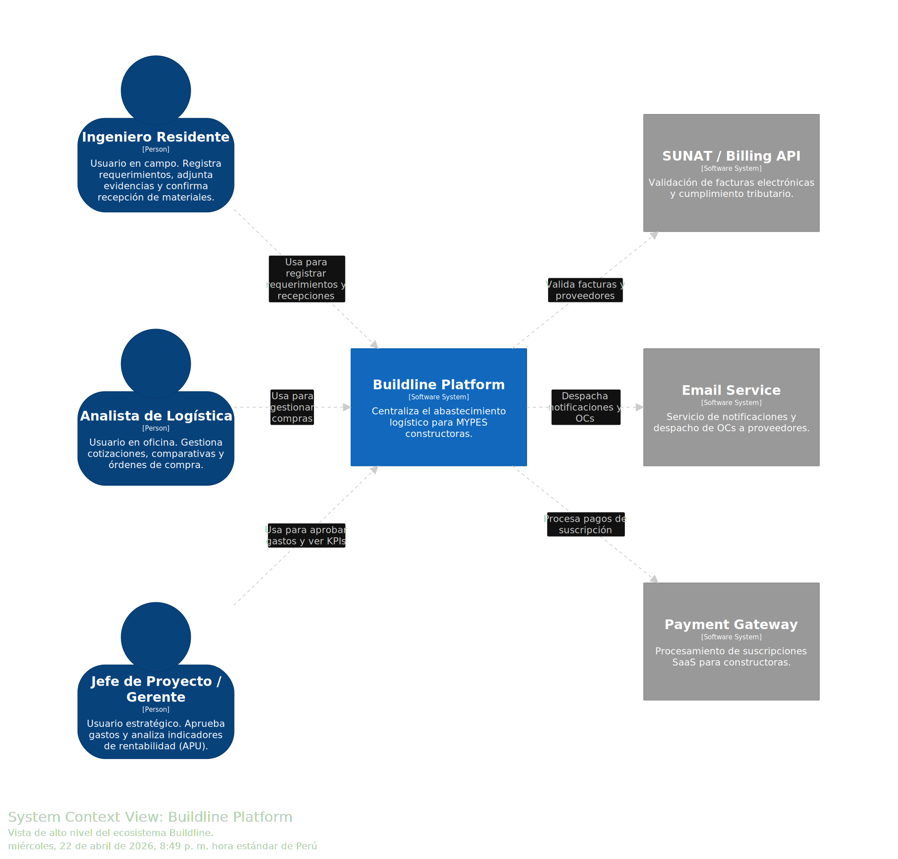
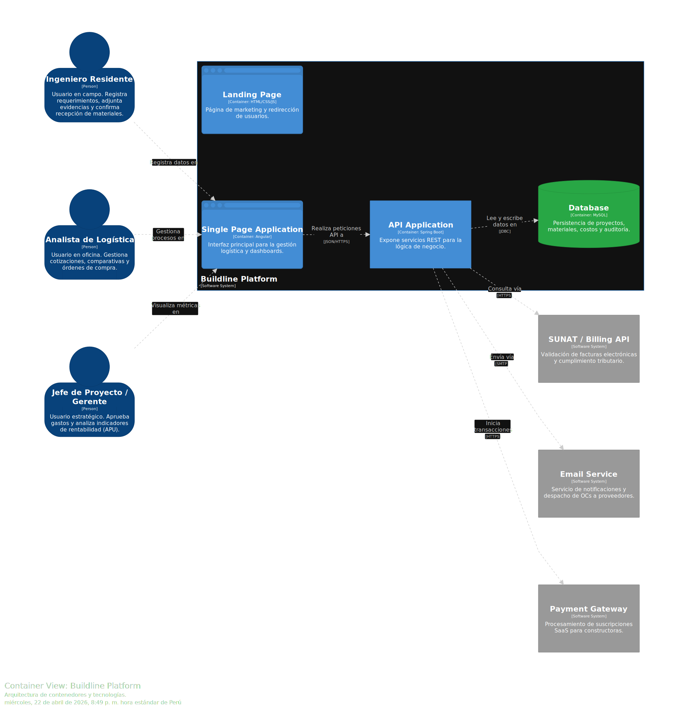

 

  

# UNIVERSIDAD PERUANA DE CIENCIAS APLICADAS

 

### Facultad de Ingeniería
### Carrera de Ingeniería de Software

 

**Ciclo Académico 2026-10**

 

**Código:** 1ASI0730 &nbsp; | &nbsp; **Curso:** Aplicaciones Web &nbsp; | &nbsp; **NRC:** 12158

 

**Docente:** Villafuerte Bazan, Oscar Ivan

 

# Informe de Trabajo Final - AV2

 

### **Nombre de la Startup:**
**RQLS (Requisitions, Quotes, Logistics System)**

 

### **Nombre del Producto:**
**Buildline**

 

### Relación de integrantes

<table align="center" style="margin: 0 auto; font-size: 15px;">
<thead>
    <tr>
      <th align="center">Código</th>
      <th align="center">Apellidos y Nombres</th>
    </tr>
  </thead>
  <tbody>
    <tr>
      <td align="center">U202113229</td>
      <td align="left">Castillo Yataco, Mauricio Sebastián</td>
    </tr>
    <tr>
      <td align="center">U20231B504</td>
      <td align="left">Morales Venegas, David Joel</td>
    </tr>
    <tr>
      <td align="center">U202316687</td>
      <td align="left">Paucar Zenteno, Jesús Fernando</td>
    </tr>
    <tr>
      <td align="center">U202322849</td>
      <td align="left">Viza Quispe, Marlon Packard</td>
    </tr>
    <tr>
      <td align="center">U201923820</td>
      <td align="left">Cáceres Pizarro, Albino Florencio</td>
    </tr>
  </tbody>
</table>

  

**Lima, abril de 2026**

# Registro de versiones del informe
| Versión | Fecha | Autores | Descripción              |
| :--- | :--- | :--- |:-------------------------|
| 1.0.0 | 26/04/2026 | Mauricio Sebastián Castillo Yataco, David Joel Morales Venegas, Jesús Fernando Paucar Zenteno, Marlon Packard Viza Quispe, Albino Florencio Cáceres Pizarro | Versión inicial del avance AV1 (TB1) |
| 2.0.0 | 16/05/2026 | Mauricio Sebastián Castillo Yataco, David Joel Morales Venegas, Jesús Fernando Paucar Zenteno, Marlon Packard Viza Quispe, Albino Florencio Cáceres Pizarro | Entrega de Trabajo Parcial (TB1) con despliegue de Frontend y Landing Page |
| 3.0.0 | 20/06/2026 | Mauricio Sebastián Castillo Yataco, David Joel Morales Venegas, Jesús Fernando Paucar Zenteno, Marlon Packard Viza Quispe, Albino Florencio Cáceres Pizarro | Entrega AV2 - Sprint Review Semana 12 con Landing Page actualizada, Frontend desplegado, primera versión de Backend Web Services en Railway, Swagger, Sprint 3, Validation Interviews, Video About-the-Product y Video About-the-Team |

# Project Report Collaboration Insights
El presente apartado tiene como finalidad evidenciar el trabajo colaborativo realizado durante el desarrollo del informe. Para ello, se pone a disposición el repositorio oficial del proyecto, alojado en una organización pública de GitHub:

🔗 https://github.com/RQLS26

A partir de este repositorio, se analiza la participación de los integrantes del equipo mediante indicadores como número de commits, frecuencia de contribuciones y actividad general registrada en la plataforma.

En el contexto de las entregas AV1, TB1, AV2 y TB2, se presenta un análisis de colaboración que permite visualizar el nivel de aporte individual de cada miembro del equipo, sustentado en los registros de GitHub. Este análisis busca demostrar la distribución del trabajo, la constancia en el desarrollo del informe y el cumplimiento de las actividades asignadas.

## AV1
Durante AV1, el equipo concentró sus esfuerzos en la comprensión del problema, la definición de los segmentos objetivo, el levantamiento de requisitos iniciales y la elaboración de los principales artefactos de análisis y diseño. La colaboración se organizó alrededor del Project Report, con responsabilidades distribuidas para entrevistas, análisis competitivo, Lean UX, Needfinding, EventStorming, User Stories, arquitectura C4, prototipos y lineamientos de diseño.

El trabajo colaborativo se apoyó en GitHub como repositorio central del informe y en reuniones de coordinación para revisar consistencia entre capítulos. Esta entrega permitió consolidar la base conceptual de Buildline antes de iniciar la implementación funcional del Frontend Web Application.

## TB1
Durante TB1, el equipo concentró el avance en la Landing Page y en la primera versión funcional del Frontend Web Application. En esta etapa no se implementó un backend productivo ni contratos definitivos de Web Services; la integración de datos se resolvió mediante una mock API basada en json-server y servicios frontend preparados para consumir endpoints REST en una etapa posterior.

La colaboración se distribuyó por módulos funcionales del frontend. Se trabajaron las vistas de autenticación, dashboard, requisiciones, cotizaciones, órdenes de compra, proveedores, incidencias, inventario, reportes, mensajes internos, perfil de empresa y configuración. Cada integrante asumió responsabilidad sobre un conjunto de pantallas y apoyó la revisión cruzada de navegación, estados visuales, formularios, filtros y consistencia con los bounded contexts definidos en el informe.

El uso de Jira y GitHub permitió ordenar el Sprint Backlog, registrar avances por ramas y consolidar los cambios hacia las ramas principales del proyecto. Como resultado, TB1 dejó una aplicación desplegada en Vercel, una base de componentes reutilizables en Vue 3 + Vite, servicios frontend conectados a datos simulados y una primera referencia funcional para preparar la futura integración con backend real durante AV2.

## AV2
Durante AV2, la colaboración se orientó a cerrar la brecha entre el frontend desarrollado en TB1 y una primera versión de servicios reales. El equipo actualizó el informe, revisó la trazabilidad entre User Stories, Technical Stories, endpoints y pantallas, y validó el despliegue de la solución integrada.

La coordinación se realizó mediante ramas de trabajo, commits por repositorio, revisión cruzada de avances y validación funcional de los flujos principales. A diferencia de TB1, esta entrega incorporó Web Services desplegados, documentación Swagger y evidencias de integración con datos persistidos.

## TB2
[pending content]

# Contenido
## Tabla de contenidos

- [Carátula](#informe-de-trabajo-final---av2)
- [Registro de Versiones del Informe](#registro-de-versiones-del-informe)
- [Student Outcome](#student-outcome)
- [Abstract](#abstract)
- [Resumen](#resumen)

- [Capítulo I: Introducción](#capítulo-i-introducción)
    - [1.1. Startup Profile](#11-startup-profile)
    - [1.2. Solution Profile](#12-solution-profile)
    - [1.3. Segmentos objetivo](#13-segmentos-objetivo)

- [Capítulo II: Requirements Elicitation & Analysis](#capítulo-ii-requirements-elicitation--analysis)
    - [2.1. Competidores](#21-competidores)
    - [2.2. Entrevistas](#22-entrevistas)
    - [2.3. Needfinding](#23-needfinding)
    - [2.4. Big Picture EventStorming](#24-big-picture-eventstorming)
    - [2.5. Ubiquitous Language](#25-ubiquitous-language)

- [Capítulo III: Requirements Specification](#capítulo-iii-requirements-specification)
    - [3.1. User Stories](#31-user-stories)
    - [3.2. Impact Mapping](#32-impact-mapping)
    - [3.3. Product Backlog](#33-product-backlog)

- [Capítulo IV: Product Design](#capítulo-iv-product-design)
    - [4.1. Style Guidelines](#41-style-guidelines)
    - [4.2. Information Architecture](#42-information-architecture)
    - [4.3. Landing Page UI Design](#43-landing-page-ui-design)
    - [4.4. Web Applications UX/UI Design](#44-web-applications-uxui-design)
    - [4.5. Web Applications Prototyping](#45-web-applications-prototyping)
    - [4.6. Domain-Driven Software Architecture](#46-domain-driven-software-architecture)
    - [4.7. Software Object-Oriented Design](#47-software-object-oriented-design)
    - [4.8. Database Design](#48-database-design)

- [Capítulo V: Product Implementation, Validation & Deployment](#capítulo-v-product-implementation-validation--deployment)
    - [5.1. Software Configuration Management](#51-software-configuration-management)
        - [5.1.1. Software Development Environment Configuration](#511-software-development-environment-configuration)
        - [5.1.2. Source Code Management](#512-source-code-management)
        - [5.1.3. Source Code Style Guide & Conventions](#513-source-code-style-guide--conventions)
        - [5.1.4. Software Deployment Configuration](#514-software-deployment-configuration)
    - [5.2. Landing Page, Services & Applications Implementation](#52-landing-page-services--applications-implementation)
        - [5.2.1. Sprint 1](#521-sprint-1)
        - [5.2.2. Sprint 2](#522-sprint-2)
        - [5.2.3. Sprint 3](#523-sprint-3)
    - [5.3. Validation Interviews](#53-validation-interviews)
        - [5.3.1. Diseño de Entrevistas](#531-diseño-de-entrevistas)
        - [5.3.2. Registro de Entrevistas](#532-registro-de-entrevistas)
        - [5.3.3. Evaluaciones según heurísticas](#533-evaluaciones-según-heurísticas)
    - [5.4. Video About-the-Product](#54-video-about-the-product)

- [Capítulo VI: Conclusions](#capítulo-vi-conclusions)
    - [6.1. Conclusiones y recomendaciones](#61-conclusiones-y-recomendaciones)
    - [6.2. Video About-the-Team](#62-video-about-the-team)

- [Bibliografía](#bibliografía)

- [Anexos](#anexos)
    - [Anexo A: Videos de Exposiciones](#anexo-a-videos-de-exposiciones)

# Student Outcome
El curso contribuye al cumplimiento del Student Outcome ABET:

**ABET – EAC - Student Outcome 5**  
**Criterio:** La capacidad de funcionar efectivamente en un equipo cuyos miembros juntos proporcionan liderazgo, crean un entorno de colaboración e inclusivo, establecen objetivos, planifican tareas y cumplen objetivos.

En el siguiente cuadro se describen las acciones realizadas y las conclusiones del equipo, que permiten sustentar el logro del ABET – EAC - Student Outcome 5.

---

## Tabla de Student Outcome
<table style="width:100%; border-collapse: collapse;">
  <tr>
    <th style="width:25%;">Criterio específico</th>
    <th style="width:45%;">Acciones realizadas</th>
    <th style="width:30%;">Conclusiones</th>
  </tr>

  <tr>
    <td>
      Trabaja en equipo para proporcionar liderazgo en forma conjunta
    </td>
    <td>
      <strong>Morales Venegas, David Joel</strong> 
      <strong>AV1:</strong> Creación del repositorio, Diseño de Landing Page, Lideró diseño/análisis de entrevistas. 
      <strong>TB1:</strong> Lideró la implementación de la mensajería interna, perfil de empresa y rediseño del Landing Page v2 (Vercel). 
      <strong>AV2:</strong> Lideró el despliegue de Web Services en Railway, la documentación de Sprint 3, la matriz de endpoints company-scoped y la sincronización del informe con backend/frontend.  
      <strong>Viza Quispe, Marlon Packard</strong> 
      <strong>AV1:</strong> Event Storming, Ubiquitous Language, Journey/Empathy Mapping. 
      <strong>TB1:</strong> Implementó el directorio de proveedores y el módulo de incidencias en el Frontend. 
      <strong>AV2:</strong> Colaboró en la validación de proveedores, incidencias, mensajes internos, notificaciones y criterios de QA funcional para la integración con backend.  
      <strong>Paucar Zenteno, Jesús Fernando</strong> 
      <strong>AV1:</strong> User Flow Diagrams, Web applications prototype. 
      <strong>TB1:</strong> Lideró la gestión de requisiciones y órdenes de compra (Approval Inbox, Quotations Management). 
      <strong>AV2:</strong> Lideró la revisión de contratos de requisiciones, cotizaciones y órdenes de compra para asegurar coherencia entre Product Backlog, Technical Stories y endpoints reales.  
      <strong>Castillo Yataco, Mauricio Sebastián</strong> 
      <strong>AV1:</strong> Lean UX Process, Segmentos Objetivo, Lean UX Canvas, Needfinding. 
      <strong>TB1:</strong> Configuró el proyecto base (Vue 3 + Vite), implementó IAM (Auth), mock API en Render y despliegue. 
      <strong>AV2:</strong> Apoyó la revisión de IAM, roles owner/admin/viewer, último inicio de sesión real, recuperación de errores y validaciones de autenticación.  
      <strong>Cáceres Pizarro, Albino Florencio</strong> 
      <strong>AV1:</strong> Arquitectura de software (C4 Context Diagrams y Class Diagrams). 
      <strong>TB1:</strong> Desarrolló el control de inventarios, dashboard financiero y generación de reportes PDF. 
      <strong>AV2:</strong> Colaboró en la revisión de inventario, delivery tracking, analytics-budgeting, dashboards, reportes y fuentes de arquitectura del backend. 
    </td>
    <td>
      <strong>AV1:</strong> El equipo demostró liderazgo compartido al asignar responsables específicos basándose en las fortalezas técnicas de cada integrante. 
      <strong>TB1:</strong> Se lideraron diferentes *bounded contexts* técnicos del Frontend, logrando una entrega funcional de software desplegado en la nube de forma paralela. 
      <strong>AV2:</strong> El liderazgo se redistribuyó entre backend, frontend integration, QA y documentación, permitiendo entregar servicios desplegados y un informe alineado con la arquitectura real. 
    </td>
  </tr>
  <tr>
    <td>
      Crea un entorno colaborativo e inclusivo, establece metas, planifica tareas y cumple objetivos
    </td>
    <td>
      <strong>Morales Venegas, David Joel</strong> 
      <strong>AV1:</strong> Colaboró en Wireframes, Wireflow y User Flow Diagrams. 
      <strong>TB1:</strong> Colaboró en la integración del Frontend con el mock server y validación de componentes PrimeVue. 
      <strong>AV2:</strong> Coordinó la actualización local del informe, la revisión de rutas por compañía y la preparación de evidencias de despliegue Railway/Vercel.  
      <strong>Viza Quispe, Marlon Packard</strong> 
      <strong>AV1:</strong> Diseño de Landing Page, revisión integradora y correcciones finales AV1. 
      <strong>TB1:</strong> Revisión integradora de código y pruebas de QA sobre los módulos de proveedores y requisiciones. 
      <strong>AV2:</strong> Revisó consistencia de módulos de proveedores, incidencias y comunicación con criterios de validación de usuario final.  
      <strong>Paucar Zenteno, Jesús Fernando</strong> 
      <strong>AV1:</strong> Diseño de Web Applications, revisión integradora y correcciones finales AV1. 
      <strong>TB1:</strong> Validó los flujos lógicos de las órdenes de compra (approval flows) contra los requisitos de dominio (DDD). 
      <strong>AV2:</strong> Contrastó User Stories, Technical Stories y endpoints para evitar que Sprint 3 agregue historias paralelas no alineadas al capítulo III.  
      <strong>Castillo Yataco, Mauricio Sebastián</strong> 
      <strong>AV1:</strong> Diseño de arquitectura, Redacción y documentación del Capítulo V (SCM, Sprint 1). 
      <strong>TB1:</strong> Redactó la documentación del Sprint 2 y organizó la planificación de tareas en Jira. 
      <strong>AV2:</strong> Participó en la validación de IAM, Settings, Users & Roles y criterios de permisos por rol para el backend.  
      <strong>Cáceres Pizarro, Albino Florencio</strong> 
      <strong>AV1:</strong> Análisis de competidores, diagrama de base de datos y artefactos de Needfinding. 
      <strong>TB1:</strong> Participó en la resolución de conflictos de ramas (merges) y diseño de filtros del dashboard. 
      <strong>AV2:</strong> Apoyó la revisión de evidencias de dashboard, delivery, inventory y reportes para la evaluación heurística AV2. 
    </td>
    <td>
      <strong>AV1:</strong> La planificación de tareas mediante un backlog inicial permitió cumplir con todos los artefactos de Needfinding y Lean UX. 
      <strong>TB1:</strong> La migración de tareas hacia Jira y el uso de un framework SPA permitió cumplir con éxito el primer despliegue funcional en Vercel. 
      <strong>AV2:</strong> La coordinación por repositorios, ramas feature/release y revisión de endpoints permitió entregar una primera integración real entre frontend, backend, base de datos y despliegue cloud. 
    </td>
  </tr>
</table>

# Capítulo I: Introducción

## 1.1. Startup Profile

### 1.1.1. Descripción de la Startup
**RQLS (Requisitions, Quotes, Logistics System)** es una startup tecnológica peruana enfocada en el desarrollo de soluciones Software as a Service (SaaS). Nuestra organización se especializa en cerrar la brecha digital en las micro y pequeñas empresas (MYPES) del sector construcción. Según el Instituto Nacional de Estadística e Informática (INEI, 2024), las MYPES representan el 99,7% de las unidades económicas del país y enfrentan costos logísticos que ascienden al 21,1% de sus ventas (ComexPerú, 2023). RQLS transforma la gestión operativa empírica en procesos basados en datos y transparencia.

**Misión:** Democratizar el acceso a herramientas de control logístico para las MYPES constructoras, permitiéndoles eliminar sobrecostos mediante la centralización de datos en tiempo real (Pacco Constructores, 2021).

**Visión:** Ser el estándar tecnológico en la gestión de abastecimiento para el sector construcción en Latinoamérica hacia el 2030.

**Valores:** Transparencia operativa, integridad de datos, innovación centrada en el operario y eficiencia.

### 1.1.2. Perfiles de integrantes del equipo
 | Imagen  | Apellidos y nombres                     |   Código   | Carrera                | Perfil                                                                                                                                                                                                                                                                                                                                                                                                                                            |
:-----------------:|:----------------------------------------|:----------:| :--------------------- |:--------------------------------------------------------------------------------------------------------------------------------------------------------------------------------------------------------------------------------------------------------------------------------------------------------------------------------------------------------------------------------------------------------------------------------------------------|
|| **Castillo Yataco, Mauricio Sebastián** | U202113229 | Ingeniería de Software | Soy estudiante de Ingeniería de Software, apasionado por la creación de soluciones tecnológicas que mejoren la vida de las personas. Mi enfoque va más allá de la programación, ya que me interesa desarrollar experiencias digitales funcionales y agradables para el usuario. Poseo conocimientos básicos en C++, HTML y CSS, y destaco por mi responsabilidad, cooperación, comunicación, flexibilidad y adaptabilidad.                        |
|| **Morales Venegas, David Joel**         | U20231B504 | Ingeniería de Software | Estudiante de Ingeniería de Software con formación intermedia en el desarrollo de aplicaciones web. Me adapto al trabajo técnico del equipo, priorizando código funcional, entendible y alineado a los requisitos del proyecto, con disposición para mejorar y corregir en función de pruebas y resultados.                                                                                                                                   |
|| **Paucar Zenteno, Jesús Fernando**      | U202316687 | Ingeniería de Software | Soy estudiante de Ingeniería de Software con gran pasión por la creación de soluciones innovadoras. Me considero una persona proactiva y orientada a resultados, con interés constante en aprender y aplicar nuevas tecnologías. Busco contribuir significativamente al proyecto, asegurando calidad y eficiencia en cada tarea.                                                                                                                  |
|| **Viza Quispe, Marlon Packard**         | U202322849 | Ingeniería de Software | Estudiante de 20 años, responsable y proactivo, con sólida base técnica en C++. Destaco por mi capacidad de aportar soluciones creativas y mi compromiso con el aprendizaje continuo en entornos profesionales. Busco asumir retos que potencien mi desarrollo y contribuyan al éxito del equipo.                                                                                                                                                 |
|| **Cáceres Pizarro, Albino Florencio**   | U201923820 | Ingeniería de Software | Me considero una persona responsable y proactiva que le gusta trabajar en equipo. Además, siempre estoy abierto a ayudar, en lo posible, a cualquier integrante del equipo. Además, busco adaptarme rápidamente a los diversos retos que se presentan en el ciclo.                                                                                                                                                                                                                                                                                                                                                                                                                          |

---

## 1.2. Solution Profile
Nuestra solución, Buildline, es una plataforma Web SaaS diseñada para gestionar de extremo a extremo las compras institucionales en constructoras. Digitaliza la comunicación entre el residente de obra (solicitud), el área de compras (cotización) y la gerencia (aprobación), eliminando pérdidas de hasta el 15% del presupuesto generadas por la gestión informal (Rodríguez Vargas, 2019).

### 1.2.1. Antecedentes y problemática
El sector construcción en el Perú proyecta una tasa de crecimiento del 6,5% para el periodo 2025, impulsado principalmente por la reactivación de la inversión en infraestructura pública (El Peruano, 2025). Esta dinámica macroeconómica se encuentra condicionada por el desempeño de las MYPES, las cuales concentran la mayor parte de la operatividad del sector pero presentan un costo logístico promedio de 21,1%, cifra significativamente superior al 16% registrado a nivel nacional (ComexPerú, 2023; INEI, 2024). Esta disparidad económica se vincula directamente a la falta de herramientas especializadas para la gestión administrativa en empresas de menor escala.

La gestión de adquisiciones en estas organizaciones se caracteriza por la ausencia de trazabilidad y formalidad técnica. Según investigaciones aplicadas en el sector, el 74,1% de los responsables de MYPES constructoras califica como inadecuado el seguimiento de compras, mientras que el 77,8% reporta incidentes recurrentes donde los insumos entregados no coinciden con las especificaciones técnicas solicitadas (Rodríguez Vargas, 2019). Estos errores operativos, derivados de la dependencia de canales informales como WhatsApp o registros manuales en papel, causan parálisis de obra en un 18% de los casos y obligan a realizar compras de urgencia no planificadas que representan el 12% del gasto logístico total (Tarraga Durand & Miranda Mitma, 2025).

El retraso en la madurez digital del sector construcción se refleja en que el 40% de los proyectos de infraestructura superan el presupuesto original debido a la ineficiencia en la planificación de recursos y la comunicación fragmentada (Ruiz Escajadillo, 2024). A pesar de que la integración de plataformas de gestión de proyectos ha demostrado incrementos de productividad del 30%, persiste una brecha tecnológica en las pequeñas empresas debido al desconocimiento de soluciones escalables y a la alta resistencia al cambio del personal operativo (ESAN, 2023; CAPECO, 2024). En este escenario, la transición hacia sistemas SaaS especializados permite la centralización de datos necesaria para la toma de decisiones financieras y el control estricto del presupuesto de obra.

**Técnica "The 5W's y 2H's" aplicada al problema:**

| The 5W's y 2H's | Pregunta                     | Descripción                                                                                                                                                                                                                                             |
| :-------------- | :--------------------------- | :------------------------------------------------------------------------------------------------------------------------------------------------------------------------------------------------------------------------------------------------------ |
| Who             | ¿Quiénes están involucrados? | El personal operativo y directivo de las MYPES constructoras, específicamente ingenieros residentes, jefes de logística y gerentes. El 74,1% de los responsables considera deficientes los mecanismos actuales de seguimiento (Rodríguez Vargas, 2019). |
| What            | ¿Cuál es el problema?        | Ineficiencia en el flujo de suministro interno con falta de concordancia técnica en el 77,8% de los productos recibidos y ausencia de proyecciones de demanda en el 70,3% de las operaciones (Rodríguez Vargas, 2019).                                  |
| Where           | ¿Dónde ocurre?               | En la brecha informativa entre las obras de edificación física y el centro administrativo. Lima concentra el 45,7% de estas empresas, pero la ineficiencia es crítica en provincias por barreras de transporte (INEI, 2024).                            |
| When            | ¿Cuándo sucede?              | Durante la etapa de ejecución técnica, manifestándose en cada ciclo de abastecimiento diario. Esta problemática es responsable del 18% de las paralizaciones de obra en el segmento (Tarraga Durand & Miranda Mitma, 2025).                             |
| Why             | ¿Por qué sucede?             | Debido a la inexistencia de sistemas de auditoría centralizados y la dependencia de herramientas informales (WhatsApp/Excel) que no aseguran el cumplimiento de calidad y tiempo (Ruiz Escajadillo, 2024).                                              |
| How             | ¿Cómo se manifiesta?         | Mediante procesos manuales sin validación presupuestal inmediata, lo que genera duplicidad de pedidos y obliga a compras de emergencia que representan el 12% del gasto logístico (Tarraga Durand & Miranda Mitma, 2025).                               |
| How Much        | ¿Cuánto impacto tiene?       | Genera un sobrecosto logístico del 21,1% sobre las ventas (5,1 puntos sobre la media nacional) y una erosión de hasta el 15% del presupuesto de insumos por errores de gestión (ComexPerú, 2023; Rodríguez Vargas, 2019).                               |

---

### 1.2.2. Lean UX Process

#### 1.2.2.1. Lean UX Problem Statements
Las micro y pequeñas empresas (MYPES) constructoras de Lima Metropolitana gestionan los requisitos de materiales mediante herramientas informales como WhatsApp o registros manuales en papel. Esta fragmentación de la información dificulta la trazabilidad de los pedidos, impide la comparación técnica de cotizaciones y retrasa la aprobación oportuna de compras por parte de la gerencia.

Como consecuencia de esta gestión operativa deficiente, las organizaciones enfrentan sobrecostos por compras de emergencia y retrasos críticos en la ejecución de obra que erosionan su rentabilidad neta. Como equipo, nos comprometemos a resolver este desafío mediante una colaboración estrecha con el personal de campo y administrativo para diseñar un flujo de abastecimiento trazable y auditable.

Ante esto nos surge la siguiente pregunta:
¿Cómo podría una plataforma SaaS de bajo costo centralizar las requisiciones y aprobaciones para reducir el lead time de compra y mejorar el control operativo?

1. Domain: Gestión de adquisiciones y abastecimiento logístico para el sector construcción (MYPES).

2. Customer Segments: Gerentes Generales (aprobadores), Ingenieros Residentes (solicitantes) y Jefes de Logística (compradores).

3. Pain Points: Pérdida de trazabilidad de requisitos, sobrecostos por emergencia y falta de comparación de cotizaciones.

4. Gap: Inexistencia de un software SaaS económico diseñado para la pequeña constructora que cubra el espacio entre el Excel manual y ERPs de alta complejidad.

5. Visión/Strategy: Digitalizar el 100% de los requisitos de materiales mediante una plataforma en la nube que permita el control presupuestal en tiempo real.

6. Initial Segment: Pequeñas empresas constructoras de edificaciones residenciales ubicadas en Lima Metropolitana.

#### 1.2.2.2. Lean UX Assumptions
**Business Assumptions:**
1. Se considera que los clientes requieren formalizar los pedidos de materiales desde obra para reducir errores y el desorden sistemático en el abastecimiento (Rodríguez Vargas, 2019).

2. Se plantea que esta necesidad puede resolverse mediante una plataforma web SaaS accesible desde dispositivos móviles, capaz de automatizar el flujo de cotizaciones y aprobaciones jerárquicas.

3. Se identifica como segmento inicial a micro y pequeñas empresas constructoras con sede en Lima Metropolitana y facturación anual menor a 1.700 UIT (INEI, 2024).

4. Se asume que el principal valor percibido por el cliente será la visualización comparada de cotizaciones en tiempo real antes de autorizar un gasto, con el fin de respaldar decisiones más rentables.

5. Se prevé que el cliente también obtendrá beneficios adicionales, como un historial digital de proveedores, reportes de gasto acumulado y mayor transparencia para auditorías.

6. Se proyecta que la adquisición de clientes se realizará mediante estrategias de marketing digital B2B segmentado y alianzas estratégicas con gremios del sector, como CAPECO.

7. Se estima que el modelo de ingresos más adecuado será una suscripción mensual basada en el volumen de obras o proyectos activos gestionados por la constructora.

8. Se considera que la competencia principal estará conformada por el uso tradicional de WhatsApp y Excel, así como por sistemas ERP complejos e inaccesibles para el presupuesto MYPE, como SAP u Odoo.

9. Se sostiene que la propuesta podrá diferenciarse mediante una arquitectura de información diseñada específicamente para el flujo campo-oficina, reduciendo la complejidad innecesaria.

10. Se presume que el principal riesgo del producto es que el personal de campo mantenga el uso de canales informales si el flujo digital no reduce de forma clara el tiempo de coordinación frente a los canales actuales.

11. Se plantea que este riesgo puede mitigarse mediante un sistema de requisitos en “3 clics”, diseñado para smartphones y más ágil que redactar un mensaje de texto.

12. Se asume que, si se comprueba que las constructoras no están dispuestas a pagar por control digital pese a las pérdidas actuales, el proyecto no será viable.

**Business Outcome Assumptions**
1. Reducir en un 40% el tiempo administrativo desde la creación de la requisición hasta la emisión de la orden de compra.

2. Lograr que el 100% de las compras institucionales cuenten con un registro digital auditable y pasen por un flujo de aprobación con sustento de cotización.

3. Disminuir las desviaciones presupuestarias por compras de emergencia no planificadas en un 15% (Tarraga Durand & Miranda Mitma, 2025).

4. Incrementar la visibilidad del margen de utilidad neta por proyecto al contar con costos de materiales centralizados y actualizados diariamente.

**User Assumptions**
1. Los jefes y gerentes requieren una herramienta que les permita aprobar compras críticas sin estar físicamente en la oficina.

2. Los jefes de proyecto valoran la posibilidad de delegar el proceso de cotización al área de compras, manteniendo siempre la decisión final sobre la elección del proveedor.

3. La gerencia espera que el sistema genere automáticamente cuadros comparativos de precios para evitar el análisis manual de múltiples correos electrónicos o archivos PDF.

4. El segmento objetivo necesita una solución que alerte de forma proactiva cuando un pedido de materiales supere el presupuesto asignado para una partida específica de la obra.

**User Outcome Assumptions**
1. Los jefes de proyecto experimentarán un aumento en la precisión de sus auditorías financieras al contar con un historial inalterable de quién solicitó, quién cotizó y quién aprobó cada insumo.

2. Los gerentes se sentirán más seguros respecto al uso del capital de la empresa al visualizar sistemáticamente al menos tres opciones de cotización antes de autorizar cualquier desembolso significativo.

3. Los responsables del negocio experimentarán una reducción del estrés operativo al disminuir las llamadas de emergencia por desabastecimiento, permitiéndoles enfocarse en la planificación estratégica y comercial.

4. Los jefes de proyecto confiarán más en la veracidad de los datos de inventario y pedidos pendientes, lo que facilitará una coordinación más fluida con los clientes finales respecto a los plazos de entrega de los inmuebles.

5. El segmento percibirá una optimización del flujo de caja operativo al evitar compras duplicadas o adquisiciones con sobreprecio derivadas de la falta de comparación inmediata.

#### 1.2.2.3. Lean UX Hypothesis Statements
**Hypothesis 1** Creemos que al centralizar las solicitudes de materiales en una plataforma web accesible desde la obra, reduciremos drásticamente los tiempos de espera. Lo sabremos cuando el tiempo promedio entre la creación de una solicitud y su aprobación por logística baje de 48 horas a menos de 8 horas.

**Hypothesis 2** Creemos que al implementar un tablero de control (Dashboard) para los Jefes de Proyectos, eliminaremos la falta de visibilidad del presupuesto. Lo sabremos cuando las desviaciones de costos por compras de emergencia se reduzcan en un 15% durante el primer trimestre de uso.

**Hypothesis 3** Creemos que al automatizar los flujos de comunicación entre obra y logística, optimizaremos el proceso de abastecimiento. Lo sabremos cuando el número de llamadas o mensajes para consultar el estado de un pedido disminuya en un 50%.

**Hypothesis 4** Creemos que al digitalizar el historial de proveedores y cotizaciones, facilitaremos la toma de decisiones gerenciales. Lo sabremos cuando el tiempo dedicado a la comparación manual de cotizaciones se reduzca de 4 horas semanales a solo 15 minutos.

**Hypothesis 5** Creemos que digitalizar los requisitos técnicos para los ingenieros de obra logrará una reducción del 50% en errores de pedido. Sabremos que es cierto cuando veamos que el 90% de los requisitos registrados no requieren correcciones técnicas posteriores.

#### 1.2.2.4. Lean UX Canvas

<table>
  <tr>
    <td valign="top">
      <strong>Business problem</strong>
        
      Las micro y pequeñas empresas (MYPES) constructoras de Lima Metropolitana gestionan los requisitos de materiales mediante herramientas informales como WhatsApp o registros manuales en papel. Esta fragmentación dificulta la trazabilidad de los pedidos, limita la comparación técnica de cotizaciones y retrasa la aprobación de compras.
        
      Como consecuencia, se generan sobrecostos por compras de emergencia, duplicidad de pedidos y retrasos en la continuidad de obra que afectan directamente la rentabilidad del proyecto.
    </td>
    <td rowspan="2" valign="top">
      <strong>Solution ideas</strong>
        
      - Plataforma web SaaS accesible desde dispositivos móviles orientada al entorno de obra
        
      - Registro digital de requisitos con flujo de aprobación jerárquica
        
      - Módulo de comparación de cotizaciones en tiempo real
        
      - Historial centralizado de proveedores, pedidos y aprobaciones
        
      - Alertas de control presupuestal y seguimiento de estados
    </td>
    <td valign="top">
      <strong>Business Outcomes</strong>
        
      - Reducir en un 40% el tiempo administrativo desde la requisición hasta la orden de compra
        
      - Lograr que el 100% de las compras cuenten con registro digital auditable
        
      - Disminuir en un 15% los sobrecostos por compras no planificadas
        
      - Mejorar la visibilidad del gasto y margen de utilidad por proyecto
    </td>
  </tr>
  <tr>
    <td valign="top">
      <strong>Users and customers</strong>
        
      - Ingenieros residentes de obra
       
      - Jefes de logística
       
      - Jefes de proyecto
       
      - Gerentes generales
       
      - MYPES constructoras de edificaciones
    </td>
    <td valign="top">
      <strong>User benefits</strong>
        
      - Aprobación remota de materiales sin dependencia de la oficina
        
      - Visibilidad del estado de cada requisito en tiempo real
        
      - Reducción del tiempo dedicado a comparar cotizaciones
        
      - Mejor coordinación entre obra y área administrativa
        
      - Mayor control sobre el presupuesto antes de ejecutar compras
    </td>
  </tr>
  <tr>
    <td valign="top">
      <strong>Hypotheses</strong>
        
      - Si se centralizan las solicitudes de materiales en una plataforma accesible desde obra, el tiempo de aprobación se reducirá de 48 horas a menos de 8 horas.
        
      - Si se implementa un panel de control para jefes de proyecto, las desviaciones por compras de emergencia se reducirán en un 15%.
        
      - Si se automatizan los flujos de comunicación entre obra y logística, disminuirán en un 50% las consultas manuales (llamadas y mensajes).
        
      - Si se digitaliza el historial de proveedores y cotizaciones, el tiempo de comparación manual se reducirá de 4 horas semanales a 15 minutos.
        
      - Si los requisitos técnicos se registran digitalmente, los errores de pedido se reducirán en un 50%.
    </td>
    <td valign="top">
      <strong>What’s the most important thing we need to learn first?</strong>
        
      Si las MYPES constructoras están dispuestas a reemplazar herramientas informales (WhatsApp, llamadas) por una plataforma digital y perciben suficiente valor como para adoptarla en su flujo de trabajo.
    </td>
    <td valign="top">
      <strong>What’s the least amount of work we need to do to learn the next most important thing?</strong>
        
      Realizar entrevistas con ingenieros residentes, jefes de logística y gerentes, y validar mediante un prototipo de baja fidelidad el flujo de requisición, aprobación y comparación de cotizaciones, evaluando facilidad de uso, rapidez y disposición de adopción.
    </td>
  </tr>
</table>

---

## 1.3. Segmentos Objetivos
El segmento objetivo de Buildline se centra exclusivamente en los perfiles de liderazgo y toma de decisiones dentro del entorno de la construcción MYPE peruana. Este grupo es el responsable final de la viabilidad financiera de los proyectos y la sostenibilidad operativa de la empresa.

### 1.3.1. Jefes de Proyectos y Gerentes Generales

| Dimensión               | Detalle del perfil                                                                                                                                                                                                                                                                                                                                                                                       |
| ----------------------- |----------------------------------------------------------------------------------------------------------------------------------------------------------------------------------------------------------------------------------------------------------------------------------------------------------------------------------------------------------------------------------------------------------|
| **Perfil Demográfico**  | Hombres y mujeres de entre 25 y 55 años. Cuentan con educación superior universitaria, siendo mayoritariamente Ingenieros Civiles o Arquitectos titulados y colegiados. Muchos operan bajo la modalidad de Persona Natural con Negocio, que representa el 73,5% de las unidades económicas del sector (INEI, 2024).                                                                                      |
| **Perfil Geográfico**   | Ubicados principalmente en zonas urbanas de alta densidad constructiva. El 45,7% de las empresas se concentra en Lima Metropolitana, seguida de regiones estratégicas como Arequipa (5,3%), La Libertad (5,2%) y Piura (4,3%) (INEI, 2024).                                                                                                                                                              |
| **Perfil Psicográfico** | Profesionales con un estilo de vida de alta presión y movilidad constante entre oficina y campo. Valoran la eficiencia y la honestidad operativa. Presentan una resistencia al cambio cultural del 48% (EY Perú, 2024), por lo que buscan herramientas que no compliquen sus procesos actuales. Su principal interés es la optimización del margen de utilidad y la transparencia de sus flujos de caja. |
| **Puntos de Dolor**     | Erosión de la rentabilidad debido a un costo logístico del 21,1% (ComexPerú, 2023). Enfrentan una falta de trazabilidad en el 74,1% de sus compras y sufren paralizaciones de obra en el 18% de los casos por desabastecimiento o errores técnicos en el suministro (Rodríguez Vargas, 2019; Tarraga Durand & Miranda Mitma, 2025).                                                                      |
| **Uso de Tecnología**   | Usuarios intensivos de dispositivos móviles; el 91,3% de la población ocupada en este rango de edad utiliza smartphones diariamente para la gestión de sus actividades (INEI, 2025). Dependen actualmente de herramientas no especializadas como WhatsApp y Excel para el control operativo básico.                                                                                                      |

# Capítulo II: Requirements Elicitation & Analysis
## 2.1. Competidores
Este análisis permite identificar cómo se posiciona Buildline frente a ERPs consolidados en el mercado local, redes de abastecimiento regionales y plataformas SaaS de control financiero emergentes. A partir de ello, se define una ventaja competitiva basada en la reducción de la brecha tecnológica y la simplificación del flujo logístico para las MYPES peruanas.

### 2.1.1. Análisis competitivo
<table style="text-align: center; width: 100%;">
  <tbody>
    <tr>
      <td colspan="6"><strong>Competitive Analysis Landscape</strong></td>
    </tr>
    <tr>
      <td colspan="2"><strong>¿Por qué llevar a cabo este análisis?</strong></td>
      <td colspan="4">
        Este análisis permite identificar brechas en el mercado logístico de construcción peruano,
        diferenciando nuestra propuesta de valor frente a ERPs tradicionales y soluciones regionales.
      </td>
    </tr>
    <tr>
      <td colspan="2"><strong>Logotipos</strong></td>
      <td></td>
      <td></td>
      <td></td>
      <td></td>
    </tr>
    <tr>
      <td colspan="2"><strong>Software</strong></td>
      <td><strong>Buildline (RQLS)</strong></td>
      <td><strong>S10 ERP</strong></td>
      <td><strong>ICONSTRUYE</strong></td>
      <td><strong>Mawi</strong></td>
    </tr>
    <tr>
      <td rowspan="2"><strong>Perfil</strong></td>
      <td>Overview</td>
      <td>Startup SaaS enfocada en centralizar el ciclo de abastecimiento (solicitud-cotización-aprobación) para MYPES constructoras peruanas.</td>
      <td>ERP peruano líder en presupuestos y gerencia de construcción; opera bajo módulos integrados que cubren desde almacén hasta contabilidad.</td>
      <td>Comunidad digital líder en LatAm que conecta constructoras con proveedores a través de un marketplace transaccional masivo.</td>
      <td>SaaS de gestión financiera para constructoras medianas enfocado en el control de costos y presupuestos en tiempo real.</td>
    </tr>
    <tr>
      <td>Ventaja competitiva, ¿Qué valor ofrece a los clientes?</td>
      <td>Flujo simple entre obra y oficina, con trazabilidad y comparación de precios en un solo lugar.</td>
      <td>Marca consolidada y alineación con normas locales de presupuestos y valorizaciones.</td>
      <td>Red amplia de proveedores y automatización del abastecimiento.</td>
      <td>Interfaz moderna, lectura con IA y reportes automáticos de utilidad.</td>
    </tr>
    <tr>
      <td rowspan="2"><strong>Perfil de Marketing</strong></td>
      <td>Mercado objetivo</td>
      <td>MYPES constructoras de Lima y provincias que hoy operan con WhatsApp y Excel.</td>
      <td>Constructoras medianas y grandes con alta complejidad administrativa.</td>
      <td>Grandes constructoras e infraestructura con alto volumen de compras.</td>
      <td>Constructoras de 6 a 100 empleados que buscan control sin complejidad excesiva.</td>
    </tr>
    <tr>
      <td>Estrategias de marketing</td>
      <td>B2B, alianzas con CAPECO y enfoque en ahorro por control logístico.</td>
      <td>Marca histórica, partners y capacitación certificada.</td>
      <td>Ecosistema 360°, marketplace y casos de éxito grandes.</td>
      <td>Propuesta de facilidad de uso, rapidez e implementación regional.</td>
    </tr>
    <tr>
      <td rowspan="3"><strong>Perfil de Producto</strong></td>
      <td>Productos &amp; Servicios</td>
      <td>Requisiciones, cotizaciones, aprobaciones y trazabilidad de pedidos.</td>
      <td>APU, planeamiento, almacenes, contabilidad y tareo móvil.</td>
      <td>Marketplace, órdenes electrónicas y facturación automatizada.</td>
      <td>Gastos de obra, órdenes de compra, gestión documental y reportes móviles.</td>
    </tr>
    <tr>
      <td>Precios &amp; Costos</td>
      <td>Suscripción mensual por obra activa.</td>
      <td>Licencia modular con inversión inicial alta.</td>
      <td>Comisiones transaccionales y suscripción corporativa.</td>
      <td>Setup inicial y planes mensuales por número de usuarios.</td>
    </tr>
    <tr>
      <td>Canales de distribución (Web y/o Móvil)</td>
      <td>Web responsive y app móvil para obra.</td>
      <td>Escritorio con portales web y apps auxiliares.</td>
      <td>Plataforma web con integración API.</td>
      <td>Web y móvil orientados a campo.</td>
    </tr>
    <tr>
      <td rowspan="4"><strong>Análisis SWOT</strong></td>
      <td>Fortalezas</td>
      <td>
        <ul style="text-align: left; margin: 0; padding-left: 18px;">
          <li>Proceso específico y crítico.</li>
          <li>Bajo costo frente a ERPs.</li>
          <li>Diseño campo-oficina.</li>
          <li>Trazabilidad en tiempo real.</li>
        </ul>
      </td>
      <td>
        <ul style="text-align: left; margin: 0; padding-left: 18px;">
          <li>Estándar local del sector.</li>
          <li>Cobertura funcional amplia.</li>
          <li>Adecuación normativa.</li>
          <li>Alta aceptación empresarial.</li>
        </ul>
      </td>
      <td>
        <ul style="text-align: left; margin: 0; padding-left: 18px;">
          <li>Red extensa de proveedores.</li>
          <li>Automatización del abastecimiento.</li>
          <li>Conexión entre múltiples actores.</li>
          <li>Escala transaccional alta.</li>
        </ul>
      </td>
      <td>
        <ul style="text-align: left; margin: 0; padding-left: 18px;">
          <li>UX moderna.</li>
          <li>IA para lectura de facturas.</li>
          <li>Implementación rápida.</li>
          <li>Reportes automáticos.</li>
        </ul>
      </td>
    </tr>
    <tr>
      <td>Debilidades</td>
      <td>
        <ul style="text-align: left; margin: 0; padding-left: 18px;">
          <li>Marca joven.</li>
          <li>Poco reconocimiento.</li>
          <li>Menos integraciones.</li>
          <li>Depende de adopción del usuario.</li>
        </ul>
      </td>
      <td>
        <ul style="text-align: left; margin: 0; padding-left: 18px;">
          <li>Interfaz menos moderna.</li>
          <li>Curva de aprendizaje alta.</li>
          <li>Complejo para MYPES.</li>
          <li>Mayor soporte técnico.</li>
        </ul>
      </td>
      <td>
        <ul style="text-align: left; margin: 0; padding-left: 18px;">
          <li>Complejidad funcional alta.</li>
          <li>Costo poco accesible.</li>
          <li>Enfoque en alto volumen.</li>
          <li>Poca adaptación a urgencias de obra.</li>
        </ul>
      </td>
      <td>
        <ul style="text-align: left; margin: 0; padding-left: 18px;">
          <li>Más financiero que operativo.</li>
          <li>Menor robustez logística.</li>
          <li>Depende de conectividad.</li>
          <li>No resuelve bien trazabilidad obra-oficina.</li>
        </ul>
      </td>
    </tr>
    <tr>
      <td>Oportunidades</td>
      <td>
        <ul style="text-align: left; margin: 0; padding-left: 18px;">
          <li>Digitalización de MYPES.</li>
          <li>Necesidad de trazabilidad.</li>
          <li>Control de gasto por proyecto.</li>
          <li>Expansión a procesos similares.</li>
        </ul>
      </td>
      <td>
        <ul style="text-align: left; margin: 0; padding-left: 18px;">
          <li>Migración a la nube.</li>
          <li>Demanda de integración total.</li>
          <li>Modernización de procesos.</li>
          <li>Captura de usuarios avanzados.</li>
        </ul>
      </td>
      <td>
        <ul style="text-align: left; margin: 0; padding-left: 18px;">
          <li>Crecimiento del comercio digital.</li>
          <li>Necesidad de marketplaces confiables.</li>
          <li>Integración a cadenas de abastecimiento.</li>
          <li>Mayor transaccionalidad sectorial.</li>
        </ul>
      </td>
      <td>
        <ul style="text-align: left; margin: 0; padding-left: 18px;">
          <li>Expansión regional.</li>
          <li>Mayor uso de reportes automáticos.</li>
          <li>Empresas que buscan control sin ERP pesado.</li>
          <li>Demanda de control presupuestal en tiempo real.</li>
        </ul>
      </td>
    </tr>
    <tr>
      <td>Amenazas</td>
      <td>
        <ul style="text-align: left; margin: 0; padding-left: 18px;">
          <li>Uso persistente de WhatsApp y Excel.</li>
          <li>Resistencia al cambio.</li>
          <li>Competidores más simples y baratos.</li>
          <li>Dificultad para demostrar valor temprano.</li>
        </ul>
      </td>
      <td>
        <ul style="text-align: left; margin: 0; padding-left: 18px;">
          <li>Soluciones más ágiles.</li>
          <li>Renovación tecnológica del mercado.</li>
          <li>Preferencia por herramientas ligeras.</li>
          <li>Riesgo de pérdida de usuarios nuevos.</li>
        </ul>
      </td>
      <td>
        <ul style="text-align: left; margin: 0; padding-left: 18px;">
          <li>Compra directa al proveedor.</li>
          <li>Portales que eliminan intermediarios.</li>
          <li>Competencia por escala.</li>
          <li>Plataformas ya posicionadas.</li>
        </ul>
      </td>
      <td>
        <ul style="text-align: left; margin: 0; padding-left: 18px;">
          <li>Software genérico barato.</li>
          <li>ERPs globales más accesibles.</li>
          <li>Baja conectividad en campo.</li>
          <li>Mayor presión por automatización.</li>
        </ul>
      </td>
    </tr>
  </tbody>
</table>

### 2.1.2. Estrategias y tácticas frente a competidores
A partir de la identificación de fortalezas y debilidades competitivas, la startup RQLS aplicará el siguiente conjunto de estrategias y tácticas preliminares para posicionar a Buildline como la solución líder para el segmento MYPE peruano.

#### Estrategia ofensiva: explotación de la brecha tecnológica frente a S10 ERP
Aprovecharemos la obsolescencia técnica de los ERPs tradicionales para captar a las empresas que buscan una modernización rápida sin la complejidad de sistemas legados.

- **Onboarding acelerado:** implementar un programa de migración de datos desde Excel en menos de 24 horas, eliminando la barrera de las semanas de capacitación que exige S10.
- **Movilidad total:** posicionar la app móvil de Buildline como la herramienta de campo que S10 no posee con robustez, permitiendo que el residente registre pedidos incluso sin conexión estable.

#### Estrategia defensiva: diferenciación por enfoque interno frente a ICONSTRUYE
ICONSTRUYE domina la relación externa con proveedores mediante un marketplace, pero Buildline se enfocará en el flujo interno que genera el desorden administrativo inicial.

- **Control de requisiciones:** enfatizar que el 74,1% de las MYPES falla en el seguimiento interno. Buildline resolverá el caos de firmas y aprobaciones antes de que el pedido llegue al proveedor, algo que las plataformas transaccionales corporativas no atienden para proyectos pequeños.
- **Costo logístico reducido:** utilizar el indicador del 21,1% de sobrecosto logístico MYPE como argumento de venta principal, ofreciendo un ROI visible en el primer mes de uso.

#### Estrategia adaptativa: mitigación de la resistencia cultural
Para afrontar la informalidad asociada al uso de WhatsApp y la resistencia al cambio detectada en el personal de obra, Buildline aplicará tácticas de adopción orgánica.

- **Solicitud en 3 clics:** diseñar la interfaz móvil para que el registro de un pedido de cemento o acero sea más rápido que escribir un mensaje de texto.
- **Dashboards de transparencia:** ofrecer al gerente un panel de control presupuestal que le permita supervisar gastos y aprobaciones, generando presión positiva desde la gerencia hacia el campo para el uso del sistema.

#### Estrategia de alianzas y contexto regional
El crecimiento esperado del sector en 2025, impulsado por obras públicas, abre una ventana de necesidad de transparencia. RQLS buscará alianzas con gremios como CAPECO para reforzar la credibilidad de Buildline y su adopción en el mercado.

- **Posicionamiento regional:** promover Buildline como una solución auditables y adaptada al contexto peruano.
- **Integración local:** priorizar la integración nativa con facturación electrónica de SUNAT, como barrera técnica frente a competidores globales con versiones simplificadas.

## 2.2. Entrevistas
En esta sección se aborda la investigación tomando como base la recolección de información mediante entrevistas a representantes del segmento objetivo. Las entrevistas serán registradas en video como evidencia del proceso de obtención de requisitos.

### 2.2.1. Diseño de entrevistas
Para el desarrollo de las entrevistas del segmento objetivo, se redactaron las siguientes preguntas siguiendo las buenas prácticas para el diseño de recolección de información:

**Segmento objetivo: Jefes de Proyectos y Gerentes Generales**

#### Preguntas Demográficas
1. ¿Cuál es su nombre completo y qué edad tiene?
2. ¿Cómo se definiría profesionalmente?
3. ¿Cuál es su estado civil y tiene familia a su cargo?
4. ¿Cuál es su cargo exacto y cuántos años de experiencia tiene en el sector construcción?
5. ¿En qué distrito/provincia reside y dónde se ubican usualmente sus proyectos?

#### Preguntas de Hábitos Digitales
6. ¿Cuál es el dispositivo que utiliza con mayor frecuencia durante su jornada laboral para gestionar tareas (Laptop, Tablet o Celular)?
7. ¿Qué navegador web y sistemas operativos utiliza con mayor frecuencia para revisar reportes técnicos?
8. ¿Cuáles son los canales digitales de interacción que más utiliza para comunicarse con su equipo (WhatsApp, Slack, correo electrónico)?
9. ¿Utiliza actualmente algún software especializado para la gestión de proyectos o presupuestos?

#### Preguntas Principales
10. ¿Cuántos proyectos u obras suele gestionar de manera simultánea en un mes promedio?
11. ¿Podría describir el flujo de trabajo actual desde que se identifica la falta de un material en obra hasta que se emite el pago al proveedor?
12. ¿Qué medios de comunicación utiliza para recibir las requisiciones de los ingenieros residentes?
13. ¿Cómo gestiona y almacena las cotizaciones recibidas de diversos proveedores para un mismo requisito?
14. ¿Cómo realiza actualmente el control presupuestal de los materiales por cada proyecto?
15. ¿Ha experimentado retrasos en el cronograma de obra debido a errores en la logística de abastecimiento?
16. ¿Considera que el uso de herramientas genéricas (como Excel) es suficiente para mantener un control de costos eficiente en sus obras?

### 2.2.2. Registro de entrevistas
**Segmento objetivo: Jefes de Proyectos y Gerentes Generales**

**Nombre del archivo de video consolidado:** `upc-pre-202610-1asi0730-12158-rqls-needfinding-sprint-1.mp4`

<table style="width:100%; border-collapse:collapse;">
  <tbody>
    <tr>
      <td colspan="4" align="center"><strong>Entrevista N.° 1</strong></td>
    </tr>
    <tr>
      <td colspan="4" align="center">
        </td>
      </td>
    </tr>
    <tr>
      <td colspan="2" align="center"><strong>Información del entrevistado</strong></td>
      <td colspan="2" align="center"><strong>Contexto tecnológico</strong></td>
    </tr>
    <tr>
      <td><strong>Nombre comple</strong></td>
      <td> Abdon Viza Amanqui </td>
      <td><strong> Dispositivo de mayor frecuencia </strong></td>
      <td> Laptop y celular </td>
    </tr>
    <tr>
      <td><strong>Edad</strong></td>
      <td> 54 años </td>
      <td><strong>Sistema operativo/browser</strong></td>
      <td> Windows (Office) </td>
    </tr>
    <tr>
      <td><strong>Definición profesional / cargo</strong></td>
      <td>Jefes de Proyectos (Ingeniero Civil)</td>
      <td><strong>Canales digitales de comunicación</strong></td>
      <td> WhatsApp </td>
    </tr>
    <tr>
      <td><strong>Residencia / ubicación</strong></td>
      <td> Juliaca (Puno) </td>
      <td><strong>Software especializado utilizado</strong></td>
      <td> AutoCAD, Excel y Word </td>
    </tr>
    <tr>
      <td colspan="2"><strong>Duración</strong>: 8:46</td>
      <td colspan="2"><strong>URL de grabación: </strong><a href="https://upcedupe-my.sharepoint.com/:v:/g/personal/u202322849_upc_edu_pe/IQCMnpYspCE0QqDrnzTy-aiJAaYFYe1RFf-w4mtejPoi3Js?e=h1W7SD&nav=eyJyZWZlcnJhbEluZm8iOnsicmVmZXJyYWxBcHAiOiJTdHJlYW1XZWJBcHAiLCJyZWZlcnJhbFZpZXciOiJTaGFyZURpYWxvZy1MaW5rIiwicmVmZXJyYWxBcHBQbGF0Zm9ybSI6IldlYiIsInJlZmVycmFsTW9kZSI6InZpZXcifX0%3D" target="_blank">Ver video</a></td>
  </td>
    </tr>
    <tr>
      <td colspan="4">
        <strong>Resumen de la entrevista</strong>  
        El entrevistado es un jefe de departamento en el sector construcción con 20 años de experiencia que labora de forma independiente y para empresas privadas, operando principalmente en Juliaca, Puno, y zonas aledañas como Cusco y Arequipa. En su rutina digital utiliza predominantemente laptop y celular, apoyándose en herramientas como AutoCAD, Excel y Word para la elaboración de reportes técnicos, mientras que WhatsApp es su canal principal de comunicación y S10 su software para presupuestos. Su dinámica de trabajo implica la gestión de levantamientos topográficos y de carreteras que luego procesa en gabinete, siguiendo un flujo logístico que inicia con el requisito de materiales desde el campo hacia el almacén.

El proceso de aprobación de compras involucra al residente y al contratista general, pudiendo demorar hasta dos días, y actualmente enfrenta desafíos como la frustración por la demora en la llegada de materiales y la necesidad de actualizar constantemente los costos del mercado. Abdón señala que el uso de Excel es insuficiente para un control eficiente debido al riesgo de errores humanos y expresa un alto interés en automatizar la variación de costos y la gestión logística. Finalmente, destaca que la rapidez en la entrega de materiales es el factor más influyente en sus decisiones y considera fundamental contar con una plataforma móvil que permita supervisar y gestionar las operaciones directamente desde el campo.
      </td>
    </tr>
  </tbody>
</table>

<table style="width:100%; border-collapse:collapse;">
  <tbody>
    <tr>
      <td colspan="4" align="center"><strong>Entrevista N.° 2</strong></td>
    </tr>
    <tr>
      <td colspan="4" align="center">
        
      </td>
    </tr>
    <tr>
      <td colspan="2" align="center"><strong>Información del entrevistado</strong></td>
      <td colspan="2" align="center"><strong>Contexto tecnológico</strong></td>
    </tr>
    <tr>
      <td><strong>Nombre completo</strong></td>
      <td> David Garibay </td>
      <td><strong>Dispositivo de mayor frecuencia</strong></td>
      <td> Celular (comunicación) y Laptop (gestión) </td>
    </tr>
    <tr>
      <td><strong>Edad</strong></td>
      <td> 45 años </td>
      <td><strong>Sistema operativo/browser</strong></td>
      <td> Windows / Google Chrome </td>
    </tr>
    <tr>
      <td><strong>Definición profesional / cargo</strong></td>
      <td> Gerente de Proyecto (Ingeniero) </td>
      <td><strong>Canales digitales de comunicación</strong></td>
      <td> WhatsApp (rápido) y Correo (formal) </td>
    </tr>
    <tr>
      <td><strong>Residencia / ubicación</strong></td>
      <td> Santiago de Surco, Lima (Obras en provincia) </td>
      <td><strong>Software especializado utilizado</strong></td>
      <td> SAP, MS Project, Oracle Primavera, Power BI y Excel </td>
    </tr>
    <tr>
      <td colspan="2"><strong>Duración</strong>: 12:14</td>
      <td colspan="2"><strong>URL de grabación: </strong><a href="https://upcedupe-my.sharepoint.com/:v:/g/personal/u202322849_upc_edu_pe/IQCMnpYspCE0QqDrnzTy-aiJAaYFYe1RFf-w4mtejPoi3Js?e=h1W7SD&nav=eyJyZWZlcnJhbEluZm8iOnsicmVmZXJyYWxBcHAiOiJTdHJlYW1XZWJBcHAiLCJyZWZlcnJhbFZpZXciOiJTaGFyZURpYWxvZy1MaW5rIiwicmVmZXJyYWxBcHBQbGF0Zm9ybSI6IldlYiIsInJlZmVycmFsTW9kZSI6InZpZXcifX0%3D" target="_blank">Ver video</a></td>
    </tr>
    <tr>
      <td colspan="4">
        <strong>Resumen de la entrevista</strong>  
        El entrevistado es un Gerente de Proyecto con 18 años de experiencia en el sector construcción, gestionando actualmente obras de gran envergadura en provincias, como minería y carreteras. En su rutina digital, utiliza el celular para resolver urgencias operativas vía WhatsApp, mientras que reserva el uso de su laptop (con Windows y Chrome) para la revisión financiera, presupuestal y la aprobación de compras usando sistemas como SAP y MS Project.  El flujo logístico que supervisa involucra requisitos del campo, cotizaciones de logística y su aprobación final. Carlos identifica los retrasos en el abastecimiento como uno de los problemas más críticos, ya que paralizar una obra genera altísimos sobrecostos. Además, señala un cuello de botella en la formalidad: aunque las requisiciones deberían procesarse en el sistema integrado, en la práctica las urgencias se manejan por mensajes directos. Finalmente, enfatiza que el uso de herramientas genéricas como Excel es "peligroso" para llevar el control de costos a nivel profesional debido al riesgo de errores humanos y la falta de trazabilidad, validando la necesidad de un sistema estructurado y seguro.
      </td>
    </tr>
  </tbody>
</table>

<table style="width:100%; border-collapse:collapse;">
  <tbody>
    <tr>
      <td colspan="4" align="center"><strong>Entrevista N.° 3</strong></td>
    </tr>
    <tr>
      <td colspan="4" align="center">
        
      </td>
    </tr>
    <tr>
      <td colspan="2" align="center"><strong>Información del entrevistado</strong></td>
      <td colspan="2" align="center"><strong>Contexto tecnológico</strong></td>
    </tr>
    <tr>
      <td><strong>Nombre completo</strong></td>
      <td> Leonardo Anhuaman </td>
      <td><strong>Dispositivo de mayor frecuencia</strong></td>
      <td> Celular (coordinación) y Laptop (reportes) </td>
    </tr>
    <tr>
      <td><strong>Edad</strong></td>
      <td> 24 años </td>
      <td><strong>Sistema operativo/browser</strong></td>
      <td> Android / Windows / Google Chrome </td>
    </tr>
    <tr>
      <td><strong>Definición profesional / cargo</strong></td>
      <td> Jefe de Proyecto Junior </td>
      <td><strong>Canales digitales de comunicación</strong></td>
      <td> WhatsApp (predominante) y Correo </td>
    </tr>
    <tr>
      <td><strong>Residencia / ubicación</strong></td>
      <td> Chorrillos, Lima </td>
      <td><strong>Software especializado utilizado</strong></td>
      <td> S10 y Excel </td>
    </tr>
    <tr>
      <td colspan="2"><strong>Duración</strong>: 05:58</td>
      <td colspan="2"><strong>URL de grabación: </strong><a href="https://upcedupe-my.sharepoint.com/:v:/g/personal/u202322849_upc_edu_pe/IQCMnpYspCE0QqDrnzTy-aiJAaYFYe1RFf-w4mtejPoi3Js?e=h1W7SD&nav=eyJyZWZlcnJhbEluZm8iOnsicmVmZXJyYWxBcHAiOiJTdHJlYW1XZWJBcHAiLCJyZWZlcnJhbFZpZXciOiJTaGFyZURpYWxvZy1MaW5rIiwicmVmZXJyYWxBcHBQbGF0Zm9ybSI6IldlYiIsInJlZmVycmFsTW9kZSI6InZpZXcifX0%3D" target="_blank">Ver video</a></td>
    </tr>
    <tr>
      <td colspan="4">
        <strong>Resumen de la entrevista</strong>  
        El entrevistado es un Jefe de Proyecto Junior con 2 años de experiencia en una constructora familiar, operando principalmente en el distrito de Chorrillos. Su perfil representa la nueva generación de profesionales en el sector que, a pesar de tener un dominio fluido de herramientas digitales (celular, laptops y apps de mensajería), se ven limitados por la informalidad de los procesos tradicionales de la empresa.   
        Leonardo describe un flujo logístico crítico basado casi exclusivamente en WhatsApp y llamadas telefónicas, lo que genera una pérdida constante de trazabilidad en las cotizaciones y errores en las especificaciones técnicas de los materiales. Identifica que la falta de un sistema de "Órdenes de Compra" formales causa retrasos operativos y paralizaciones de cuadrillas, impactando directamente en la rentabilidad. El entrevistado valida la necesidad de transicionar de un control basado en Excel manual hacia una plataforma integrada que permita la aprobación inmediata por parte de gerencia y centralice el historial de costos para una mejor toma de decisiones.
      </td>
    </tr>
  </tbody>
</table>

<table style="width:100%; border-collapse:collapse;">
  <tbody>
    <tr>
      <td colspan="4" align="center"><strong>Entrevista N.° 4</strong></td>
    </tr>
    <tr>
      <td colspan="4" align="center">
        
      </td>
    </tr>
    <tr>
      <td colspan="2" align="center"><strong>Información del entrevistado</strong></td>
      <td colspan="2" align="center"><strong>Contexto tecnológico</strong></td>
    </tr>
    <tr>
      <td><strong>Nombre completo</strong></td>
      <td>Lisset Paredes</td>
      <td><strong>Dispositivo de mayor frecuencia</strong></td>
      <td>aptop y celular (uso intensivo del celular para coordinación en campo)</td>
    </tr>
    <tr>
      <td><strong>Edad</strong></td>
      <td>32 años</td>
      <td><strong>Sistema operativo/browser</strong></td>
      <td>Windows (laptop), Android (celular), navegador Google Chrome</td>
    </tr>
    <tr>
      <td><strong>Definición profesional / cargo</strong></td>
      <td>Jefa de logística, profesional organizada, analítica y orientada a resultados</td>
      <td><strong>Canales digitales de comunicación</strong></td>
      <td>WhatsApp (principal), correo electrónico (uso formal y registro)</td>
    </tr>
    <tr>
      <td><strong>Residencia / ubicación</strong></td>
      <td>Jesús María, Lima – Proyectos en San Miguel, Surco y Ate</td>
      <td><strong>Software especializado utilizado</strong></td>
      <td>Uso parcial de Indusoft (consulta de stock y requisitos), complementado con Excel, correo electrónico y WhatsApp</td>
    </tr>
    <tr>
      <td colspan="2"><strong>Duración</strong>: 6:08</td>
      <td colspan="2"><strong>URL de grabación: </strong><a href="https://upcedupe-my.sharepoint.com/:v:/g/personal/u202322849_upc_edu_pe/IQCMnpYspCE0QqDrnzTy-aiJAaYFYe1RFf-w4mtejPoi3Js?e=h1W7SD&nav=eyJyZWZlcnJhbEluZm8iOnsicmVmZXJyYWxBcHAiOiJTdHJlYW1XZWJBcHAiLCJyZWZlcnJhbFZpZXciOiJTaGFyZURpYWxvZy1MaW5rIiwicmVmZXJyYWxBcHBQbGF0Zm9ybSI6IldlYiIsInJlZmVycmFsTW9kZSI6InZpZXcifX0%3D" target="_blank">Ver video</a></td>
    </tr>
    <tr>
      <td colspan="4">
        <strong>Resumen de la entrevista</strong>  
        La entrevistada, Lisset Paredes, jefa de logística con aproximadamente 10 años de experiencia, gestiona entre 2 y 3 proyectos de manera simultánea. Su trabajo se apoya principalmente en herramientas como WhatsApp para la comunicación diaria, el correo electrónico para formalizar información y Microsoft Excel para el control de costos. Además, utiliza parcialmente Indusoft para consultas de stock, aunque este presenta limitaciones como lentitud en su funcionamiento.
El proceso de abastecimiento inicia con requisitos enviados desde obra, generalmente a través de WhatsApp y muchas veces con información incompleta, lo que genera retrabajo y retrasos. Posteriormente, la búsqueda y comparación de cotizaciones se realiza de forma manual, almacenando la información en distintos medios sin un sistema centralizado.

El control presupuestal también se gestiona en Excel, sin actualización en tiempo real, lo que ocasiona desfases entre los registros y la ejecución real de gastos. Esta falta de integración y trazabilidad contribuye a errores logísticos, pérdida de información y retrasos en obra.
En general, la entrevistada considera que las herramientas actuales no son suficientes para gestionar eficientemente múltiples proyectos, evidenciando la necesidad de una solución digital más integrada y especializada.
      </td>
    </tr>
  </tbody>
</table>

<table style="width:100%; border-collapse:collapse;">
  <tbody>
    <tr>
      <td colspan="4" align="center"><strong>Entrevista N.° 5</strong></td>
    </tr>
    <tr>
      <td colspan="4" align="center">
        
      </td>
    </tr>
    <tr>
      <td colspan="2" align="center"><strong>Información del entrevistado</strong></td>
      <td colspan="2" align="center"><strong>Contexto tecnológico</strong></td>
    </tr>
    <tr>
      <td><strong>Nombre completo</strong></td>
      <td>Sebastián Vásquez</td>
      <td><strong>Dispositivo de mayor frecuencia</strong></td>
      <td>Laptop y Smartphone (Android)</td>
    </tr>
    <tr>
      <td><strong>Edad</strong></td>
      <td>27 años</td>
      <td><strong>Sistema operativo/browser</strong></td>
      <td>Windows 11 / Google Chrome</td>
    </tr>
    <tr>
      <td><strong>Definición profesional / cargo</strong></td>
      <td>Ingeniero Civil</td>
      <td><strong>Canales digitales de comunicación</strong></td>
      <td>WhatsApp Business y Microsoft Outlook</td>
    </tr>
    <tr>
      <td><strong>Residencia / ubicación</strong></td>
      <td>San Borja, Lima</td>
      <td><strong>Software especializado utilizado</strong></td>
      <td>S10 (Presupuestos), MS Project y MS Excel</td>
    </tr>
    <tr>
      <td colspan="2"><strong>Duración</strong>: 14:54</td>
      <td colspan="2"><strong>URL de grabación: </strong><a href="https://upcedupe-my.sharepoint.com/:v:/g/personal/u202322849_upc_edu_pe/IQCMnpYspCE0QqDrnzTy-aiJAaYFYe1RFf-w4mtejPoi3Js?e=h1W7SD&nav=eyJyZWZlcnJhbEluZm8iOnsicmVmZXJyYWxBcHAiOiJTdHJlYW1XZWJBcHAiLCJyZWZlcnJhbFZpZXciOiJTaGFyZURpYWxvZy1MaW5rIiwicmVmZXJyYWxBcHBQbGF0Zm9ybSI6IldlYiIsInJlZmVycmFsTW9kZSI6InZpZXcifX0%3D" target="_blank">Ver video</a></td>
    </tr>
    <tr>
      <td colspan="4">
        <strong>Resumen de la entrevista</strong>  
        Sebastián destaca que el mayor dolor administrativo es la pérdida de trazabilidad en las compras. Actualmente, recibe requisitos por WhatsApp que se mezclan con fotos de obra y mensajes personales, lo que causa olvidos y compras de emergencia que elevan los costos hasta en un 18%.
        Valida positivamente la solución, ya que actualmente debe revisar PDF's sueltos en el correo para decidir a qué proveedor comprar. Indica que su disposición a pagar por el SaaS depende de que el operario en campo (Residente) realmente use el sistema en lugar de llamar por teléfono. Sugiere que la interfaz sea extremadamente ligera debido a la baja señal en algunas obras de infraestructura.
      </td>
    </tr>
  </tbody>
</table>

### 2.2.3. Análisis de entrevistas

### Análisis por segmento objetivo

**Segmento objetivo: Jefes de Proyectos y Gerentes Generales**

#### 1. Descripción general del segmento
Este segmento agrupa a [descripción breve del grupo analizado]. A partir de las entrevistas registradas, se identificaron patrones comunes en sus características objetivas y subjetivas, los cuales sirven como base para la construcción del arquetipo correspondiente.

#### 2. Características objetivas del segmento
| Característica              | Sustento estadístico | Evidencia en entrevistas | Relación con el arquetipo |
|:----------------------------| :-- | :-- | :-- |
| **Uso de mensajería informal para requisitos** | 100% (5/5) | **Entrevistas 1, 2, 3, 4 y 5:** Todos afirman usar WhatsApp como canal principal para urgencias y requisitos de obra, mezclando datos técnicos con mensajes personales. | Define el comportamiento actual del usuario y justifica la necesidad de crear un canal de comunicación centralizado y estructurado. |
| **Uso de MS Excel como herramienta base de control** | 80% (4/5) | **Entrevistas 1, 2, 3 y 4:** Abdón, Carlos, Leonardo y Lisset utilizan Excel para presupuestos y control de costos, pero reconocen que no se actualiza en tiempo real. | Establece la línea base de competencia tecnológica del usuario: están acostumbrados a tablas y grillas, por lo que la nueva interfaz debe ser familiar pero automatizada. |
| **Operación dividida (Campo vs. Gabinete)** | 100% (5/5) | **Todas las entrevistas:** Evidencian un flujo logístico desconectado donde el campo (residente) pide y el gabinete (oficina/logística) procesa y aprueba. | Moldea el arquetipo en dos roles interactuantes, obligando a que la solución sea multiplataforma (móvil para campo, web para oficina). |
| **Dependencia de dispositivos móviles con conectividad limitada** | 60% (3/5) | **Entrevistas 1, 2 y 5:** Abdón, Carlos y Sebastián priorizan el celular. Sebastián indica que la señal en obras de infraestructura es baja. | Dictamina que el arquetipo valora la inmediatez y requiere que la aplicación sea extremadamente ligera (Low-Data) para funcionar en campo. |

#### 3. Características subjetivas del segmento
| Característica               | Sustento estadístico | Evidencia en entrevistas | Relación con el arquetipo |
|:-----------------------------| :-- | :-- | :-- |
| **Frustración por pérdida de trazabilidad** | 100% (5/5) | **Entrevistas 3, 4 y 5:** Leonardo, Lisset y Sebastián sufren por cotizaciones perdidas, PDFs sueltos y requisitos incompletos enviados por WhatsApp. | Define el principal dolor (*pain point*) del arquetipo: la ansiedad administrativa y la carga cognitiva de buscar información dispersa. |
| **Percepción de riesgo ante procesos manuales** | 60% (3/5) | **Entrevistas 1, 2 y 3:** Carlos califica a Excel como "peligroso" a nivel profesional. Abdón y Leonardo señalan el alto riesgo de errores humanos. | Aporta a los objetivos del usuario: busca seguridad, formalidad y automatización para proteger su prestigio y el presupuesto de la obra. |
| **Preocupación por sobrecostos logísticos** | 80% (4/5) | **Entrevistas 2, 3, 4 y 5:** Carlos y Leonardo afirman que los retrasos paralizan cuadrillas. Sebastián cuantifica que las compras de emergencia elevan costos hasta un 18%. | Establece la motivación de compra (*driver*) del usuario: adoptarán el sistema si este demuestra prevenir paralizaciones y reducir urgencias. |
| **Condicionamiento de adopción tecnológica** | 40% (2/5) | **Entrevistas 1 y 5:** Sebastián condiciona el pago del SaaS a que el operario de campo realmente lo use y deje de llamar. Abdón exige poder gestionar desde campo. | Define las frustraciones potenciales frente a nuevas soluciones: el usuario teme pagar por un software que su equipo operativo se resista a utilizar. |

#### 4. Hallazgos principales
- **La informalidad como cuello de botella (100% de coincidencia):** El uso generalizado de WhatsApp para emitir "Órdenes de Compra" informales es la principal causa de pérdida de información, errores en especificaciones técnicas y estrés administrativo.
- **El costo del retraso manual (80% de coincidencia):** La dependencia de Excel y aprobaciones lentas (hasta 2 días) genera compras de emergencia que elevan los costos operativos de los proyectos de construcción hasta en un 18%.
- **Necesidad de adopción "Bottom-Up" (40% de coincidencia clave):** La decisión de adquirir y mantener una plataforma de gestión no solo depende de la directiva, sino de que la interfaz móvil sea lo suficientemente amigable y ligera para que el "Residente de Obra" la prefiera por encima de una llamada telefónica convencional.

#### 5. Conclusión del segmento
Con base en las entrevistas registradas, este segmento se caracteriza por sufrir un alto nivel de estrés operativo debido a la brecha entre la urgencia del trabajo en campo y la lentitud de los procesos administrativos manuales en gabinete. Las evidencias obtenidas permiten establecer que el éxito de una solución digital no radica en ofrecer funciones complejas, sino en reemplazar a WhatsApp con un flujo de aprobaciones inmediato, estructurado y de alta trazabilidad, lo cual resulta necesario para la construcción del arquetipo de usuario: un profesional enfocado en la rentabilidad, urgido por la velocidad logística y altamente dependiente de su teléfono móvil.

## 2.3. Needfinding
A partir del análisis de las entrevistas y la recolección de información sobre las dinámicas en la gestión de proyectos de construcción, se identificaron dos perfiles principales dentro de nuestro segmento objetivo que interactuarán con la solución RQLS. Aunque ambos pertenecen a la gestión de la obra, representan dos polos operativos: la urgencia de la ejecución en campo y la necesidad de control financiero en oficina. La construcción de estos *User Persona* permite al equipo comprender sus motivaciones, frustraciones y el contraste en sus herramientas tecnológicas, lo cual es vital para diseñar un flujo que conecte la obra con la gerencia de manera efectiva.

**1) Perfil 1: Área operativa de campo**

Para el área operativa se elaboró el User Persona **Donnie Ruiz**. Se consideraron factores como su rol en la supervisión física de las obras, su necesidad de cumplir cronogramas estrictos y su ritmo de trabajo altamente móvil. Sus principales frustraciones giran en torno a la burocracia logística que retrasa la llegada de materiales y la dependencia de canales informales como WhatsApp para presionar por urgencias. Su perfil refleja una necesidad crítica de contar con una plataforma móvil, rápida y responsiva, que le permita solicitar insumos y rastrear su estado de entrega en tiempo real sin abandonar el campo.

 

**2) Perfil 2: Área de control y gerencia**

Para el área de control y gerencia se elaboró el User Persona **Roberto Alcántara**. Se consideraron aspectos como su enfoque en la rentabilidad, la aprobación de presupuestos y la auditoría corporativa. Sus principales frustraciones están asociadas a la pérdida de dinero por "compras de emergencia" no planificadas, el desorden documentario y la inseguridad de usar hojas de Excel compartidas para llevar las finanzas. Su perfil requiere un entorno de escritorio (Dashboard) que centralice las cotizaciones, garantice la inmutabilidad de los datos y le permita aprobar órdenes de compra formales con un solo clic.

### 2.3.2. User Task Matrix

El User Task Matrix presenta las tareas clave que realizan los User Persona para cumplir sus objetivos en el día a día logístico y constructivo, independientemente de si usan nuestro software o no. Se evalúa la frecuencia y la importancia de cada tarea para identificar dónde RQLS debe aportar el mayor valor.

<table border="1" cellpadding="8" cellspacing="0" style="border-collapse:collapse; width:100%; font-family:Arial, sans-serif; text-align:center;">
  <thead>
    <tr style="background-color:#eef3f7;">
      <th rowspan="2">Tarea (Task)</th>
      <th colspan="2">Ejecutor en Campo (Martín)</th>
      <th colspan="2">Gerente de Oficina (Roberto)</th>
    </tr>
    <tr style="background-color:#eef3f7;">
      <th>Frecuencia</th>
      <th>Importancia</th>
      <th>Frecuencia</th>
      <th>Importancia</th>
    </tr>
  </thead>
  <tbody>
    <tr>
      <td style="text-align:left;">Generar requisitos de materiales de obra</td>
      <td>Often</td><td>High</td>
      <td>Rarely</td><td>Low</td>
    </tr>
    <tr>
      <td style="text-align:left;">Revisar y comparar cotizaciones de proveedores</td>
      <td>Rarely</td><td>Low</td>
      <td>Often</td><td>High</td>
    </tr>
    <tr>
      <td style="text-align:left;">Aprobar financieramente las órdenes de compra</td>
      <td>Occasionally</td><td>Medium</td>
      <td>Often</td><td>High</td>
    </tr>
    <tr>
      <td style="text-align:left;">Rastrear el estado de despacho y entrega de materiales</td>
      <td>Often</td><td>High</td>
      <td>Occasionally</td><td>Medium</td>
    </tr>
    <tr>
      <td style="text-align:left;">Controlar el gasto real vs. el presupuesto planificado</td>
      <td>Monthly</td><td>Medium</td>
      <td>Monthly</td><td>High</td>
    </tr>
    <tr>
      <td style="text-align:left;">Comunicar urgencias o retrasos logísticos a otras áreas</td>
      <td>Often</td><td>High</td>
      <td>Occasionally</td><td>High</td>
    </tr>
  </tbody>
</table>

**Análisis del Task Matrix:**
Se observa una clara complementariedad entre ambos perfiles. La tarea de **"Generar requisitos de materiales"** es de altísima frecuencia e importancia para Martín (Campo), mientras que **"Revisar cotizaciones y Aprobar"** es el "Core" de Roberto (Oficina). Esto confirma que RQLS debe priorizar un flujo bidireccional: una interfaz de creación de pedidos ultra rápida (Mobile) para el ejecutor, conectada automáticamente a un Dashboard de aprobación seguro y comparativo (Desktop) para el gerente. Adicionalmente, la tarea de rastrear despachos (**High** para Martín) valida la necesidad de un sistema de notificaciones de estados.

### 2.3.3. User Journey Mapping

El User Journey Mapping es una herramienta de diseño centrado en el usuario que nos permite **"caminar en las zapatos de otro"** del personal de construcción. En este análisis, mapeamos el viaje emocional y operativo que recorren tanto el Jefe de Campo (urgencia técnica) como el Gerente de Oficina (control financiero) durante el ciclo de abastecimiento.

**1) Perfil 1: Área operativa de campo**

**2) Perfil 2: Área de control y gerencia**

### 2.3.4. Empathy Mapping

Para crear una solución que realmente se vincule con las personas, no es suficiente con saber qué hacen; tenemos que comprender lo que sienten. El Empathy Mapping es una herramienta de diseño centrado en el usuario que nos posibilita trascender los datos demográficos y explorar más a fondo el mundo interno de nuestros perfiles.

**1) Perfil 1: Área operativa de campo**

**2) Perfil 2: Área de control y gerencia**

## 2.4. Big Picture EventStorming

Para diseñar un sistema robusto, primero debemos entender el negocio como un todo, dejando de lado los tecnicismos para enfocarnos en la lógica pura del dominio. El Big Picture EventStorming es una técnica colaborativa que nos ayuda a visualizar todos los eventos significativos que ocurren en la cadena de abastecimiento de una constructora. Al organizar estos eventos de manera cronológica, logramos identificar los flujos críticos del negocio y los puntos exactos donde la información suele perderse o demorarse en la transición entre la obra y la oficina central.

**Step 1 – Free Exploration**

En esta primera etapa, el equipo realizó una sesión de lluvia de ideas para capturar todos los eventos de dominio relevantes, sin preocuparse inicialmente por el orden o la jerarquía. El objetivo principal fue representar los acontecimientos reales del negocio —como la detección de una falta de material o la negociación de un precio— de manera independiente a cualquier función técnica o arquitectura del sistema.

**Step 2 – Structured Organization** 

Después de listar los eventos en esta estructura nos permitió aislar los procesos clave, desde el requisito inicial en el frente de obra hasta la conciliación financiera final, resaltando las áreas de mejora que serán abordadas mediante nuestra solución digital.

## 2.5. Ubiquitous Language

| Term                   | Definition                                                                                                                         |
|------------------------|------------------------------------------------------------------------------------------------------------------------------------|
| Field Supervisor     |Project manager or engineer located at the construction site responsible for identifying needs, creating requisitions, and confirming material receipt.|
| Project Manager      | Strategic user who manages budgets, reviews cost comparisons, and authorizes purchase orders from the central office.      |
| Supplier             | External entity registered in the platform that receives quote requests, submits proposals, and dispatches materials to project sites. |
| Material Requisition | Formal internal request created by the field supervisor when a material shortage or minimum stock level is detected.                 |
| Purchase Order (PO)  | Formal and immutable document approved by management that authorizes the legal and financial acquisition of materials from a supplier.  |
| Comparison Sheet     | Document automatically generated by the system that allows for side-by-side analysis of prices, delivery times, and supplier reliability.|
| Waybill              | Document delivered by the supplier upon arrival; in Buildline, it is digitalized via OCR to certify the physical receipt of goods.    |
| Way Match            | Automated validation process where the system verifies that the Purchase Order, Waybill, and Invoice all match in quantity and price.  |
| Safety Stock         | Minimum inventory level defined for critical materials (like cement or rebar) that triggers an automatic alert to prevent project downtime.              |
| Waste                | Recorded loss or non-productive consumption of material during execution, used to adjust the project's actual cost vs. planned budget. |
| APU                  | Technical budget baseline used to validate if a requisition’s cost is aligned with the project's financial planning.                   |
| Logistics Overcost   | The 21.1% average extra expense incurred by MYPES due to inefficient manual processes and emergency purchases that Buildline aims to reduce.|
| Project Dashboard    | Centralized interface for management showing real-time metrics, requisition statuses, and overall project profitability.        |
| Field App            | Mobile-first interface designed for high-speed use in construction environments, allowing for "3-click" requisitions and OCR scanning. |
| Audit Log            | Immutable record of every action taken in the system (approvals, edits, deletions) to ensure total transparency and accountability. |

**Expected benefits of the ubiquitous language:**

- Facilitates communication: Bridges the gap between developers, field engineers, and financial administrators.
- Improves technical alignment: Ensures that database tables and UI labels match the business reality.
- Avoids ambiguities: Clearly distinguishes between an internal "Requisition" and an external "Purchase Order," preventing procurement errors.
- Ensures consistency: Guarantees that documentation, mobile interfaces, and project reports use the same professional terminology.

# Capítulo III: Requirements Specification

## TO-BE Scenario Mapping
Jefes de Proyecto / Gerentes Generales

| Fase | Doing (Qué hace) | Thinking (Qué piensa) | Feeling (Qué siente) |
|------|----------------|----------------------|----------------------|
| Evaluación de requisitos | Revisa solicitudes de materiales con información consolidada, incluyendo prioridad, costo estimado e impacto en el proyecto, provenientes de obra y logística. | “Necesito entender rápidamente qué solicitudes son críticas y cuáles pueden optimizarse para no afectar el proyecto.” | Analítico y bajo presión por tomar decisiones rápidas. |
| Análisis y comparación | Evalúa cotizaciones de diferentes proveedores considerando variables como precio, tiempo de entrega, calidad y confiabilidad del proveedor. | “Debo elegir la mejor opción en términos de costo-beneficio sin comprometer el cronograma ni la calidad.” | Estratégico, cauteloso y enfocado en resultados. |
| Toma de decisión | Aprueba o rechaza solicitudes de compra dentro del sistema basándose en información clara, validada y estructurada. | “Mi decisión debe estar bien fundamentada para evitar sobrecostos o retrasos en la obra.” | Responsable y con presión por el impacto de sus decisiones. |
| Seguimiento y control | Monitorea el estado de pedidos, cumplimiento de entregas y ejecución presupuestal mediante dashboards, indicadores y alertas del sistema. | “Necesito asegurar que todo se esté ejecutando según lo planificado y dentro del presupuesto establecido.” | Vigilante, con mayor sensación de control y seguridad. |

## 3.1. User Stories

## Epics

| EPIC ID | Titulo | Descripcion |
|--------|--------|-------------|
| EP-01 | Gestión de requisitos | Permite registrar, visualizar, buscar y filtrar requisitos de materiales desde obra, asegurando un flujo estructurado de solicitudes. |
| EP-02 | Gestión de compras y abastecimiento | Permite gestionar el proceso completo de compras: cotizaciones, comparación, aprobación y generación de órdenes de compra. |
| EP-03 | Gestión de inventario y almacén | Permite controlar el stock de materiales, registrar movimientos y confirmar la recepción de pedidos para mantener inventarios actualizados. |
| EP-04 | Gestión de usuarios y seguridad | Permite registrar usuarios, gestionar roles y controlar accesos al sistema mediante autenticación segura. |
| EP-05 | Análisis y control de gestión | Permite visualizar indicadores, historial de compras y control presupuestal para la toma de decisiones estratégicas. |
| EP-06 | Comunicación e integración | Permite enviar notificaciones, acceso móvil y exportación/importación de datos para mejorar la conectividad y usabilidad del sistema. |
| EP-07 | Gestión de proveedores | Permite registrar, evaluar y gestionar proveedores, así como controlar incidencias relacionadas con ellos. |

## User Stories

| US ID | Título | Descripción | Criterio de Aceptación | Relacionado con (EPIC ID) |
|------|--------|-------------|------------------------|--------------------------|
| US 001 | Registrar requisito de material | **Como** ingeniero residente, **Quiero** registrar un requisito de materiales desde obra, **Para** iniciar el proceso de abastecimiento de forma estructurada. | **Escenario 1: Registro correcto** **Dado** que el usuario completa los campos obligatorios (material, cantidad, proyecto y prioridad), **Cuando** envía el requisito, **Entonces** el sistema registra el requisito con un ID único, estado “Pendiente” y fecha de registro.  **Escenario 2: Datos incompletos** **Dado** que faltan campos obligatorios, **Cuando** intenta enviar el requisito, **Entonces** el sistema bloquea el registro y muestra mensajes específicos por campo. | EP-01 |
| US 002 | Adjuntar evidencia al requisito | **Como** ingeniero residente, **Quiero** adjuntar fotos o documentos al requisito, **Para** brindar mayor claridad sobre el material solicitado. | **Escenario 1: Archivo válido** **Dado** que el usuario adjunta archivos JPG, PNG o PDF menores a 10MB, **Cuando** envía el requisito, **Entonces** los archivos se almacenan correctamente y se vinculan al requisito.  **Escenario 2: Archivo inválido** **Dado** que el archivo excede el tamaño o el formato permitido, **Cuando** intenta cargarlo, **Entonces** el sistema muestra un error indicando la restricción. | EP-01 |
| US 003 | Visualizar lista de requisitos | **Como** analista de logística, **Quiero** ver todos los requisitos en una lista, **Para** gestionarlos eficientemente. | **Escenario 1: Lista con datos** **Dado** que existen requisitos registrados, **Cuando** accede a la lista, **Entonces** el sistema muestra los requisitos en una tabla con filtros, ordenados por fecha y prioridad.  **Escenario 2: Sin datos** **Dado** que no existen requisitos registrados, **Cuando** accede a la lista, **Entonces** el sistema muestra el mensaje “No hay requisitos registrados”. | EP-01 |
| US 004 | Filtrar requisitos | **Como** analista de logística, **Quiero** filtrar requisitos por estado o proyecto, **Para** encontrarlos rápidamente. | **Escenario 1: Filtro aplicado** **Dado** que selecciona criterios como estado, proyecto o fecha, **Cuando** aplica el filtro, **Entonces** el sistema actualiza la lista mostrando solo las coincidencias.  **Escenario 2: Sin coincidencias** **Dado** que no existen resultados que coincidan con los criterios, **Cuando** aplica el filtro, **Entonces** el sistema muestra un mensaje claro sin afectar la interfaz. | EP-01 |
| US 005 | Generar solicitud de cotización | **Como** analista de logística, **Quiero** generar solicitudes de cotización, **Para** obtener precios de proveedores. | **Escenario 1: Generación correcta** **Dado** que el requisito está aprobado, **Cuando** genera la solicitud de cotización, **Entonces** el sistema crea un documento con los detalles del requisito y lo deja listo para enviarse a los proveedores.  **Escenario 2: Error de validación** **Dado** que faltan datos obligatorios, **Cuando** intenta generar la solicitud, **Entonces** el sistema notifica qué campos deben completarse. | EP-02 |
| US 006 | Registrar cotizaciones | **Como** analista de logística, **Quiero** registrar cotizaciones recibidas, **Para** compararlas. | **Escenario 1: Registro válido** **Dado** que ingresa proveedor, precio y tiempo de entrega, **Cuando** guarda la cotización, **Entonces** la cotización queda asociada al requisito.  **Escenario 2: Datos incompletos** **Dado** que faltan campos obligatorios, **Cuando** intenta guardar, **Entonces** el sistema impide el registro y muestra las validaciones correspondientes. | EP-02 |
| US 007 | Comparar cotizaciones | **Como** jefe de proyecto, **Quiero** comparar cotizaciones, **Para** elegir la mejor opción. | **Escenario 1: Comparación disponible** **Dado** que existen múltiples cotizaciones registradas, **Cuando** accede a la comparación, **Entonces** el sistema muestra una tabla comparativa con precio, tiempo de entrega y proveedor.  **Escenario 2: Sin cotizaciones** **Dado** que no existen cotizaciones registradas, **Cuando** accede a la comparación, **Entonces** el sistema muestra un mensaje indicando la ausencia de datos. | EP-02 |
| US 008 | Aprobar compra | **Como** jefe de proyecto, **Quiero** aprobar compras, **Para** autorizar gastos dentro del sistema. | **Escenario 1: Aprobación** **Dado** que revisa una cotización, **Cuando** aprueba la compra, **Entonces** el sistema cambia el estado a “Aprobado” y continúa el proceso.  **Escenario 2: Rechazo** **Dado** que decide rechazar la compra, **Cuando** registra la decisión, **Entonces** el sistema solicita un motivo y notifica a logística. | EP-02 |
| US 009 | Generar orden de compra | **Como** analista de logística, **Quiero** generar órdenes de compra, **Para** formalizar pedidos. | **Escenario 1: Generación correcta** **Dado** que la compra está aprobada, **Cuando** genera la orden de compra, **Entonces** el sistema crea un documento con código único y datos completos.  **Escenario 2: Error de validación** **Dado** que existen inconsistencias en los datos, **Cuando** intenta generar la orden, **Entonces** el sistema alerta sobre las inconsistencias detectadas. | EP-02 |
| US 010 | Notificar al proveedor | **Como** analista de logística, **Quiero** notificar al proveedor, **Para** iniciar el proceso de entrega. | **Escenario 1: Notificación exitosa** **Dado** que existe una orden de compra, **Cuando** envía la notificación, **Entonces** el proveedor recibe un correo con los detalles de la orden.  **Escenario 2: Error de envío** **Dado** que ocurre un fallo al enviar la notificación, **Cuando** el sistema registra el intento fallido, **Entonces** permite reenviar el mensaje. | EP-06 |
| US 011 | Seguimiento de pedidos | **Como** ingeniero residente, **Quiero** ver el estado de mis pedidos, **Para** monitorear avances. | **Escenario 1: Estado actualizado** **Dado** que el pedido está en proceso, **Cuando** consulta el seguimiento, **Entonces** visualiza los estados (pendiente, enviado, entregado) con sus fechas correspondientes.  **Escenario 2: Sin datos** **Dado** que no existen pedidos registrados, **Cuando** consulta el seguimiento, **Entonces** el sistema muestra un mensaje informativo. | EP-02 |
| US 012 | Confirmar recepción de materiales | **Como** ingeniero residente, **Quiero** confirmar la recepción de materiales, **Para** cerrar pedidos correctamente. | **Escenario 1: Confirmación** **Dado** que recibe los materiales, **Cuando** confirma la recepción, **Entonces** el pedido pasa a “Completado” y se registra la fecha y el responsable.  **Escenario 2: Validación adicional** **Dado** que falta validar información asociada al pedido, **Cuando** intenta cerrar la recepción, **Entonces** el sistema solicita una validación adicional antes de finalizar. | EP-03 |
| US 013 | Registrar incidencias | **Como** ingeniero residente, **Quiero** registrar problemas con proveedores, **Para** llevar control de incidencias. | **Escenario 1: Registro** **Dado** que detecta un problema con un proveedor, **Cuando** registra la incidencia con evidencia, **Entonces** queda guardada con estado “Abierta” y asociada al pedido.  **Escenario 2: Error de validación** **Dado** que faltan campos obligatorios, **Cuando** intenta registrar la incidencia, **Entonces** el sistema valida la información antes de guardar. | EP-07 |
| US 014 | Controlar stock | **Como** analista de logística, **Quiero** ver el stock disponible, **Para** evitar faltantes de materiales. | **Escenario 1: Stock disponible** **Dado** que existen materiales en almacén, **Cuando** consulta el inventario, **Entonces** el sistema muestra el stock actualizado por almacén y tipo de material.  **Escenario 2: Sin stock** **Dado** que no existe stock disponible, **Cuando** consulta el inventario, **Entonces** el sistema muestra una alerta visual y una sugerencia de reposición. | EP-03 |
| US 015 | Actualizar stock | **Como** analista de logística, **Quiero** actualizar el inventario, **Para** mantener datos reales del almacén. | **Escenario 1: Actualización correcta** **Dado** que se registra ingreso o salida de materiales, **Cuando** guarda el movimiento, **Entonces** el stock se actualiza automáticamente.  **Escenario 2: Error de consistencia** **Dado** que el movimiento genera inconsistencias, **Cuando** intenta guardar, **Entonces** el sistema evita el cambio y muestra la validación correspondiente. | EP-03 |
| US 016 | Visualizar historial de compras | **Como** jefe de proyecto, **Quiero** ver el historial de compras, **Para** analizar decisiones pasadas. | **Escenario 1: Historial visible** **Dado** que existen compras registradas, **Cuando** accede al historial, **Entonces** se muestra una lista filtrable por fecha, proveedor y proyecto.  **Escenario 2: Historial vacío** **Dado** que no existen compras registradas, **Cuando** accede al historial, **Entonces** el sistema muestra un mensaje informativo. | EP-05 |
| US 017 | Control presupuestal | **Como** jefe de proyecto, **Quiero** ver el control de costos, **Para** evitar sobrecostos en el proyecto. | **Escenario 1: Datos actualizados** **Dado** que el sistema cuenta con información financiera actualizada, **Cuando** consulta el control presupuestal, **Entonces** visualiza un dashboard con presupuesto vs. gasto real.  **Escenario 2: Error de datos** **Dado** que existe inconsistencia en la información, **Cuando** accede al control presupuestal, **Entonces** el sistema muestra una alerta de inconsistencia. | EP-05 |
| US 018 | Alertas de sobrecosto | **Como** jefe de proyecto, **Quiero** recibir alertas de sobrecostos, **Para** prevenir desviaciones presupuestales. | **Escenario 1: Exceso** **Dado** que el gasto supera el umbral definido, **Cuando** se registra la variación presupuestal, **Entonces** el sistema envía una alerta automática.  **Escenario 2: Dentro del rango** **Dado** que el gasto no supera el umbral, **Cuando** se actualiza el presupuesto, **Entonces** el sistema no genera alertas. | EP-05 |
| US 019 | Dashboard general | **Como** jefe de proyecto, **Quiero** visualizar indicadores generales, **Para** tomar decisiones rápidas. | **Escenario 1: Dashboard cargado** **Dado** que existen datos disponibles, **Cuando** accede al dashboard, **Entonces** se muestran KPIs como costos, pedidos y tiempos.  **Escenario 2: Sin datos** **Dado** que no existen datos suficientes, **Cuando** accede al dashboard, **Entonces** el sistema muestra un mensaje informativo. | EP-05 |
| US 020 | Acceso móvil | **Como** ingeniero residente, **Quiero** acceder desde el móvil, **Para** gestionar procesos desde obra. | **Escenario 1: Acceso correcto** **Dado** que el usuario accede desde un dispositivo móvil, **Cuando** ingresa al sistema, **Entonces** la interfaz se adapta correctamente y mantiene sus funciones principales.  **Escenario 2: Error de compatibilidad** **Dado** que el navegador o dispositivo no es compatible, **Cuando** intenta ingresar, **Entonces** el sistema muestra un mensaje de compatibilidad. | EP-06 |
| US 021 | Notificaciones en tiempo real | **Como** usuario, **Quiero** recibir notificaciones en tiempo real, **Para** reaccionar rápidamente a eventos. | **Escenario 1: Evento ocurre** **Dado** que sucede un evento relevante en el sistema, **Cuando** se registra el evento, **Entonces** el sistema envía una notificación inmediata.  **Escenario 2: Error de entrega** **Dado** que falla el envío de la notificación, **Cuando** el sistema detecta el error, **Entonces** reintenta automáticamente el envío. | EP-06 |
| US 022 | Registro de usuarios | **Como** analista de logística, **Quiero** registrar usuarios en el sistema, **Para** permitir el acceso controlado. | **Escenario 1: Registro válido** **Dado** que el formulario contiene datos correctos, **Cuando** registra el usuario, **Entonces** el sistema lo crea con el rol asignado.  **Escenario 2: Datos inválidos** **Dado** que los datos son incorrectos o incompletos, **Cuando** intenta crear el usuario, **Entonces** el sistema valida la información antes de guardar. | EP-04 |
| US 023 | Inicio de sesión | **Como** usuario, **Quiero** iniciar sesión, **Para** acceder al sistema. | **Escenario 1: Credenciales correctas** **Dado** que el usuario ingresa credenciales válidas, **Cuando** inicia sesión, **Entonces** accede al sistema correctamente.  **Escenario 2: Credenciales incorrectas** **Dado** que el usuario ingresa credenciales inválidas, **Cuando** intenta acceder varias veces, **Entonces** el sistema bloquea el acceso tras múltiples intentos fallidos. | EP-04 |
| US 024 | Gestión de roles | **Como** jefe de proyecto, **Quiero** gestionar roles, **Para** controlar permisos dentro del sistema. | **Escenario 1: Rol asignado** **Dado** que selecciona un usuario y un rol, **Cuando** guarda la asignación, **Entonces** el sistema aplica los permisos correspondientes.  **Escenario 2: Error de validación** **Dado** que la información es inconsistente, **Cuando** intenta guardar el rol, **Entonces** el sistema bloquea la acción y muestra el error. | EP-04 |
| US 025 | Historial de acciones | **Como** jefe de proyecto, **Quiero** ver el historial de acciones, **Para** auditoría del sistema. | **Escenario 1: Logs visibles** **Dado** que existen registros de actividad, **Cuando** accede al historial, **Entonces** se muestran los registros con usuario, fecha y acción.  **Escenario 2: Sin logs** **Dado** que no existen registros, **Cuando** accede al historial, **Entonces** el sistema muestra un mensaje informativo. | EP-04 |
| US 026 | Búsqueda global | **Como** analista de logística, **Quiero** buscar información en el sistema, **Para** encontrar datos rápidamente. | **Escenario 1: Coincidencia encontrada** **Dado** que existe información relacionada con el término buscado, **Cuando** realiza la búsqueda, **Entonces** el sistema muestra resultados categorizados.  **Escenario 2: Sin resultados** **Dado** que no existen coincidencias, **Cuando** ejecuta la búsqueda, **Entonces** el sistema muestra un mensaje claro. | EP-01 |
| US 027 | Integración con Excel | **Como** jefe de proyecto, **Quiero** exportar datos a Excel, **Para** realizar análisis externos. | **Escenario 1: Exportación correcta** **Dado** que existen datos disponibles para exportar, **Cuando** solicita la exportación, **Entonces** el sistema descarga un archivo Excel estructurado correctamente.  **Escenario 2: Error de exportación** **Dado** que ocurre un problema durante el proceso, **Cuando** se genera la exportación, **Entonces** el sistema muestra un mensaje de fallo. | EP-06 |
| US 028 | Carga masiva de datos | **Como** analista de logística, **Quiero** subir datos de forma masiva, **Para** ahorrar tiempo en registros. | **Escenario 1: Archivo válido** **Dado** que el archivo cumple con la estructura requerida, **Cuando** lo carga al sistema, **Entonces** el sistema procesa la información y muestra un resumen de registros.  **Escenario 2: Error en archivo** **Dado** que el archivo contiene errores, **Cuando** intenta cargarlo, **Entonces** el sistema genera un reporte de errores. | EP-06 |
| US 029 | Gestión de proveedores | **Como** analista de logística, **Quiero** registrar proveedores, **Para** tener una base de datos organizada. | **Escenario 1: Registro correcto** **Dado** que el formulario contiene información completa, **Cuando** registra el proveedor, **Entonces** el sistema guarda el proveedor correctamente.  **Escenario 2: Error de validación** **Dado** que faltan datos obligatorios, **Cuando** intenta guardar el proveedor, **Entonces** el sistema valida la información antes de confirmar. | EP-07 |
| US 030 | Evaluación de proveedores | **Como** jefe de proyecto, **Quiero** calificar proveedores, **Para** mejorar decisiones futuras. | **Escenario 1: Evaluación guardada** **Dado** que completa la calificación del proveedor, **Cuando** guarda la evaluación, **Entonces** queda visible en el historial.  **Escenario 2: Error de validación** **Dado** que faltan campos obligatorios, **Cuando** intenta guardar, **Entonces** el sistema valida la información antes de almacenar la evaluación. | EP-07 |

## Technical Stories

| TS ID | Título | Descripción | Criterios de Aceptación | Relacionado con (EPIC ID) |
|------|--------|-------------|------------------------|--------------------------|
| TS-IAM-001 | Sign-in API | **Como** frontend developer, **Quiero** autenticar usuarios con `POST /api/v1/auth/sign-in`, **Para** obtener JWT y datos de sesión. | **Escenario 1: Credenciales válidas** **Dado** username/email y password válidos, **Cuando** la API valida las credenciales, **Entonces** responde `200 OK` con usuario, rol y token.  **Escenario 2: Credenciales inválidas** **Dado** credenciales incorrectas, **Cuando** se solicita el login, **Entonces** responde error controlado sin emitir token. | EP-04 |
| TS-IAM-002 | Sign-up API | **Como** frontend developer, **Quiero** registrar usuarios con `POST /api/v1/auth/sign-up`, **Para** habilitar el onboarding y acceso controlado. | **Escenario 1: Registro válido** **Dado** un payload con datos obligatorios, **Cuando** la API crea el usuario, **Entonces** responde confirmación y datos básicos.  **Escenario 2: Registro inválido** **Dado** datos incompletos o duplicados, **Cuando** la API valida el comando, **Entonces** responde `400 Bad Request`. | EP-04 |
| TS-IAM-003 | Users directory API | **Como** frontend developer, **Quiero** consumir `GET` y `POST /api/v1/companies/{companyId}/users`, **Para** listar y crear usuarios administrativos. | **Escenario 1: Listado** **Dado** usuarios registrados, **Cuando** se consulta el endpoint, **Entonces** responde una colección de users.  **Escenario 2: Creación** **Dado** un payload válido, **Cuando** la API persiste el usuario, **Entonces** responde el recurso creado. | EP-04 |
| TS-IAM-004 | User detail and update API | **Como** frontend developer, **Quiero** usar `GET` y `PATCH /api/v1/companies/{companyId}/users/{id}`, **Para** mostrar detalle y actualizar rol/estado. | **Escenario 1: Usuario encontrado** **Dado** un id existente, **Cuando** se consulta el detalle, **Entonces** responde `200 OK`.  **Escenario 2: Actualización** **Dado** cambios válidos, **Cuando** se ejecuta PATCH, **Entonces** persiste los campos editables. | EP-04 |
| TS-PROF-001 | Profile read and update API | **Como** frontend developer, **Quiero** consumir `/api/v1/profiles`, **Para** mostrar y actualizar datos de empresa/perfil. | **Escenario 1: Perfil disponible** **Dado** un perfil existente, **Cuando** se consulta por id, **Entonces** responde `ProfileResource`.  **Escenario 2: Perfil actualizado** **Dado** datos válidos, **Cuando** se ejecuta PUT/PATCH, **Entonces** retorna el perfil actualizado. | EP-04 |
| TS-ANB-003 | Projects reference API | **Como** frontend developer, **Quiero** consultar `GET /api/v1/companies/{companyId}/projects`, **Para** poblar filtros y formularios por proyecto. | **Escenario 1: Lista de proyectos** **Dado** proyectos seed, **Cuando** se consulta el endpoint, **Entonces** responde una colección usable por requisiciones, inventario y dashboard. | EP-01 / EP-05 |
| TS-REQ-004 | Materials catalog API | **Como** frontend developer, **Quiero** consumir `/api/v1/companies/{companyId}/materials`, **Para** seleccionar materiales desde requisiciones e inventario. | **Escenario 1: Listar catálogo** **Dado** materiales registrados, **Cuando** se consulta `GET`, **Entonces** responde nombre, unidad y categoría.  **Escenario 2: Mantener catálogo** **Dado** datos válidos, **Cuando** se usa POST, PUT/PATCH o DELETE, **Entonces** el catálogo compartido se actualiza. | EP-01 / EP-03 |
| TS-INV-003 | Categories reference API | **Como** frontend developer, **Quiero** consultar `/api/v1/companies/{companyId}/categories`, **Para** clasificar materiales, inventario y filtros. | **Escenario 1: Lista de categorías** **Dado** categorías disponibles, **Cuando** se consulta el endpoint, **Entonces** responde datos de referencia estables. | EP-03 |
| TS-REQ-001 | Create requisition API | **Como** frontend developer, **Quiero** crear requisiciones con `POST /api/v1/companies/{companyId}/requisitions`, **Para** registrar solicitudes desde obra. | **Escenario 1: Creación válida** **Dado** material, proyecto, cantidad, unidad, prioridad y fecha requerida, **Cuando** la API valida el payload, **Entonces** responde `201 Created` con código y estado inicial. | EP-01 |
| TS-REQ-002 | List and detail requisitions API | **Como** frontend developer, **Quiero** usar `GET /api/v1/companies/{companyId}/requisitions` y `GET /api/v1/companies/{companyId}/requisitions/{id}`, **Para** implementar bandejas y detalle de solicitudes. | **Escenario 1: Listado** **Dado** requisiciones existentes, **Cuando** se consulta la lista, **Entonces** responde colección con estado, prioridad y solicitante.  **Escenario 2: No encontrado** **Dado** un id inexistente, **Cuando** se consulta el detalle, **Entonces** responde `404 Not Found`. | EP-01 |
| TS-REQ-003 | Update requisition API | **Como** frontend developer, **Quiero** actualizar requisiciones con `PATCH /api/v1/companies/{companyId}/requisitions/{id}`, **Para** reflejar cambios de estado y prioridad. | **Escenario 1: Actualización válida** **Dado** cambios permitidos, **Cuando** la API persiste el PATCH, **Entonces** responde el recurso actualizado. | EP-01 |
| TS-PROC-001 | Quotations list and create API | **Como** frontend developer, **Quiero** usar `GET` y `POST /api/v1/companies/{companyId}/quotations`, **Para** registrar ofertas de proveedores. | **Escenario 1: Cotización creada** **Dado** proveedor, material, monto y entrega, **Cuando** se envía el POST, **Entonces** responde `201 Created`.  **Escenario 2: Listado** **Dado** cotizaciones registradas, **Cuando** se consulta GET, **Entonces** responde colección comparable. | EP-02 |
| TS-PROC-002 | Quotation detail and update API | **Como** frontend developer, **Quiero** consumir `GET` y `PATCH /api/v1/companies/{companyId}/quotations/{id}`, **Para** ver y actualizar estados de cotización. | **Escenario 1: Detalle** **Dado** una cotización existente, **Cuando** se consulta por id, **Entonces** responde datos de proveedor, material y monto.  **Escenario 2: Cambio de estado** **Dado** un estado permitido, **Cuando** se ejecuta PATCH, **Entonces** persiste la decisión. | EP-02 |
| TS-PROC-003 | Purchase orders list and create API | **Como** frontend developer, **Quiero** usar `GET` y `POST /api/v1/companies/{companyId}/purchaseOrders`, **Para** formalizar compras aprobadas. | **Escenario 1: Orden creada** **Dado** proveedor, proyecto, material y monto, **Cuando** la API crea la orden, **Entonces** responde `201 Created` con código de OC.  **Escenario 2: Historial** **Dado** órdenes existentes, **Cuando** se consulta GET, **Entonces** responde historial para compras. | EP-02 / EP-05 |
| TS-PROC-004 | Purchase order detail and update API | **Como** frontend developer, **Quiero** usar `GET` y `PATCH /api/v1/companies/{companyId}/purchaseOrders/{id}`, **Para** consultar y aprobar/rechazar órdenes. | **Escenario 1: Detalle** **Dado** una OC existente, **Cuando** se consulta por id, **Entonces** responde proveedor, monto y estado.  **Escenario 2: Aprobación o rechazo** **Dado** una transición válida, **Cuando** se ejecuta PATCH, **Entonces** actualiza estado sin perder trazabilidad. | EP-02 |
| TS-INV-001 | Inventory list and create API | **Como** frontend developer, **Quiero** usar `GET` y `POST /api/v1/companies/{companyId}/inventory`, **Para** visualizar y registrar stock por proyecto. | **Escenario 1: Listado de stock** **Dado** items existentes, **Cuando** se consulta GET, **Entonces** responde stock actual, mínimo, máximo y categoría.  **Escenario 2: Nuevo item** **Dado** datos válidos, **Cuando** se envía POST, **Entonces** crea el registro de inventario. | EP-03 |
| TS-INV-002 | Inventory stock update API | **Como** frontend developer, **Quiero** actualizar `PATCH /api/v1/companies/{companyId}/inventory/{id}`, **Para** reflejar movimientos de almacén. | **Escenario 1: Stock actualizado** **Dado** un cambio de cantidad válido, **Cuando** se ejecuta PATCH, **Entonces** actualiza stock y fecha de modificación. | EP-03 |
| TS-DEL-001 | Delivery tracking list and create API | **Como** frontend developer, **Quiero** usar `GET` y `POST /api/v1/companies/{companyId}/deliveries`, **Para** registrar y seguir despachos. | **Escenario 1: Entrega registrada** **Dado** orden de compra, proveedor, origen, destino y ETA, **Cuando** se crea la entrega, **Entonces** responde trackingId y estado inicial.  **Escenario 2: Listado** **Dado** entregas existentes, **Cuando** se consulta GET, **Entonces** responde tracking para obra y logística. | EP-02 / EP-03 |
| TS-DEL-002 | Delivery status update API | **Como** frontend developer, **Quiero** actualizar `PATCH /api/v1/companies/{companyId}/deliveries/{id}`, **Para** reflejar despacho, demora o recepción. | **Escenario 1: Estado actualizado** **Dado** una transición válida, **Cuando** se ejecuta PATCH, **Entonces** responde la entrega actualizada. | EP-02 / EP-03 |
| TS-SUP-001 | Suppliers directory API | **Como** frontend developer, **Quiero** usar `GET` y `POST /api/v1/companies/{companyId}/suppliers`, **Para** mantener el directorio de proveedores. | **Escenario 1: Proveedor creado** **Dado** RUC, nombre, categoría y contacto, **Cuando** se envía POST, **Entonces** responde el proveedor creado.  **Escenario 2: Listado** **Dado** proveedores existentes, **Cuando** se consulta GET, **Entonces** responde rating y delivery rate. | EP-07 |
| TS-SUP-002 | Supplier update and delete API | **Como** frontend developer, **Quiero** usar `PATCH` y `DELETE /api/v1/companies/{companyId}/suppliers/{id}`, **Para** actualizar o desactivar proveedores. | **Escenario 1: Actualización** **Dado** campos válidos, **Cuando** se ejecuta PATCH, **Entonces** responde el proveedor actualizado.  **Escenario 2: Eliminación lógica** **Dado** un proveedor existente, **Cuando** se ejecuta DELETE, **Entonces** deja de aparecer como activo. | EP-07 |
| TS-SUP-003 | Incidents list and create API | **Como** frontend developer, **Quiero** usar `GET` y `POST /api/v1/companies/{companyId}/incidents`, **Para** registrar problemas con proveedores o entregas. | **Escenario 1: Incidencia creada** **Dado** proveedor, orden, severidad y descripción, **Cuando** se envía POST, **Entonces** responde incidencia abierta.  **Escenario 2: Listado** **Dado** incidencias existentes, **Cuando** se consulta GET, **Entonces** responde severidad y estado. | EP-07 |
| TS-SUP-004 | Incident status update API | **Como** frontend developer, **Quiero** actualizar `PATCH /api/v1/companies/{companyId}/incidents/{id}`, **Para** cerrar o escalar incidencias. | **Escenario 1: Estado actualizado** **Dado** una incidencia existente, **Cuando** se ejecuta PATCH, **Entonces** responde la incidencia con nuevo estado. | EP-07 |
| TS-ANB-001 | Budget dashboard API | **Como** frontend developer, **Quiero** consultar `GET /api/v1/companies/{companyId}/budgets`, **Para** alimentar dashboards de analytics-budgeting. | **Escenario 1: KPIs disponibles** **Dado** presupuestos por proyecto, **Cuando** se consulta GET, **Entonces** responde totalBudget, spent, allocated y status. | EP-05 |
| TS-ANB-002 | Budget update API | **Como** frontend developer, **Quiero** actualizar `PATCH /api/v1/companies/{companyId}/budgets/{id}`, **Para** recalcular desviaciones presupuestales. | **Escenario 1: Presupuesto actualizado** **Dado** cambios en spent o allocated, **Cuando** se ejecuta PATCH, **Entonces** responde el presupuesto actualizado con estado recalculable. | EP-05 |
| TS-COM-001 | Messages inbox API | **Como** frontend developer, **Quiero** usar `GET` y `POST /api/v1/companies/{companyId}/messages`, **Para** mostrar bandeja y crear alertas internas. | **Escenario 1: Bandeja** **Dado** mensajes existentes, **Cuando** se consulta GET, **Entonces** responde sender, subject, category, read y starred.  **Escenario 2: Mensaje creado** **Dado** un payload válido, **Cuando** se envía POST, **Entonces** responde el mensaje creado. | EP-06 |
| TS-COM-002 | Message state and delete API | **Como** frontend developer, **Quiero** usar `PATCH` y `DELETE /api/v1/companies/{companyId}/messages/{id}`, **Para** marcar leído, destacar o eliminar mensajes. | **Escenario 1: Estado actualizado** **Dado** un mensaje existente, **Cuando** se ejecuta PATCH, **Entonces** cambia read/starred.  **Escenario 2: Eliminación** **Dado** un mensaje existente, **Cuando** se ejecuta DELETE, **Entonces** ya no aparece en la bandeja. | EP-06 |

### Backend Technical Improvements

| ID | Título | Descripción | Evidencia esperada |
|------|--------|-------------|-------------------|
| IMP-BE-001 | Backend foundations | Configurar ASP.NET Core/C# con health check, CORS, JWT Bearer, Problem Details, XML documentation, Swagger auth y versionado `/api/v1`. | Rama `feature/backend-foundations`, Swagger con XML docs y `GET /api/v1/health`. |
| IMP-BE-002 | Persistence, migrations and seed data | Modelar DbContext, constraints, auditoría, migraciones EF Core y datos iniciales equivalentes al mock del frontend. | Rama `feature/backend-persistence-migrations`, migración versionada y seed data por contexto. |
| IMP-BE-003 | Deployment and integration readiness | Preparar Docker, configuración de producción, variables de entorno, ejemplos HTTP y smoke test de integración con frontend. | Rama `feature/backend-deployment-readiness`, Dockerfile, appsettings de producción y colección HTTP. |

### API Endpoint Coverage for Backend Web Services

La siguiente matriz consolida los contratos REST esperados para la primera versión de los Web Services en .NET / C#. Los endpoints se derivan de las Technical Stories actualizadas, de los bounded contexts del Capítulo IV, del Product Backlog y de los recursos consumidos por el Frontend Web Application durante Sprint 2.

| Endpoint | Métodos esperados | Fuente de requisito | Contexto frontend / backend |
|------|-------------------|---------------------|-----------------------------|
| `/api/v1/health` | GET | IMP-BE-001 | shared / platform |
| `/api/v1/auth/sign-in` | POST | TS-IAM-001 / US-023 | iam |
| `/api/v1/auth/sign-up` | POST | TS-IAM-002 / US-022 | iam |
| `/api/v1/companies/{companyId}/users` | GET, POST | TS-IAM-003 / US-022 / US-024 | iam |
| `/api/v1/companies/{companyId}/users/{id}` | GET, PATCH | TS-IAM-004 / US-024 / US-025 | iam |
| `/api/v1/profiles` | GET | TS-PROF-001 | profiles |
| `/api/v1/profiles/{id}` | GET, PUT/PATCH | TS-PROF-001 | profiles |
| `/api/v1/companies/{companyId}/projects` | GET | TS-ANB-003 / US-004 / US-017 / US-019 | analytics-budgeting / projects reference |
| `/api/v1/companies/{companyId}/projects/{id}` | GET | TS-ANB-003 / US-004 / US-017 / US-019 | analytics-budgeting / projects reference |
| `/api/v1/companies/{companyId}/materials` | GET, POST | TS-REQ-004 / US-001 / US-014 | requisition / materials reference |
| `/api/v1/companies/{companyId}/materials/{id}` | GET, PUT/PATCH, DELETE | TS-REQ-004 / US-014 / US-015 | requisition / materials reference |
| `/api/v1/companies/{companyId}/categories` | GET | TS-INV-003 | inventory / categories reference |
| `/api/v1/companies/{companyId}/categories/{id}` | GET | TS-INV-003 | inventory / categories reference |
| `/api/v1/companies/{companyId}/requisitions` | GET, POST | TS-REQ-001 / TS-REQ-002 / US-001 / US-003 / US-004 | requisition |
| `/api/v1/companies/{companyId}/requisitions/{id}` | GET, PATCH | TS-REQ-002 / TS-REQ-003 / US-003 / US-004 / US-008 | requisition |
| `/api/v1/companies/{companyId}/quotations` | GET, POST | TS-PROC-001 / US-005 / US-006 / US-007 | procurement |
| `/api/v1/companies/{companyId}/quotations/{id}` | GET, PATCH | TS-PROC-002 / US-006 / US-007 | procurement |
| `/api/v1/companies/{companyId}/purchaseOrders` | GET, POST | TS-PROC-003 / US-008 / US-009 / US-016 | procurement |
| `/api/v1/companies/{companyId}/purchaseOrders/{id}` | GET, PATCH | TS-PROC-004 / US-008 / US-009 / US-016 | procurement |
| `/api/v1/companies/{companyId}/inventory` | GET, POST | TS-INV-001 / US-014 / US-015 | inventory |
| `/api/v1/companies/{companyId}/inventory/{id}` | GET, PATCH | TS-INV-002 / US-014 / US-015 | inventory |
| `/api/v1/companies/{companyId}/deliveries` | GET, POST | TS-DEL-001 / US-011 / US-012 | delivery |
| `/api/v1/companies/{companyId}/deliveries/{id}` | GET, PATCH | TS-DEL-002 / US-011 / US-012 | delivery |
| `/api/v1/companies/{companyId}/suppliers` | GET, POST | TS-SUP-001 / US-029 / US-030 | suppliers |
| `/api/v1/companies/{companyId}/suppliers/{id}` | GET, PATCH, DELETE | TS-SUP-002 / US-029 / US-030 | suppliers |
| `/api/v1/companies/{companyId}/incidents` | GET, POST | TS-SUP-003 / US-013 | suppliers |
| `/api/v1/companies/{companyId}/incidents/{id}` | GET, PATCH | TS-SUP-004 / US-013 | suppliers |
| `/api/v1/companies/{companyId}/budgets` | GET, POST | TS-ANB-001 / US-017 / US-018 / US-019 | analytics-budgeting |
| `/api/v1/companies/{companyId}/budgets/{id}` | GET, PATCH | TS-ANB-002 / US-017 / US-018 / US-019 | analytics-budgeting |
| `/api/v1/companies/{companyId}/messages` | GET, POST | TS-COM-001 / US-010 / US-021 | communication |
| `/api/v1/companies/{companyId}/messages/{id}` | GET, PATCH, DELETE | TS-COM-002 / US-010 / US-021 | communication |

## 3.2. Impact Mapping

## 3.3. Product Backlog

| Orden | User Story ID | Título | Descripción | Story Points |
|------|--------------|--------|-------------|--------------|
| 1 | US-001 | Registrar requisito de material | Como ingeniero residente, quiero registrar un requisito de materiales desde obra para iniciar el proceso de abastecimiento de forma estructurada. | 5 |
| 2 | US-002 | Adjuntar evidencia al requisito | Como ingeniero residente, quiero adjuntar fotos o documentos al requisito para brindar mayor claridad sobre el material solicitado. | 3 |
| 3 | US-003 | Visualizar lista de requisitos | Como analista de logística, quiero ver todos los requisitos en una lista para gestionarlos eficientemente. | 5 |
| 4 | US-004 | Filtrar requisitos | Como analista de logística, quiero filtrar requisitos por estado o proyecto para encontrarlos rápidamente. | 3 |
| 5 | US-005 | Generar solicitud de cotización | Como analista de logística, quiero generar solicitudes de cotización para obtener precios de proveedores. | 5 |
| 6 | US-006 | Registrar cotizaciones | Como analista de logística, quiero registrar cotizaciones recibidas para compararlas. | 5 |
| 7 | US-007 | Comparar cotizaciones | Como jefe de proyecto, quiero comparar cotizaciones para elegir la mejor opción. | 5 |
| 8 | US-008 | Aprobar compra | Como jefe de proyecto, quiero aprobar compras para autorizar gastos dentro del sistema. | 5 |
| 9 | US-009 | Generar orden de compra | Como analista de logística, quiero generar órdenes de compra para formalizar pedidos. | 5 |
| 10 | US-010 | Notificar al proveedor | Como analista de logística, quiero notificar al proveedor para iniciar el proceso de entrega. | 3 |
| 11 | US-011 | Seguimiento de pedidos | Como ingeniero residente, quiero ver el estado de mis pedidos para monitorear avances. | 5 |
| 12 | US-012 | Confirmar recepción de materiales | Como ingeniero residente, quiero confirmar la recepción de materiales para cerrar pedidos correctamente. | 5 |
| 13 | US-013 | Registrar incidencias | Como ingeniero residente, quiero registrar problemas con proveedores para llevar control de incidencias. | 5 |
| 14 | US-014 | Controlar stock | Como analista de logística, quiero ver el stock disponible para evitar faltantes de materiales. | 5 |
| 15 | US-015 | Actualizar stock | Como analista de logística, quiero actualizar el inventario para mantener datos reales del almacén. | 5 |
| 16 | US-016 | Visualizar historial de compras | Como jefe de proyecto, quiero ver el historial de compras para analizar decisiones pasadas. | 3 |
| 17 | US-017 | Control presupuestal | Como jefe de proyecto, quiero ver el control de costos para evitar sobrecostos en el proyecto. | 5 |
| 18 | US-018 | Alertas de sobrecosto | Como jefe de proyecto, quiero recibir alertas de sobrecostos para prevenir desviaciones presupuestales. | 3 |
| 19 | US-019 | Dashboard general | Como jefe de proyecto, quiero visualizar indicadores generales para tomar decisiones rápidas. | 5 |
| 20 | US-020 | Acceso móvil | Como ingeniero residente, quiero acceder desde el móvil para gestionar procesos desde obra. | 3 |
| 21 | US-021 | Notificaciones en tiempo real | Como usuario, quiero recibir notificaciones en tiempo real para reaccionar rápidamente a eventos. | 3 |
| 22 | US-022 | Registro de usuarios | Como analista de logística, quiero registrar usuarios en el sistema para permitir el acceso controlado. | 3 |
| 23 | US-023 | Inicio de sesión | Como usuario, quiero iniciar sesión para acceder al sistema. | 3 |
| 24 | US-024 | Gestión de roles | Como jefe de proyecto, quiero gestionar roles para controlar permisos dentro del sistema. | 5 |
| 25 | US-025 | Historial de acciones | Como jefe de proyecto, quiero ver el historial de acciones para auditoría del sistema. | 5 |
| 26 | US-026 | Búsqueda global | Como analista de logística, quiero buscar información en el sistema para encontrar datos rápidamente. | 3 |
| 27 | US-027 | Integración con Excel | Como jefe de proyecto, quiero exportar datos a Excel para realizar análisis externos. | 3 |
| 28 | US-028 | Carga masiva de datos | Como analista de logística, quiero subir datos de forma masiva para ahorrar tiempo en registros. | 5 |
| 29 | US-029 | Gestión de proveedores | Como analista de logística, quiero registrar proveedores para tener una base de datos organizada. | 3 |
| 30 | US-030 | Evaluación de proveedores | Como jefe de proyecto, quiero calificar proveedores para mejorar decisiones futuras. | 3 |
| 31 | IMP-BE-001 | Backend foundations | Como desarrollador, quiero configurar ASP.NET Core/C# con seguridad, health check, Swagger y XML docs para sostener los endpoints del Sprint 3. | 3 |
| 32 | IMP-BE-002 | Persistence, migrations and seed data | Como desarrollador, quiero configurar EF Core, auditoría, migraciones y seed data para reemplazar el mock con persistencia real. | 5 |
| 33 | TS-IAM-001 | Sign-in API | Como frontend developer, quiero autenticar usuarios mediante `POST /api/v1/auth/sign-in` para obtener JWT y sesión. | 2 |
| 34 | TS-IAM-002 | Sign-up API | Como frontend developer, quiero registrar usuarios mediante `POST /api/v1/auth/sign-up` para habilitar onboarding. | 2 |
| 35 | TS-IAM-003 | Users directory API | Como frontend developer, quiero listar y crear usuarios con `/api/v1/companies/{companyId}/users` para administrar accesos. | 3 |
| 36 | TS-IAM-004 | User detail and update API | Como frontend developer, quiero consultar y actualizar usuarios con `/api/v1/companies/{companyId}/users/{id}` para gestionar roles y estados. | 3 |
| 37 | TS-PROF-001 | Profile read and update API | Como frontend developer, quiero consumir `/api/v1/profiles` para mostrar y actualizar datos de perfil/empresa. | 3 |
| 38 | TS-ANB-003 | Projects reference API | Como frontend developer, quiero consultar proyectos para alimentar filtros, requisiciones, inventario y dashboard. | 2 |
| 39 | TS-REQ-004 | Materials catalog API | Como frontend developer, quiero consumir el catálogo compartido de materiales para requisiciones e inventario. | 3 |
| 40 | TS-INV-003 | Categories reference API | Como frontend developer, quiero consultar categorías para clasificar materiales e inventario. | 2 |
| 41 | TS-REQ-001 | Create requisition API | Como frontend developer, quiero crear requisiciones con `POST /api/v1/companies/{companyId}/requisitions` para registrar solicitudes desde obra. | 3 |
| 42 | TS-REQ-002 | List and detail requisitions API | Como frontend developer, quiero listar y consultar requisiciones para implementar bandejas y detalle. | 3 |
| 43 | TS-REQ-003 | Update requisition API | Como frontend developer, quiero actualizar requisiciones para reflejar cambios de estado y prioridad. | 2 |
| 44 | TS-PROC-001 | Quotations list and create API | Como frontend developer, quiero listar y registrar cotizaciones para comparar ofertas de proveedores. | 3 |
| 45 | TS-PROC-002 | Quotation detail and update API | Como frontend developer, quiero consultar y actualizar cotizaciones para gestionar su estado. | 2 |
| 46 | TS-PROC-003 | Purchase orders list and create API | Como frontend developer, quiero listar y crear órdenes de compra para formalizar compras aprobadas. | 3 |
| 47 | TS-PROC-004 | Purchase order detail and update API | Como frontend developer, quiero consultar y actualizar órdenes de compra para aprobar o rechazar compras. | 3 |
| 48 | TS-INV-001 | Inventory list and create API | Como frontend developer, quiero listar y crear items de inventario para controlar stock por proyecto. | 3 |
| 49 | TS-INV-002 | Inventory stock update API | Como frontend developer, quiero actualizar stock para reflejar movimientos de almacén. | 2 |
| 50 | TS-DEL-001 | Delivery tracking list and create API | Como frontend developer, quiero listar y registrar entregas para seguir despachos. | 3 |
| 51 | TS-DEL-002 | Delivery status update API | Como frontend developer, quiero actualizar entregas para reflejar despacho, demora o recepción. | 2 |
| 52 | TS-SUP-001 | Suppliers directory API | Como frontend developer, quiero listar y crear proveedores para mantener el directorio. | 3 |
| 53 | TS-SUP-002 | Supplier update and delete API | Como frontend developer, quiero actualizar o desactivar proveedores para mantener datos vigentes. | 2 |
| 54 | TS-SUP-003 | Incidents list and create API | Como frontend developer, quiero listar y registrar incidencias para controlar problemas operativos. | 3 |
| 55 | TS-SUP-004 | Incident status update API | Como frontend developer, quiero actualizar incidencias para cerrarlas o escalarlas. | 2 |
| 56 | TS-ANB-001 | Budget dashboard API | Como frontend developer, quiero consultar presupuestos para alimentar analytics-budgeting. | 3 |
| 57 | TS-ANB-002 | Budget update API | Como frontend developer, quiero actualizar presupuestos para recalcular desviaciones. | 2 |
| 58 | TS-COM-001 | Messages inbox API | Como frontend developer, quiero listar y crear mensajes para soportar bandeja y alertas. | 3 |
| 59 | TS-COM-002 | Message state and delete API | Como frontend developer, quiero actualizar o eliminar mensajes para gestionar lectura, destacados y limpieza. | 2 |
| 60 | IMP-BE-003 | Deployment and integration readiness | Como desarrollador, quiero preparar Docker, configuración productiva y smoke tests para desplegar los Web Services. | 3 |

**Enlace directo al tablero:** [Tablero Jira - Proyecto Buildline](https://rqls26.atlassian.net/jira/software/projects/RQSL/boards/1/backlog?atlOrigin=eyJpIjoiYTI5N2Y0MTUyZjQ0NDdlZTg4ZjgzZWI2NjE4NTViMjIiLCJwIjoiaiJ9)

  
  
<em>Figura: Captura del Product Backlog en la herramienta de gestión del proyecto.</em>

# Capítulo IV: Product Design

En este capítulo se detallan las decisiones de diseño de producto para la plataforma **Buildline** y su respectiva Landing Page. Se establecen las guías de estilo visuales, la arquitectura de la información y los criterios que aseguran una experiencia de usuario (UX) intuitiva y profesional, alineada a las exigencias del sector construcción y la gestión logística de obras.

## 4.1. Style Guidelines

### 4.1.1. General Style Guidelines

El diseño visual de la plataforma **Buildline** se rige por una estética robusta, tecnológica y de alta eficiencia operativa, reflejando el compromiso con la eliminación de la informalidad y la integridad de la trazabilidad en la cadena de suministro. El objetivo es proyectar un entorno de control y profesionalismo que minimice la carga cognitiva tanto del residente en campo como del jefe de logística en la oficina.

En este capítulo, detallaremos cada uno de los elementos visuales y de estilo que guían el desarrollo de la aplicación Buildline, siempre siguiendo los principios de Diseño de Experiencia de Usuario (UX) e Interfaz de Usuario (UI) para garantizar la máxima usabilidad bajo condiciones de obra.

**Branding**

El logotipo principal de Buildline está compuesto por un isotipo que integra múltiples elementos semánticos de nuestro dominio técnico: 
* **La Línea Continua:** Una 'B' estilizada formada por un trazo ininterrumpido que simboliza un flujo logístico eficiente y sin fin, respondiendo a la necesidad de trazabilidad absoluta.
* **El Edificio Modular:** Integrado en la parte superior del bucle, evoca el progreso de la obra y la finalización exitosa del proyecto gracias a un abastecimiento oportuno.
* **Nodos de Conexión:** Los pequeños círculos representan la integración digital de requisitos, cotizaciones y órdenes de compra, eliminando el caos de aplicaciones informales como WhatsApp.

 

  

 

**Typography**

La tipografía empleada en Buildline será **Montserrat**, con sus variantes Regular, Medium, SemiBold y Bold. La elección de Montserrat se basa en su estética geométrica y sólida que evoca la resistencia de la construcción, equilibrada con una legibilidad perfecta para revisar presupuestos y listas de materiales en pantallas móviles bajo el sol o en oficinas. Además, su disponibilidad a través de Google Fonts asegura una carga eficiente.

La jerarquía tipográfica se establece de la siguiente manera para garantizar claridad y ritmo visual:
* **Títulos principales (H1/Sección heading):** 5rem (aprox. 50px) en escritorio, 4.5rem (aprox. 45px) en móvil.
* **Subtítulos (H2/Sub-headings):** 3rem (aprox. 30px) en escritorio.
* **Títulos de componentes (H3/H4):** 2rem (aprox. 20px) a 2.5rem (aprox. 25px).
* **Cuerpo del texto (p):** 1.6rem (aprox. 16px) con un interlineado de 1.6.
* **Botones y etiquetas (span):** 1.4rem (aprox. 14px) a 1.8rem (aprox. 18px).

  

Esta distribución garantiza un contraste óptimo entre el texto y el fondo, superando un ratio mínimo de 4.5:1 según las WCAG 2.1 AA para una accesibilidad superior en entornos de campo.

**Colors**

Nuestra paleta de colores ha sido cuidadosamente seleccionada para evocar sensaciones de control corporativo, acción operativa e innovación. Se ha distribuido en tres categorías principales:

* **Paleta principal:** Colores que definen la identidad de Buildline y se usan en elementos clave.
    * **Primario (Deep Navy Blue):** Transmite autoridad, formalidad profesional y seguridad. Utilizado en menús de oficina y presupuestos.
    * **Secundario (Vibrant Orange):** Representa la energía de la obra en campo y la velocidad logística. Utilizado para llamados a la acción (CTAs) y botones urgentes.
    * **Terciario (Tech Cyan):** Evoca la conectividad y la nube. Utilizado para marcadores de estado y trazabilidad.
    * **Fondo Claro:** Proporciona un entorno visual limpio para tablas de cotizaciones.
    * **Fondo Blanco:** Fondos de tarjetas de requisitos y paneles de control.
* **Paleta de Soporte:** Colores complementarios que añaden profundidad y contraste.
    * **Gris Neutro:** Para bordes sutiles, líneas divisorias y separadores de listas de materiales.
* **Colores Funcionales:** Reservados para comunicar estados críticos al usuario.
    * **Éxito:** Verde para órdenes de compra aprobadas y materiales entregados.
    * **Error:** Rojo para presupuestos excedidos o alertas de retraso.
    * **Advertencia:** Amarillo para quiebres de stock o requisitos pendientes.

  

Esta combinación cromática refleja los valores de nuestra marca y busca transmitir al público (constructoras y gerentes de proyecto) una imagen de rigor, velocidad y control financiero.

**Spacing**

El espaciado en Buildline sigue un sistema modular para garantizar un ritmo visual armonioso y una jerarquía clara. La consistencia en el espaciado ayuda a reducir el estrés administrativo del usuario frente a largas listas de inventario.
* **Espaciado Básico:** Usamos un espaciado base en el sistema de grid, multiplicado para crear espacios mayores.
* **Margen Interno (Padding) Generoso:** Las secciones principales utilizan un padding vertical de 5rem (50px) para crear pausas visuales. Los contenedores de requisitos usan padding menor (30px - 40px) para agrupar datos lógicamente.
* **Espacio entre Elementos:** El espaciado entre tarjetas de obra o cotizaciones varía entre 3rem y 5rem, manteniendo una densidad de información adecuada sin abrumar visualmente al jefe de logística.
* **Line Height del Texto:** Interlineado configurado en 1.6, facilitando la lectura de especificaciones técnicas de materiales.

**Tono de Comunicación**

La voz y el tono de Buildline están diseñados para ser tan resolutivos y estructurados como nuestra plataforma. Nuestro objetivo es conectar tanto con Residentes de Obra (campo) como con Gerentes Generales (gabinete).
* **Tono: Formal pero orientado a la acción.** Buscamos proyectar autoridad en el control de costos, manteniendo el dinamismo que exige el trabajo en obra.
* **Actitud: Resolutiva y ágil.** El 90% de nuestra comunicación se orienta a la eficiencia ("Cero retrasos", "Aprobaciones en un clic"), mientras que el 10% es persuasiva para incentivar la adopción del sistema.
* **Lenguaje: Técnico y directo.** Hablamos el idioma de la construcción (ej. Órdenes de Compra, Valorizaciones, Requisitos, Cuadrillas, RFI). Nos enfocamos en la rentabilidad y la reducción de sobrecostos.
* **Voz: Experta y moderna.** Posicionamos a Buildline como el fin de la informalidad y la llegada de la Industria 4.0 a la construcción peruana.

### 4.1.2. Web Style Guidelines

Las directrices de estilo web de **Buildline** se centran en la velocidad operativa, la inmutabilidad del historial de compras y la facilidad de uso. Nuestro objetivo es crear una experiencia visual que digitalice el flujo de abastecimiento con un diseño limpio e intuitivo, especialmente para usuarios en campo con baja conectividad.

**1) Layout**
* **Sistema de Grid:** Utilizamos un diseño de cuadrícula flexible para garantizar que Buildline se adapte perfectamente. Esto permite que las tablas de cotizaciones complejas se condensen fluidamente en pantallas pequeñas.
* **Headers y Footers:** El encabezado es fijo, proporcionando acceso a la navegación y botones de acceso. El pie de página centraliza enlaces, contacto y soporte técnico.
* **Cards:** Las tarjetas estructuran información crítica, como los requisitos de Obra pendientes. Cuentan con bordes redondeados y sombras suaves para facilitar la rápida lectura de prioridades.

**2) Responsive Design**
* **Desktop:** Optimizado para la oficina de logística y gerencia. Menús laterales completos y grillas de datos expansivas para comparar cotizaciones en pantallas grandes.
* **Tablet:** Interfaz adaptada para supervisores de obra, con botones táctiles ampliados para el uso en movimiento.
* **Mobile (Mobile-First para Campo):** La experiencia móvil es ultra-ligera (Low-Data). Menú de hamburguesa y botones masivos para generar requisitos fácilmente incluso con una sola mano y guantes de obra.

**3) Interaction Design**
* **Botones:** Llamativos utilizando el "Vibrant Orange" para acciones principales (Aprobar, Enviar Requisito). Efectos lineales al pasar el cursor confirman la interactividad.
* **Formularios:** Extremadamente simplificados. Los campos de solicitud de material utilizan autocompletado predictivo para evitar que el operario de campo escriba largos textos.

**4) Images and Icons**
* **Imágenes:** Fotografías de alta calidad que evocan grandes infraestructuras, ingenieros utilizando tablets en campo y almacenes ordenados.
* **Íconos:** Estilo lineal y minimalista. Representan maquinaria, cascos, portapapeles y nodos de red para ofrecer una navegación visual intuitiva sin necesidad de leer mucho texto.

**5) Repositorio Central**
* **Organización:** Estructura lógica modular (`public/assets/images`, `public/assets/styles/style.css`, `public/assets/scripts/main.js`).
* **Versionado:** Uso estricto de Git para el control de versiones del equipo de desarrollo, garantizando despliegues seguros de la plataforma.

## 4.2. Information Architecture

La arquitectura de la información de **Buildline** está diseñada para una navegación intuitiva orientada a roles, permitiendo que Gerentes, Logísticos y Residentes encuentren exactamente lo que necesitan sin fricciones.

### 4.2.1. Organization Systems

* **Jerarquía de Contenidos:** La información va del impacto macro al detalle operativo. La Landing Page inicia con el dolor principal (retrasos) y la promesa de valor (trazabilidad).
* **Secciones Principales de la Landing Page:**
    * **Hero:** El fin del caos logístico en la construcción.
    * **What We Offer:** Visión general del flujo Requisito-Aprobación-Entrega.
    * **Features:** Aprobaciones móviles, control presupuestal, tracking de proveedores.
    * **Benefits:** Reducción de sobrecostos de emergencia (hasta 18%) y prevención de paralizaciones.
    * **About Us:** Nuestro compromiso con la formalización del sector.
    * **Plans:** Suscripciones adaptadas a constructoras MYPES y grandes corporaciones.
    * **Testimonials:** Respaldo de Jefes de Proyecto.
* **Agrupación de Contenidos:** Uso de pestañas y acordeones interactivos para clasificar funcionalidades técnicas sin saturar la pantalla.

### 4.2.2. Labeling Systems

* **Nomenclatura:** Lenguaje 100% de la industria ("Crear Requisito", "Comparar Cotizaciones", "Emitir OC"). Botones claros como "Request Demo".
* **Consistencia:** Unificación de términos en todo el SaaS (siempre se usa "Requisito", nunca se mezcla con "Pedido" u "Orden").
* **Lenguaje Adaptativo:** Accesible para operarios de campo sin jerga de software, pero con el rigor financiero que exige una gerencia.

### 4.2.3. SEO Tags and Meta Tags

Para asegurar el correcto posicionamiento orgánico de la Landing Page de **Buildline** en motores de búsqueda, se han definido y configurado los siguientes SEO tags y Meta tags, orientados específicamente al mercado de la construcción en Perú. Estos metadatos permiten que Google y otros buscadores indexen adecuadamente la propuesta de valor.

* **Title Tag:** `<title>Buildline - Gestión Logística y Control de Materiales para Constructoras</title>`
* **Meta Description:** `<meta name="description" content="Buildline es el SaaS logístico que elimina las compras de emergencia y centraliza los requisitos de materiales desde la obra hasta la gerencia en constructoras MYPES.">`
* **Meta Keywords:** `<meta name="keywords" content="software logística construcción, control de obra, órdenes de compra construcción, SaaS MYPE construcción Perú, requisitos de materiales">`
* **Open Graph (OG) Tags:** Utilizados para mejorar la previsualización de enlaces al compartir la plataforma en LinkedIn y WhatsApp:
  * `<meta property="og:title" content="Buildline - Plataforma Logística para Obras">`
  * `<meta property="og:type" content="website">`
  * `<meta property="og:image" content="https://buildline.pe/og-image.jpg">`

### 4.2.4. Searching Systems

* **Barra de Búsqueda:** Dentro del SaaS, es la herramienta principal de la oficina. Ubicada en la parte superior para buscar por *Nombre de Proyecto*, *ID de Orden de Compra* o *Proveedor*.
* **Filtros y Facetas:** Filtros críticos por Estado (Pendiente, Aprobado, Rechazado, En Tránsito), Fechas y Rango de Costos.
* **Historial de Búsqueda:** Registro de materiales más solicitados para agilizar futuras cotizaciones.
* **Resultados Relevantes:** Priorización de requisitos con etiqueta de "Urgente" o aquellos que superan el presupuesto base.

### 4.2.5. Navigation Systems

* **Navegación Global:** Barra de navegación superior fija en la Landing Page (`Home`, `Soluciones`, `Beneficios`, `Planes`).
* **Navegación Contextual:** Botones de llamado a la acción (CTAs naranjas) que guían al usuario fluidamente desde la lectura de un beneficio hasta la solicitud de una cuenta.

## 4.3. Landing Page UI Design

### 4.3.1. Landing Page Wireframe

El wireframe de la landing page de Buildline ha sido diseñado para reflejar una solución robusta, transparente y eficiente, atacando directamente la informalidad logística del sector construcción. La disposición de las secciones es la siguiente:

**Nav y Hero**

Esta sección presenta el logotipo de Buildline y el menú de navegación. El titular principal comunica la misión de la startup: "El fin del caos logístico en la construcción". El diseño visual integra widgets de control en tiempo real que muestran el Presupuesto de Materiales, indicadores de Eficiencia de Suministro y estados de almacenamiento (Cemento, Acero). Incluye un campo de registro rápido para que los gerentes de MYPES soliciten un demo de inmediato.

**Workflow**

Bajo el título "Todo lo que necesitas para gestionar y controlar tus proyectos", se detalla el flujo digital que reemplaza al WhatsApp/Excel en cuatro pasos:

**Dashboard y Control Operativo**

Esta sección unifica las capacidades críticas de análisis de la plataforma. Permite visualizar las desviaciones presupuestales antes de que se conviertan en pérdidas, gestionar el centro de alertas para aprobaciones jerárquicas en tiempo real y mantener una trazabilidad de compras total. El diseño está optimizado para que el Jefe de Logística priorice compras críticas, reduciendo el 12% de sobrecostos por compras de emergencia y garantizando que el insumo en obra coincida con la especificación técnica.

**Testimonials**

Bajo la sección "¿Por qué Buildline?", se presentan testimonios de roles clave (Dueños de obra, Supervisores de mercado y Gerentes de operaciones). Los mensajes validan la solución enfocándose en la eliminación de hojas de cálculo manuales, la reducción del estrés operativo y la capacidad de validar pedidos desde el campo sin necesidad de retornar a la oficina.

**Register** 

Define los tres pilares de la experiencia Buildline: Setup (creación estructurada de pedidos), Monitor (seguimiento de cotizaciones) y Control (detección temprana de quiebres de stock). Finaliza con un formulario de registro limpio que permite el acceso mediante credenciales institucionales o redes sociales (Google/Apple), reduciendo la fricción de entrada para el personal operativo.

**Pricing** 

Presenta la escalabilidad del modelo SaaS mediante dos planes: el Project Base Plan, ideal para MYPES con hasta 3 proyectos que buscan eliminar el desorden de WhatsApp, y el Multi-Project Enterprise, que ofrece escala ilimitada, reportes de rentabilidad avanzada e integración con sistemas contables locales para constructoras de mayor volumen.

**Footer** 

Cierra la interfaz con una organización clara de recursos dividida en Producto, Soporte y Recursos. Incluye accesos a plantillas, guías de usuario, políticas de privacidad y canales de contacto directo, reforzando la seriedad y el soporte técnico que RQLS ofrece a sus clientes.

### 4.3.2. Landing Page Mock-up

El mock-up de la página de inicio representa la versión final de alta fidelidad, donde se aplican las guías de estilo para transmitir confianza, modernidad y rigor técnico a las MYPES constructoras.

**Nav y Hero**

Se observa el acabado final del logotipo de Buildline en la esquina superior izquierda. El diseño utiliza una composición limpia con un fondo claro para resaltar los widgets de datos. La tipografía Rubik en el titular principal presenta un contraste jerárquico que facilita la lectura. El botón de llamado a la acción (CTA) en azul tecnológico guía al usuario hacia la conversión inmediata, mientras que la imagen central humaniza la tecnología frente al operario de construcción.

**Workflow**

En esta sección se aplican íconos planos con colores vibrantes para diferenciar las etapas de la cadena de suministro. El diseño utiliza tarjetas con sombras suaves (soft shadows) que generan profundidad, permitiendo que el flujo de Monitoreo, Registros, Alertas y Compliance se perciba como un proceso fluido y sencillo de seguir, alejándose de la complejidad visual de los ERP tradicionales.

**Dashboard y Control Operativo** 

Este bloque integra de manera cohesiva el centro neurálgico de la plataforma. Se visualizan gráficos de anillos y líneas con la paleta de colores funcionales (Verde para éxito, Rojo para alertas de presupuesto). La interfaz del mock-up demuestra la alta densidad de datos de forma organizada, permitiendo que el Jefe de Proyecto identifique rápidamente desviaciones de costos y estados de sensores en almacén sin saturación visual.

**Testimonials** 

El mock-up presenta las tarjetas de testimonios en un formato limpio y minimalista. Se utilizan avatares circulares y una tipografía ligera para las citas, reforzando la credibilidad. El uso de espacios en blanco (whitespace) entre cada testimonio asegura que la "prueba social" sea fácil de digerir, transmitiendo la seguridad que otros profesionales ya experimentan con Buildline.

**Register**

Se muestra el diseño final del formulario de registro, el cual aparece como una capa superpuesta (overlay) con un desenfoque de fondo (backdrop blur). Los campos de entrada tienen estados visuales claros y los botones de registro social (Google/Apple) mantienen la estética minimalista del sistema, reduciendo la carga cognitiva del usuario al momento de crear su cuenta.

**Pricing**

La interfaz de precios utiliza un selector de tiempo (Mensual/Anual) con una transición visual suave. Se aplica un contraste marcado entre el Project Base Plan (claro) y el Multi-Project Enterprise (oscuro/pizarra) para diferenciar visualmente los segmentos de cliente, destacando los beneficios mediante un sistema de check-list limpio y profesional.

**Footer**

El pie de página final utiliza un tono gris pizarra oscuro para marcar el cierre de la navegación. Los íconos de redes sociales y los enlaces están distribuidos con un espaciado modular que garantiza la legibilidad, manteniendo la sobriedad institucional de la startup RQLS.

## 4.4. Web Applications UX/UI Design
### 4.4.1. Web Applications Wireframes

En esta sección se presentan los wireframes diseñados para la aplicación web de RQLS (Buildline). Cada pantalla responde a las funcionalidades principales del sistema de gestión logística y control presupuestal, atendiendo a los roles de usuario definidos: Ingeniero Residente, Jefe de Logística y Gerente General.

**Portal de Inicio - Buildline**

Pantalla principal de presentación donde se ofrecen las opciones de ingreso y registro de nuevas plantas industriales.

**Crear Cuenta - Buildline**

Interfaz de registro inicial diseñada para capturar de forma estructurada los datos del responsable de la constructora, estableciendo los cimientos de la seguridad y el acceso jerárquico al sistema.

**Recuperación de Credenciales - Buildline**

Wireframe del módulo de soporte para el restablecimiento de contraseñas. Proporciona un flujo directo que permite al usuario retomar sus actividades operativas mediante una verificación vía correo electrónico.

**Gestión de Requisitos de Materiales - Buildline**

Pantalla técnica que centraliza las solicitudes provenientes de obra. Permite la visualización de la Prioridad (Critical/High) y el estado de la validación, integrando un buscador dinámico para la localización rápida de pedidos específicos.

**Panel de Control de Requisiciones - Buildline**

Vista alternativa del módulo de inventario con un enfoque en el seguimiento de estados (Pending Auth, In Transit, Processing, Delivered). Permite al Jefe de Logística tener una visión panorámica del flujo de suministros hacia las distintas obras.

**Dashboard Overview - Buildline**

Panel principal de análisis que consolida los KPIs críticos de la constructora. Muestra métricas de Total Deliveries y Active Personnel, acompañadas de gráficos de tendencia para el monitoreo de la eficiencia operativa.

**Registro de Nuevo Requisito - Buildline**

Interfaz de formulario modal (New Material Request) diseñada para que el Ingeniero Residente registre pedidos de insumos de forma ágil. Contiene campos para seleccionar el proyecto, tipo de material, cantidad, unidad de medida y fecha requerida, además de un área de especificaciones técnicas.

### 4.4.2. Web Applications Wireflow Diagrams

Los Wireflows se utilizan, sobre todo, en el diseño de la experiencia del usuario (UX) y son particularmente beneficiosos para aplicaciones que contienen interacciones complejas y flujos de trabajo.

### 4.4.3. Web Applications Mock-ups

En esta sección se presentan los mock-ups de alta fidelidad para la aplicación web de Buildline. Estos diseños finales integran la identidad visual de la marca, tipografías legibles y una arquitectura de información optimizada para la gestión logística en tiempo real.

**Portal de Inicio - Buildline**

Esta interfaz representa el punto de acceso principal al ecosistema de Buildline. Utiliza una composición limpia y moderna que resalta el formulario de autenticación, permitiendo a los usuarios de la constructora ingresar de forma segura o iniciar el proceso de creación de cuenta nueva.

**Crear Cuenta - Buildline**

Diseño final del formulario de registro organizacional. Esta pantalla permite recolectar los datos fundamentales de la constructora y el administrador principal, utilizando una jerarquía visual clara para asegurar la integridad de la información de seguridad.

**Recuperación de Credenciales - Buildline**

Mock-up del flujo de soporte para el restablecimiento de credenciales. La interfaz ha sido diseñada para minimizar la fricción operativa, permitiendo al usuario solicitar un enlace de restauración mediante su correo institucional en pocos pasos.

**Gestión de Requisitos de Materiales - Buildline**

Mock-up del módulo operativo principal. Presenta una tabla de datos avanzada con estados de validación por colores (Pending, Approved, In Transit), permitiendo al Jefe de Logística supervisar la trazabilidad completa de los materiales desde la obra.

**Panel de Control de Requisiciones - Buildline**

Vista alternativa del módulo de inventario con un enfoque en el seguimiento de estados (Pending Auth, In Transit, Processing, Delivered). Permite al Jefe de Logística tener una visión panorámica del flujo de suministros hacia las distintas obras.

**Dashboard Overview - Buildline**

El dashboard centralizado de Buildline en alta fidelidad. Consolida indicadores críticos como Total Deliveries y Alertas de Inventario mediante tarjetas visuales y gráficos interactivos, facilitando la toma de decisiones estratégicas para la gerencia.

**Registro de Nuevo Requisito - Buildline**

Interfaz de formulario modal (New Material Request) diseñada para que el Ingeniero Residente registre pedidos de insumos de forma ágil. Contiene campos para seleccionar el proyecto, tipo de material, cantidad, unidad de medida y fecha requerida, además de un área de especificaciones técnicas.

**Mock-ups Version Mobile**

La sección de Web Applications UX/UI Design presenta la propuesta visual, estructural y de interacción desarrollada para la experiencia móvil de Buildline, el ecosistema SaaS orientado a la gestión integral de adquisiciones, el control de suministros en tiempo real y la trazabilidad de materiales en el sector construcción.

### 4.4.4. Web Applications User Flow Diagrams

Para asegurar una navegación intuitiva y una curva de aprendizaje mínima para nuestros usuarios, se ha definido una simbología estándar basada en colores y formas geométricas. Esta coherencia visual se mantiene en todos los diagramas del sistema.

**Leyenda Visual de Simbología**

**Diagrama 1: Flujo de Autenticación**

Este flujo garantiza que solo personal autorizado (Jefes de Proyecto y Gerentes) acceda a los datos financieros de las obras.

**Diagrama 2: Flujo de Requisición de Materiales**

Representa la interacción del Jefe de Proyecto en el frente de obra al detectar una necesidad de insumos, asegurando que la información llegue formalmente a la oficina.

**Diagrama 3: Flujo Global de Abastecimiento**

Representa el ciclo completo de negocio (Happy Path) que conecta la solicitud en campo con la aprobación gerencial y la emisión del documento de compra.

## 4.5. Web Applications Prototyping

Para validar la arquitectura de información y la eficiencia del flujo de negocio de **Buildline**, se ha desarrollado un prototipo interactivo de alta fidelidad basado en los diagramas de interacción detallados en la sección anterior. Este artefacto permite verificar la fluidez de la interfaz y la respuesta del sistema ante las necesidades críticas del sector construcción.

**Nombre del archivo de video:** `upc-pre-202610-1asi0730-12158-rqls-prototypenavigation-sprint-1.mp4`

> [**Ver Video Prototipo Interactivo - Buildline**](https://upcedupe-my.sharepoint.com/:v:/g/personal/u202316687_upc_edu_pe/IQDfG_KwrXxqSrKx5D7At2JHAb3kkmot9LW_fXuBca38Z_g?nav=eyJyZWZlcnJhbEluZm8iOnsicmVmZXJyYWxBcHAiOiJPbmVEcml2ZUZvckJ1c2luZXNzIiwicmVmZXJyYWxBcHBQbGF0Zm9ybSI6IldlYiIsInJlZmVycmFsTW9kZSI6InZpZXciLCJyZWZlcnJhbFZpZXciOiJNeUZpbGVzTGlua0NvcHkifX0&e=aRAlkn)

## 4.6. Domain-Driven Software Architecture

La arquitectura de software de Buildline se construye a partir de los resultados obtenidos en el Big Picture Event Storming, que permitió comprender en profundidad los flujos clave del dominio de abastecimiento logístico en el sector construcción y las interacciones entre los ingenieros residentes, el área de logística y la gerencia general. A partir de este análisis inicial, se desarrolló una visión más estructurada del dominio utilizando los principios de Domain-Driven Design (DDD).

En las siguientes secciones se presenta cada nivel del modelo, explicando la estructura, responsabilidades y comunicación entre los elementos que conforman la arquitectura de Buildline.

### 4.6.1. Design-Level Event Storming

Para identificar los eventos de dominio y la lógica de negocio, se realizó una sesión de Event Storming. Esta técnica colaborativa permitió visualizar y comprender el flujo de eventos dentro de la cadena de suministro de las MYPES constructoras, facilitando la identificación de los Bounded Contexts que estructurarán el sistema.

El desarrollo del proceso del Domain-Driven Design se realizó en la aplicación Miro: [(https://miro.com/app/board/uXjVHeXoe4U=/?share_link_id=202545251721)]

1. Bounded Context **IAM**

   El bounded context IAM (Identity and Access Management) se encarga de la autenticación, autorización y seguridad dentro de Buildline. Administra el acceso de los diferentes perfiles (Residente de Obra, Analista de Logística y Jefe de Proyecto) garantizando que cada actor solo interactúe con los módulos que le corresponden. Su propósito es asegurar la integridad del acceso al sistema SaaS y gestionar los permisos jerárquicos de aprobación.
   
   

2. Bounded Context **Profiles**

   El bounded context Profiles gestiona la información estática y de configuración de la empresa constructora (MYPE) y los perfiles laborales de su equipo. Administra la creación y actualización de datos de contacto y la estructura organizacional. Su propósito es centralizar la ficha de contacto operativa para que contextos como IAM, Requisition y Procurement sepan exactamente quién está solicitando o aprobando los recursos.
   
   

3. Bounded Context **Requisition**

   El bounded context Requisition representa el punto de inicio operativo en el frente de obra. Administra la creación, priorización y seguimiento de los requisitos de materiales que realizan los Ingenieros Residentes, incluyendo la adjunción de evidencia técnica. Su propósito es digitalizar la necesidad de la obra, eliminando la informalidad de canales como WhatsApp y centralizando las solicitudes técnicas.
   
   

4. Bounded Context **Procurement**

   El bounded context Procurement es el núcleo transaccional en gabinete. Gestiona el ciclo de compras completo: generación de solicitudes de cotización, comparación de ofertas de proveedores y la aprobación jerárquica de la Orden de Compra (PO) por parte de la gerencia. Su propósito es eliminar las compras de emergencia informales y asegurar que todo gasto esté debidamente sustentado y aprobado antes de su ejecución.
   
   

5. Bounded Context **Inventory**

   El bounded context Inventory administra la recepción física de los materiales en la obra y el control de los saldos. Permite al personal en campo confirmar la llegada de insumos y registrar mermas o desperdicios. Se integra estrechamente con Procurement para realizar el cruce de información entre la Orden de Compra y la Guía de Remisión (Way Match), previniendo pérdidas por descontrol de almacén.
   
   

6. Bounded Context **Suppliers**

   El bounded context Suppliers gestiona el directorio, historial de confiabilidad y evaluación de los proveedores de la constructora. Permite registrar nuevos ofertantes, calificar sus tiempos de entrega y documentar incidencias operativas. Su propósito es construir una base de datos confiable que agilice las cotizaciones en Procurement y evite la contratación de empresas con antecedentes deficientes.
   
   

7. Bounded Context **Analytics & Budgeting**

   El bounded context Analytics & Budgeting procesa la información financiera cruzando el presupuesto planificado (APU) con los gastos reales derivados de las órdenes de compra. Permite la visualización de métricas y la detección de desviaciones presupuestales. Su propósito es brindar visibilidad gerencial en tiempo real mediante Dashboards, previniendo el impacto de los sobrecostos logísticos estructurales del sector.
   
   

8. Bounded Context **Communication**

   El bounded context Communication gestiona el envío automatizado de notificaciones internas (alertas de requisitos críticos, avisos de bajo stock) y correos electrónicos externos (envío formal de Órdenes de Compra a proveedores). Su propósito es asegurar una comunicación oportuna, trazable y estructurada que reduzca los cuellos de botella informativos entre la obra y la oficina central.
   
   

9. Bounded Context **Shared**

   El bounded context Shared contiene elementos transversales, utilidades, el catálogo maestro de materiales y registros de auditoría inmutables utilizados por todos los demás contextos. Su propósito es evitar la duplicidad de lógica de negocio, garantizar la trazabilidad total de las acciones de los usuarios en el sistema y mantener la coherencia semántica en toda la plataforma.
   
   

### 4.6.2. Software Architecture Context Diagram

En este nivel se presenta una vista de alto nivel de la arquitectura, donde el foco está en el sistema de software Buildline como una “caja negra” y en las interacciones que mantiene con sus usuarios y con otros sistemas externos.

El context diagram muestra al **Buildline Software System** como un recuadro en el centro, rodeado por los principales actores y sistemas con los que se comunica:

- **Ingeniero Residente**: usuario interno operativo ubicado en el frente de obra. Interactúa con Buildline para registrar requisitos de materiales, adjuntar evidencias técnicas y confirmar la recepción física de los despachos.
- **Analista de Logística**: usuario administrativo en oficina responsable de gestionar el ciclo de compras. Interactúa con la plataforma para solicitar cotizaciones, comparar precios y generar las órdenes de compra.
- **Jefe de Proyecto / Gerente**: usuario estratégico que supervisa la viabilidad financiera del proyecto. Consulta la plataforma para monitorear el control de costos (APU) y aprobar o rechazar gastos críticos.
- **SUNAT / Billing API**: sistema gubernamental (o proveedor PSE) externo utilizado para la validación de comprobantes de pago y el cumplimiento de la normativa tributaria local.
- **Email Notification Service**: servicio de correo utilizado para enviar notificaciones transaccionales (alertas de stock, recordatorios) y despachar formalmente las órdenes de compra a los proveedores.
- **Payment Gateway (Stripe)**: sistema externo encargado de procesar el cobro de las suscripciones mensuales (modelo SaaS) asociadas al uso de la plataforma por parte de la constructora.

En el diagrama se representan las relaciones entre estos elementos, destacando que los actores humanos interactúan únicamente con Buildline, mientras que el sistema se encarga de orquestar las integraciones con los servicios externos (validación tributaria, correos y pagos). Esta vista permite entender el alcance del sistema, los límites de responsabilidad y el ecosistema logístico en el que se inserta Buildline antes de entrar a detalles de implementación.

---

### 4.6.3. Software Architecture Container Diagrams

En el nivel de contenedores, la atención se desplaza desde “quién usa el sistema” hacia “cómo se organiza internamente el sistema en aplicaciones y fuentes de datos”. El container diagram muestra los elementos de alto nivel de la arquitectura de Buildline, sus responsabilidades principales y la forma en que se comunican entre sí y con los sistemas externos.

La arquitectura lógica de Buildline se estructura en los siguientes contenedores:

- **Landing Page**: aplicación web estática que presenta la propuesta de valor de Buildline orientada a MYPES constructoras, guía a nuevos usuarios y redirige a la aplicación principal. Está desarrollada con tecnologías web estándar (HTML, CSS y JavaScript) y se despliega en un entorno orientado a contenido estático.
- **Single Page Application (SPA)**: aplicación web principal, implementada en **Vue.js 3**, donde interactúan el Ingeniero Residente, el Analista de Logística y el Gerente. Este contenedor concentra la experiencia de usuario, las vistas y la lógica de presentación para los diferentes contextos del dominio (iam, profiles, requisition, procurement, inventory, delivery, suppliers, analytics y communication).
- **API Application**: backend implementado con **ASP.NET Core / C# sobre .NET 10**, que expone una API REST y encapsula la lógica de negocio, reglas de validación y orquestación de procesos logísticos. Este contenedor agrupa los módulos backend por contexto (IAM Backend, Profiles Backend, Requisition Backend, Procurement Backend, Inventory Backend, Delivery Backend, Suppliers Backend, Analytics Backend, Communication Backend y Shared Backend).
- **Database**: base de datos relacional **MySQL**, donde se persiste la información estructurada del sistema: usuarios, perfiles de constructoras, proyectos, requisitos, cotizaciones, órdenes de compra, entregas, inventarios, auditorías y métricas.

En el diagrama se observa que:

- Los usuarios acceden primero a la **Landing Page**, la cual redirige a la **SPA** tras la autenticación.
- La **SPA** se comunica exclusivamente con la **API Application** mediante peticiones **HTTP/HTTPS** con mensajes **JSON**, siguiendo un estilo REST.
- La **API Application** persiste y consulta datos en la **Database** mediante **Entity Framework Core** y mapeo objeto–relacional.
- Tanto la **SPA** como la **API Application** interactúan con los sistemas externos: el **Payment Gateway** para suscripciones, la **SUNAT API** para validaciones, y el **Email Notification Service** para el envío de notificaciones y órdenes de compra.

Esta vista permite apreciar cómo se distribuyen las responsabilidades entre la capa de presentación (Landing y SPA), la capa de lógica de negocio (API Application) y la capa de persistencia (Database), así como las principales decisiones tecnológicas que se han tomado para cada contenedor.

---

### 4.6.4. Software Architecture Components Diagrams

En el nivel de componentes se detalla la descomposición interna de los contenedores, mostrando los bloques estructurales que conforman cada uno y las relaciones entre ellos. Dado que la **Single Page Application** y la **Database** ya fueron descritas en otros apartados mediante diagramas de clases frontend y de base de datos, en esta sección se pone especial énfasis en el contenedor **API Application**, donde reside la mayor parte de la lógica de negocio.

El component diagram de la **API Application** agrupa la arquitectura interna siguiendo los bounded contexts definidos en el dominio de Buildline. Cada módulo backend representa un componente principal dentro del contenedor:

- **IAM Backend**: se encarga de la autenticación, gestión de usuarios, roles jerárquicos (Residente, Logística, Gerencia) y validaciones de acceso a la plataforma.
- **Profiles Backend**: gestiona la información de la empresa constructora (MYPE) y los perfiles de los empleados, centralizando los datos de contacto y estructura organizacional.
- **Requisition Backend**: implementa la lógica de las solicitudes de campo, permitiendo registrar requisitos de materiales, adjuntar evidencias y establecer prioridades.
- **Procurement Backend**: agrupa la funcionalidad del ciclo de compras en oficina, incluyendo la gestión de cotizaciones, generación de cuadros comparativos y emisión de Órdenes de Compra formales.
- **Inventory Backend**: administra el control de almacén en obra, validando la recepción de materiales mediante el cruce de Guías de Remisión con Órdenes de Compra (Way Match) y registrando mermas.
- **Delivery Backend**: gestiona el seguimiento de entregas asociadas a órdenes de compra, permitiendo registrar despachos, estados en tránsito, demoras y confirmaciones de recepción.
- **Suppliers Backend**: gestiona el directorio de proveedores de la constructora, almacenando historiales de confiabilidad, calificaciones e incidencias operativas.
- **Analytics Backend**: ofrece capacidades de agregación y cálculo cruzando el presupuesto planificado (APU) con los gastos reales, generando KPIs y detectando sobrecostos logísticos.
- **Communication Backend**: orquesta el envío de notificaciones internas en tiempo real (alertas de aprobación, quiebres de stock) y la comunicación externa con proveedores (envío de OCs).
- **Shared Backend**: provee componentes compartidos, utilidades, proyectos, el catálogo maestro de materiales, categorías y el registro inmutable de auditoría utilizado por los demás módulos backend.

En el diagrama se refleja cómo:

- La **SPA** consume los servicios expuestos por cada módulo backend a través de la **API Application**, utilizando endpoints REST específicos por contexto.
- Cada módulo backend accede a la **Database** para leer y escribir la información correspondiente a su contexto (por ejemplo, Requisition Backend a tablas de solicitudes, Procurement Backend a tablas de cotizaciones y OCs).
- Algunos módulos se integran con sistemas externos: el **Procurement Backend** con la API de SUNAT para validar proveedores, y el **Communication Backend** con el servicio de correos.
- Todos los módulos backend reutilizan capacidades comunes provistas por el **Shared Backend**, garantizando que todo material solicitado respete el catálogo maestro y toda acción crítica quede registrada en la auditoría.

De esta forma, los component diagrams complementan los diagramas de clases del frontend, backend y base de datos, mostrando cómo los contenedores se descomponen en componentes coherentes con los bounded contexts del dominio y cómo estos colaboran entre sí para implementar la funcionalidad completa de Buildline.

## 4.7. Software Object-Oriented Design
### 4.7.1. Class Diagrams

En esta sección se presenta el diseño orientado a objetos del sistema **Buildline**, el cual desarrolla con mayor detalle la implementación interna de los componentes identificados en los diagramas C4 del apartado anterior. A partir de los contenedores definidos (**API Application** en ASP.NET Core / C# sobre .NET 10 y **Database** en MySQL), se derivan diagramas de clases específicos para cada *bounded context* del dominio, con el objetivo de mostrar:

- **1. Modelado del Dominio (Backend)**

Cómo se estructuran las entidades, agregados, repositorios y servicios dentro de cada *bounded context* (**IAM, Profiles, Requisition, Procurement, Inventory, Delivery & Tracking, Suppliers, Analytics & Budgeting y Communication**), asegurando que la lógica de negocio —como la gestión de requisiciones, la generación de órdenes de compra o el cálculo de desviaciones presupuestarias— se encuentre correctamente encapsulada y alineada a los principios de *Domain-Driven Design*.

- **2. Arquitectura de Aplicación (Backend)**

Cómo se organizan los servicios de aplicación y las interfaces de repositorio que orquestan los casos de uso del sistema, permitiendo la interacción entre los distintos contextos sin acoplar directamente sus modelos internos.

- **3. Diseño de Persistencia (Database)**

Cómo las entidades del dominio se mapean a estructuras relacionales en la base de datos, garantizando la integridad de la información, la trazabilidad de las operaciones y el soporte a consultas clave del negocio, como el seguimiento de requisitos, órdenes de compra y control presupuestal.
A nivel de backend, los diagramas de clases reflejan la implementación de la **API Application** siguiendo principios de *Domain-Driven Design (DDD)*, donde cada *bounded context* encapsula su lógica de negocio y su modelo de datos de forma independiente, manteniendo bajo acoplamiento y alta cohesión.

**Backend completo**

Ilustra la estructura general del sistema organizada por *bounded contexts*, mostrando cómo cada módulo (**IAM, Profiles, Requisition, Procurement, Inventory, Delivery & Tracking, Suppliers, Analytics & Budgeting y Communication**) define sus propias entidades, servicios y repositorios, alineados al dominio de la gestión de abastecimiento en constructoras.

- **Shared**

Concentra componentes transversales como **Project**, **MaterialCatalog**, **Category**, **AuditLog** y el objeto de valor **Money**, los cuales son reutilizados por múltiples contextos para garantizar consistencia en la representación de datos, trazabilidad de operaciones y manejo de valores monetarios.

- **IAM**

Incluye clases como **UserAccount**, **SessionToken** y **AuthService**, responsables de la autenticación, gestión de sesiones y control de acceso basado en roles dentro del sistema.

- **Profiles**

Modela las entidades **EmployeeProfile** y **CompanyProfile**, junto con los servicios encargados de gestionar la información organizacional de la empresa constructora y sus usuarios.

- **Requisition**

Contiene las clases **Requisition** y **RequisitionItem**, que representan las solicitudes de materiales generadas desde obra, junto con los servicios que gestionan su creación, priorización y seguimiento.

- **Procurement**

Agrupa las entidades **PurchaseOrder** y **Quote**, junto con los servicios que implementan el flujo de compras, incluyendo la comparación de cotizaciones y la generación de órdenes de compra.

- **Inventory**

Incluye clases como **InventoryItem** y **GoodsReceipt**, encargadas de registrar la recepción de materiales en obra, actualizar el stock y validar la correspondencia con las órdenes de compra.

- **Delivery & Tracking**

Incluye clases como **Delivery** y **DeliveryStatus**, encargadas de registrar el despacho, seguimiento y estado de entrega de los pedidos vinculados a órdenes de compra.

- **Suppliers**

Modela la entidad **Supplier** y los servicios asociados a su gestión, permitiendo mantener un registro estructurado y evaluable de proveedores.

- **Analytics & Budgeting**

Contiene clases como **Budget**, **CostRecord** y **DeviationReport**, responsables de procesar la información financiera, calcular desviaciones presupuestarias y generar métricas para la toma de decisiones.

- **Communication**

Incluye entidades como **Notification** y **Recipient**, junto con servicios que gestionan el envío de notificaciones internas y comunicaciones relevantes dentro del flujo operativo.

### Diagrama de Clases Backend ###

- **Diagrama Completo**
  

### Diagrama dividido por contextos ###

- **Shared**
   
  

- **IAM**
   
  

- **Profiles**
   
  

- **Requisition**
  
  

- **Communication**
   
  

- **Inventory**
   
  

- **Analytics & Budgeting**
    
  

- **Procurement**
  
  

- **Suppliers**
  
  

## 4.8. Database Design

Ilustra la estructura general del sistema a nivel relacional, organizada por *bounded contexts*, mostrando cómo cada módulo (**IAM, Profiles, Requisition, Procurement, Inventory, Delivery & Tracking, Suppliers, Analytics & Budgeting y Communication**) define sus propias tablas, relaciones y restricciones, manteniendo coherencia con el dominio de la gestión de abastecimiento en constructoras.

### 4.8.1. Database Diagrams

- **Diagrama Completo**

### Diagrama dividido por contextos

- **Shared**  
  

- **IAM**  
  

- **Profiles**  
  

- **Requisition**  
  

- **Procurement**  
  

- **Inventory**  
  

- **Suppliers**  
  

- **Analytics & Budgeting**  
  

- **Communication**  
  

# Capítulo V: Product Implementation, Validation & Deployment

## 5.1. Software Configuration Management

En esta sección se describen las decisiones, convenciones y principios adoptados por el equipo de **RQLS** para garantizar la coherencia, trazabilidad y control de versiones durante el ciclo de vida del desarrollo de la solución **Buildline**. Se establecen los lineamientos para la configuración del entorno de desarrollo, gestión del código fuente, convenciones de estilo y configuración de despliegue orientada a la nube.

### 5.1.1. Software Development Environment Configuration

Se especifican los productos de software utilizados durante el ciclo de vida del proyecto, organizados por disciplinas técnicas para asegurar la estandarización del entorno entre los desarrolladores de Buildline.

#### Project Management
* **Jira:** Utilizada para la gestión de la metodología Scrum, administración del Product Backlog, planificación de Sprints y seguimiento de User Stories para el control logístico de obra.
    * **Ruta:** [https://www.atlassian.com/software/jira](https://www.atlassian.com/software/jira)

#### Requirements Management
* **Trello:** Empleado para la organización visual del flujo de trabajo diario y la priorización rápida de tareas durante el desarrollo de los módulos de requisición.
    * **Ruta:** [https://trello.com](https://trello.com)

#### Product UX/UI Design
1.  **Miro:** Pizarra colaborativa fundamental para el Design-Level Event Storming de Buildline, permitiendo identificar los eventos de dominio entre obra y oficina.
2.  **Figma:** Herramienta principal para el diseño de la interfaz móvil (Field App) y la plataforma web de gestión, incluyendo el diseño del sistema de diseño (Design System).
3.  **LucidChart:** Utilizado para el modelado de la arquitectura de software mediante diagramas C4 y diagramas de base de datos relacional.

#### Software Development
1.  **GitHub:** Hosting de repositorios bajo la organización RQLS. Implementación de GitFlow para separar las funcionalidades de inventario, compras y reportes.
2.  **WebStorm:** IDE especializado para el desarrollo del Frontend de Buildline, optimizando la codificación con Vue.js y la gestión de estilos.
3.  **JetBrains Rider:** IDE principal para el desarrollo del Backend robusto basado en .NET/C#, facilitando la integración con servicios de base de datos y lógica de negocio.
4.  **Vue.js Framework:** Framework progresivo de JavaScript elegido para construir la SPA de Buildline por su ligereza y velocidad de carga en condiciones de baja conectividad en obra.
5.  **ASP.NET Core / C# sobre .NET 10:** Tecnología de backend para garantizar la escalabilidad, seguridad transaccional en las Órdenes de Compra y alto rendimiento.

#### Software Testing
* **Lenguaje Gherkin:** Utilizado para definir los criterios de aceptación en formato Given-When-Then, asegurando que las validaciones de "Way Match" y presupuestos funcionen correctamente.

#### Software Documentation
* **Swagger / OpenAPI:** Generación de documentación interactiva para que el equipo de Frontend pueda consumir los servicios de requisiciones y proveedores de forma eficiente.

---

### 5.1.2. Source Code Management

Se establecen los repositorios oficiales de la solución Buildline para garantizar la integridad del código fuente.

#### Repositorios del Proyecto
<table>
  <thead>
    <tr>
      <th>Producto</th>
      <th>URL del Repositorio</th>
    </tr>
  </thead>
  <tbody>
    <tr>
      <td>Organización RQLS26</td>
      <td><a href="https://github.com/RQLS26">https://github.com/RQLS26</a></td>
    </tr>
    <tr>
      <td>Landing Page</td>
      <td><a href="https://github.com/RQLS26/buildline-landing-page">https://github.com/RQLS26/buildline-landing-page</a></td>
    </tr>
    <tr>
      <td>Frontend Web Application</td>
      <td><a href="https://github.com/RQLS26/buildline-frontend">https://github.com/RQLS26/buildline-frontend</a></td>
    </tr>
    <tr>
      <td>Backend Web Services</td>
      <td><a href="https://github.com/RQLS26/buildline-platform">https://github.com/RQLS26/buildline-platform</a></td>
    </tr>
  </tbody>
</table>

#### GitFlow Workflow and Collaboration Strategy
Para asegurar una colaboración organizada, evitar conflictos en el código y mantener la integración continua, el equipo RQLS aplica estrictamente **GitFlow** como flujo de trabajo de ramificación (Branching Workflow). La estrategia de colaboración se define de la siguiente manera:

* **main:** Rama que contiene el código de producción estable y auditado. Solo recibe integraciones a través de un proceso formal de Merge desde `release` o `hotfix`.
* **develop:** Rama de integración principal. Aquí se unifica el trabajo de los desarrolladores para preparar el próximo despliegue.
* **feature/&lt;módulo&gt;:** Ramas temporales creadas a partir de `develop` para aislar el desarrollo de nuevas Historias de Usuario (Ej: `feature/landing-hero-section`). La colaboración exige que estas ramas se integren a `develop` exclusivamente mediante **Pull Requests (PR)** en GitHub, requiriendo revisión de código (Code Review) antes de ser aprobadas.
* **hotfix/&lt;issue&gt;:** Ramas de corrección rápida creadas desde `main` para resolver bugs críticos o parches de emergencia.

El ciclo de vida del proyecto se apoya en Jira para asignar las tareas, asociando cada commit al ID de la tarea mediante Conventional Commits para una trazabilidad completa.

### 5.1.3. Source Code Style Guide & Conventions

En esta sección se establecen las convenciones de estilo y nomenclatura adoptadas para los lenguajes utilizados en el proyecto Buildline: HTML, CSS, JavaScript, TypeScript (Vue.js), C# (.NET 10) y Gherkin. Se aplica nomenclatura en inglés para todos los elementos del código, siguiendo el Ubiquitous Language definido para el dominio logístico de la construcción.

#### Referencias de Guías de Estilo Adoptadas

| Lenguaje/Tecnología | Guía de Estilo |
| :--- | :--- |
| HTML/CSS | [Google HTML/CSS Style Guide](https://google.github.io/styleguide/htmlcssguide.html) |
| JavaScript | [Google JavaScript Style Guide](https://google.github.io/styleguide/jsguide.html) |
| TypeScript / Vue.js | [Vue.js Priority A Guide](https://vuejs.org/style-guide/rules-essential.html) |
| C# / .NET | [Microsoft C# Coding Conventions](https://learn.microsoft.com/en-us/dotnet/csharp/fundamentals/coding-style/coding-conventions) |
| Gherkin | [Gherkin Reference](https://cucumber.io/docs/gherkin/reference/) |

Se utiliza nomenclatura en inglés relacionada con las entidades del dominio logístico (ej. Requisition, Quote, Inventory, Provider).

| Elemento | Convención | Ejemplo |
| :--- | :--- | :--- |
| Clases C# | PascalCase | `PurchaseOrderService`, `BudgetController` |
| Interfaces C# | PascalCase (prefijo I) | `IRequisitionRepository` |
| Métodos C# | PascalCase | `CalculateOvercost()`, `ApproveOrder()` |
| Variables / Métodos TS | camelCase | `materialId`, `fetchQuotes()` |
| Constantes | SCREAMING_SNAKE_CASE | `MIN_STOCK_LEVEL`, `MAX_FILE_SIZE` |
| Componentes Vue | kebab-case (archivos) | `quote-comparison-table.vue` |

#### Sangría y Formato
* Se aplica una indentación de dos espacios para archivos web (HTML, CSS, TS) y de cuatro espacios para C# (estándar de Rider/Visual Studio).
* Las llaves de apertura en C# se colocan en una nueva línea (Estilo Allman), mientras que en TS/JS van en la misma línea (Estilo K&R).

---
### 5.1.4. Software Deployment Configuration

Se especifica la configuración de despliegue para los entornos de Buildline, garantizando alta disponibilidad para ingenieros en obra.

#### Landing Page - Vercel
Despliegue automático del contenido estático mediante la integración con Vercel tras cada merge a la rama `main`.
* **URL:** [https://landing-page-bay-iota.vercel.app/](https://landing-page-bay-iota.vercel.app/)

## 5.2. Landing Page, Services & Applications Implementation

### 5.2.1. Sprint 1

<table border="1" cellpadding="4" cellspacing="0">
  <thead>
    <tr>
      <th colspan="2" style="text-align: center;">Sprint Planning Sprint 1</th>
    </tr>
  </thead>
  <tbody>
    <tr>
      <td colspan="2" style="text-align: center;"><strong>Sprint Planning Background</strong></td>
    </tr>
    <tr>
      <td>Date</td>
      <td>05/04/2026</td>
    </tr>
    <tr>
      <td>Time</td>
      <td>10:00 p.m.</td>
    </tr>
    <tr>
      <td>Location</td>
      <td>Discord / Whatsapp</td>
    </tr>
    <tr>
      <td>Prepared By</td>
      <td>Castillo Yataco, Mauricio Sebastián</td>
    </tr>
    <tr>
      <td>Attendees</td>
      <td>
        Castillo Yataco, Mauricio Sebastián 
        Morales Venegas, David Joel 
        Paucar Zenteno, Jesús Fernando 
        Viza Quispe, Marlon Packard 
        Cáceres Pizarro, Albino Florencio
      </td>
    </tr>
    <tr>
      <td colspan="2" style="text-align: center;"><strong>Sprint Goal & User Stories</strong></td>
    </tr>
    <tr>
      <td colspan="2"><strong>Sprint 1 Goal (Outcome–Impact–Customer–Confirmation):</strong>  
<em>Our focus is on delivering the first marketing Landing Page of Buildline that clearly communicates the value proposition regarding logistics traceability and APU budget control.</em>  
<em>We believe it delivers a clear, professional first impression for Project Managers and General Managers of construction MYPES, helping them understand our SaaS offering.</em>  
<em>This will be confirmed when users can navigate through all core sections (Hero, Features, Benefits, Plans, About Us) and can seamlessy contact the sales team.</em>
      </td>
    </tr>
    <tr>
      <td>Sprint 1 Velocity</td>
      <td>14 Story Points</td>
    </tr>
  </tbody>
</table>

  <strong>Repositorio:</strong> <a href="https://github.com/RQLS26/buildline-landing-page">https://github.com/RQLS26/buildline-landing-page</a>

#### 5.2.1.2. Aspect Leaders and Collaborators

Esta matriz <strong>LACX</strong> identifica los aspectos principales del sprint y asigna responsabilidades (Líder/Colaborador) para organizar al equipo de RQLS.

<table border="1" cellpadding="4" cellspacing="0" align="center">
  <thead>
    <tr>
      <th>Team Member</th>
      <th>Aspect: UI/UX & Styling</th>
      <th>Aspect: HTML Structuring & Deployment</th>
    </tr>
  </thead>
  <tbody>
    <tr><td>Castillo Yataco, Mauricio Sebastián</td><td>L</td><td>C</td></tr>
    <tr><td>Morales Venegas, David Joel</td><td>C</td><td>L</td></tr>
    <tr><td>Paucar Zenteno, Jesús Fernando</td><td>C</td><td>C</td></tr>
    <tr><td>Viza Quispe, Marlon Packard</td><td>C</td><td>C</td></tr>
    <tr><td>Cáceres Pizarro, Albino Florencio</td><td>C</td><td>C</td></tr>
  </tbody>
</table>

### 5.2.1.3. Sprint Backlog 1

El Sprint Backlog agrupa las tareas iniciales correspondientes a la presencia digital del proyecto Buildline.

  
  
<em>Figura: Tablero del Sprint 1 en Jira Software (Proyecto Buildline)</em>

| User Story Id | Title | Task Id | Title | Description | Estimation (Hours) | Assigned To | Status |
| :--- | :--- | :--- | :--- | :--- | :--- | :--- | :--- |
| **US00** | Landing Page Base | T001 | Implementación de Hero y Features | Desarrollo de la sección principal y propuesta de valor en HTML/CSS/Vue.js. | 4h | Morales Venegas, David Joel | Done |
| **US00** | Landing Page Info | T002 | Maquetación de Beneficios | Implementación de la sección informativa detallando el control de APU y la trazabilidad logística. | 3h | Castillo Yataco, Mauricio Sebastian | Done |
| **Cap I - II** | Discovery & Discovery | T003 | Needfinding y Strategic Domain | Análisis de entrevistas con gerentes de obra, Lean UX Canvas y definición del Ubiquitous Language. | 6h | Viza Quispe, Marlon | Done |
| **Cap II - III** | Requirements Eng. | T004 | Context Mapping y Product Backlog | Definición del Mapa de Contexto (DDD), Impact Mapping y redacción de User Stories (Gherkin). | 5h | Paucar Zenteno, Jesus Fernando | Done |
| **Cap IV** | Software Design | T005 | Event Storming y C4 Model | Sesión de Design-Level Event Storming y elaboración de diagramas de Contexto y Contenedores en Structurizr. | 7h | Cáceres Pizarro, Albino Florencio | Done |

#### 5.2.1.4. Development Evidence for Sprint Review

  Resumen de los commits más relevantes en el repositorio de la Landing Page de Buildline.

<table border="1" cellpadding="4" cellspacing="0">
  <thead>
    <tr>
      <th>Branch</th>
      <th>Commit Id</th>
      <th>Commit Message</th>
      <th>Committed on</th>
    </tr>
  </thead>
  <tbody>
    <tr>
      <td>main</td>
      <td><code>42086bfb18d1f9d3eb360d40cbebbd3298126335</code></td>
      <td>docs: finalize needfinding analysis and lean UX canvas (Cap I)</td>
      <td>10-04-2026</td>
    </tr>
    <tr>
      <td>feature/landing</td>
      <td><code>8b5f6d2</code></td>
      <td>feat(ui): implement landing page hero and feature sections</td>
      <td>22-04-2026</td>
    </tr>
    <tr>
      <td>feature/ddd-design</td>
      <td><code>3c9a8b1</code></td>
      <td>docs(ddd): define strategic context map and ubiquitous language</td>
      <td>18-04-2026</td>
    </tr>
    <tr>
      <td>feature/architecture</td>
      <td><code>7903d32</code></td>
      <td>docs(c4): complete system context and container diagrams in DSL</td>
      <td>19-04-2026</td>
    </tr>
    <tr>
      <td>main</td>
      <td><code>0a8cdee</code></td>
      <td>docs: update product backlog and impact mapping (Cap III)</td>
      <td>13-04-2026</td>
    </tr>
  </tbody>
</table>

#### 5.2.1.5. Execution Evidence for Sprint Review

Durante el Sprint 1, el equipo logró implementar con éxito el diseño, maquetación y despliegue de la Landing Page estática. A continuación, se presentan las evidencias visuales de la ejecución del producto de software, demostrando el cumplimiento de los Criterios de Aceptación de las Historias de Usuario planificadas:

**Evidencia 1: Hero Section y Propuesta de Valor**
Se desarrolló la pantalla de inicio principal destacando el mensaje de mitigación de sobrecostos y control del APU. La navegación superior es completamente funcional y el diseño respeta los lineamientos *responsive* para dispositivos móviles.

  
  
<em>Figura: Vista principal (Hero Section) desplegada en la Landing Page.</em>

**Evidencia 2: Sección de Beneficios y Trazabilidad**
Se maquetó la sección informativa donde se detallan los módulos de control de obra y aprobaciones jerárquicas, aplicando la paleta de colores corporativa y el sistema de diseño definido en Figma.

  
  
<em>Figura: Sección de características y propuesta de valor logístico.</em>

#### 5.2.1.6. Services Documentation Evidence

  Dado que el Sprint 1 abarca únicamente contenido estático (Landing Page de marketing), la implementación y consumo de la API en .NET para la gestión de requisiciones y órdenes de compra se abordará en los sprints posteriores orientados al Backend Web Services.

#### 5.2.1.7. Software Deployment Evidence

  <strong>URL de Producción:</strong> <a href="https://landing-page-bay-iota.vercel.app/">https://landing-page-bay-iota.vercel.app/</a>

#### 5.2.1.8. Team Collaboration Insights during Sprint

  Durante este primer sprint, el esfuerzo principal del equipo de RQLS se centró en la estructuración del proyecto, el diseño de UX/UI, la arquitectura de software y la elaboración de los requisitos técnicos (Capítulos I al IV). Por lo tanto, las evidencias de colaboración de GitHub presentadas a continuación corresponden al repositorio del <strong>Project Report</strong>, sentando las bases documentales y de diseño para la posterior codificación de la plataforma Buildline.

  En primer lugar, el <strong>Historial de Commits</strong> del repositorio demuestra que el trabajo no fue centralizado, sino altamente colaborativo. A lo largo del sprint, se observa un flujo constante de aportes realizados en diferentes días por distintos miembros del equipo (reflejados a través de sus usuarios de GitHub). Cada integrante se encargó de actualizar y mejorar secciones específicas, como el análisis de entrevistas a los Gerentes y Residentes, el Event Storming o los diagramas de arquitectura C4, evidenciando un desarrollo incremental y distribuido.

  
  
<em>Figura: Historial de commits demostrando la participación activa de los miembros del equipo RQLS.</em>

  En segundo lugar, el gráfico de <strong>Visitors (Traffic)</strong> proporcionado por los Insights de GitHub demuestra que el repositorio documental mantuvo una actividad de consulta constante. El flujo de "Views" y "Unique visitors" a lo largo de las semanas del sprint confirma que los integrantes del equipo ingresaban recurrentemente al repositorio no solo para subir su parte, sino para revisar el trabajo de sus compañeros, unificar criterios sobre el Ubiquitous Language (como "Way Match" y "APU") y validar la coherencia de los diagramas antes del cierre del documento.

  
  
<em>Figura: Gráfica de visitantes mostrando la revisión constante del repositorio por parte del equipo.</em>

### 5.2.2. Sprint 2

En esta sección se documenta el avance del Sprint 2 del proyecto Buildline. El alcance principal corresponde a la implementación y despliegue de la **primera versión del Frontend Web Application** de Buildline, así como la publicación de una **nueva versión del Landing Page** con correcciones derivadas del feedback recibido en AV1. El frontend se desarrolló con Vue.js 3, Vite, Pinia, Vue Router, PrimeVue y vue-i18n, organizado por *bounded contexts* siguiendo la arquitectura DDD definida en el Capítulo IV.

<table border="1" cellpadding="4" cellspacing="0">
  <thead>
    <tr>
      <th colspan="2" style="text-align: center;">Sprint Planning Sprint 2</th>
    </tr>
  </thead>
  <tbody>
    <tr>
      <td colspan="2" style="text-align: center;"><strong>Sprint Planning Background</strong></td>
    </tr>
    <tr>
      <td>Date</td>
      <td>05/05/2026</td>
    </tr>
    <tr>
      <td>Time</td>
      <td>09:00 p.m.</td>
    </tr>
    <tr>
      <td>Location</td>
      <td>Discord / Whatsapp</td>
    </tr>
    <tr>
      <td>Prepared By</td>
      <td>Castillo Yataco, Mauricio Sebastián</td>
    </tr>
    <tr>
      <td>Attendees</td>
      <td>
        Castillo Yataco, Mauricio Sebastián 
        Morales Venegas, David Joel 
        Paucar Zenteno, Jesús Fernando 
        Viza Quispe, Marlon Packard 
        Cáceres Pizarro, Albino Florencio
      </td>
    </tr>
    <tr>
      <td colspan="2" style="text-align: center;"><strong>Sprint 1 Review Summary</strong></td>
    </tr>
    <tr>
      <td colspan="2">
        Se entregó y desplegó la primera versión del Landing Page de Buildline en GitHub Pages, cubriendo las secciones Hero, Features, Benefits, Plans y About Us. El Product Owner aprobó el resultado y recomendó reforzar la jerarquía visual del Hero y mejorar las llamadas a la acción del bloque de Planes para la próxima entrega.
      </td>
    </tr>
    <tr>
      <td colspan="2" style="text-align: center;"><strong>Sprint 1 Retrospective Summary</strong></td>
    </tr>
    <tr>
      <td colspan="2">
        El equipo coincidió en que la coordinación inicial fue lenta por la falta de un tablero unificado. Para el Sprint 2 se acordó migrar al uso intensivo de Jira, definir Definition of Done explícita por user story y realizar daily syncs cortos por Discord cada dos días para destrabar bloqueos a tiempo.
      </td>
    </tr>
    <tr>
      <td colspan="2" style="text-align: center;"><strong>Sprint Goal & User Stories</strong></td>
    </tr>
    <tr>
      <td colspan="2"><strong>Sprint 2 Goal (Outcome–Impact–Customer–Confirmation):</strong>  
<em>Our focus is on delivering the first navigable version of the Buildline Frontend Web Application, integrated with a mock services layer, covering the core flows of IAM, requisitions, suppliers, procurement, delivery tracking, inventory and budget control.</em>  
<em>We believe it delivers a tangible first product experience for Project Managers and General Managers of construction MYPES, demonstrating end-to-end requisition traceability and APU budget visibility.</em>  
<em>This will be confirmed when users can sign in, create a material requisition, browse the supplier directory, review inventory and visualize the financial dashboard without intervention from the development team.</em>
      </td>
    </tr>
    <tr>
      <td>Sprint 2 Velocity</td>
      <td>28 Story Points</td>
    </tr>
    <tr>
      <td>Sum of Story Points</td>
      <td>28 Story Points</td>
    </tr>
  </tbody>
</table>

  <strong>Repositorio Frontend:</strong> <a href="https://github.com/RQLS26/buildline-frontend">https://github.com/RQLS26/buildline-frontend</a> 
  <strong>Repositorio Landing Page v2:</strong> <a href="https://github.com/RQLS26/buildline-landing-page">https://github.com/RQLS26/buildline-landing-page</a>

#### 5.2.2.2. Aspect Leaders and Collaborators

Para el Sprint 2 se identificaron aspectos funcionales que corresponden a los <em>bounded contexts</em> implementados en el frontend, más un aspecto transversal de Project Setup (Vue 3 + Vite + Pinia + i18n + json-server) y un aspecto para la versión v2 del Landing Page. La siguiente matriz <strong>LACX</strong> identifica los aspectos principales del Sprint y asigna responsabilidades (Líder/Colaborador) al equipo de RQLS, alineadas con las fortalezas técnicas evidenciadas durante el Sprint 1.

<table border="1" cellpadding="4" cellspacing="0" align="center">
  <thead>
    <tr>
      <th>Team Member</th>
      <th>Aspect: IAM & Project Setup</th>
      <th>Aspect: Requisition & Procurement</th>
      <th>Aspect: Suppliers</th>
      <th>Aspect: Inventory & Delivery</th>
      <th>Aspect: Analytics & Profiles</th>
      <th>Aspect: Communication</th>
      <th>Aspect: Landing Page v2</th>
    </tr>
  </thead>
  <tbody>
    <tr><td>Castillo Yataco, Mauricio Sebastián</td><td>L</td><td>C</td><td>C</td><td>C</td><td>C</td><td>C</td><td>C</td></tr>
    <tr><td>Morales Venegas, David Joel</td><td>C</td><td>C</td><td>C</td><td>C</td><td>C</td><td>L</td><td>L</td></tr>
    <tr><td>Paucar Zenteno, Jesús Fernando</td><td>C</td><td>L</td><td>C</td><td>C</td><td>C</td><td>C</td><td>C</td></tr>
    <tr><td>Viza Quispe, Marlon Packard</td><td>C</td><td>C</td><td>L</td><td>C</td><td>C</td><td>C</td><td>C</td></tr>
    <tr><td>Cáceres Pizarro, Albino Florencio</td><td>C</td><td>C</td><td>C</td><td>L</td><td>L</td><td>C</td><td>C</td></tr>
  </tbody>
</table>

#### 5.2.2.3. Sprint Backlog 2

El Sprint Backlog 2 agrupa los User Stories priorizados del Product Backlog que corresponden al primer release navegable del Frontend Web Application, organizados por bounded context. Se utilizó Jira Software como herramienta de control de estado.

  
  
<em>Figura: Tablero del Sprint 2 en Jira Software (Proyecto Buildline)</em>

| User Story Id | Title | Task Id | Title | Description | Estimation (Hours) | Assigned To | Status |
| :--- | :--- | :--- | :--- | :--- | :--- | :--- | :--- |
| **US01** | Authentication and Access Control | T101 | Sign-In View | Vista de inicio de sesión con validación de credenciales contra el mock service. | 4h | Castillo Yataco, Mauricio Sebastián | Done |
| **US01** | Authentication and Access Control | T102 | Sign-Up View | Vista de registro con persistencia en json-server y redirección a Sign-In. | 4h | Castillo Yataco, Mauricio Sebastián | Done |
| **US01** | Authentication and Access Control | T103 | Forgot Password View | Formulario de recuperación de contraseña y feedback visual al usuario. | 2h | Castillo Yataco, Mauricio Sebastián | Done |
| **US01** | Authentication and Access Control | T104 | IAM Pinia Store & Route Guards | Estado global de autenticación y protección de rutas privadas vía `router.beforeEach`. | 3h | Castillo Yataco, Mauricio Sebastián | Done |
| **US02** | Material Requisitions | T201 | Material Request List View | Listado de requisiciones con filtros por proyecto, prioridad y estado. | 4h | Paucar Zenteno, Jesús Fernando | Done |
| **US02** | Material Requisitions | T202 | New Requisition Form | Formulario de creación de requisiciones con validación contra el catálogo de materiales. | 4h | Paucar Zenteno, Jesús Fernando | Done |
| **US02** | Material Requisitions | T203 | Requisition Service (Axios) | Capa de infraestructura para consumir los endpoints `/requisitions` y `/materials` del mock. | 3h | Paucar Zenteno, Jesús Fernando | Done |
| **US03** | Supplier Directory | T301 | Supplier Directory View | Listado de proveedores con RUC, razón social, rating y estado. | 3h | Viza Quispe, Marlon Packard | Done |
| **US03** | Supplier Directory | T302 | Incidents List View | Vista de incidencias asociadas a proveedores con severidad y estado. | 3h | Viza Quispe, Marlon Packard | Done |
| **US04** | Purchase Order Management | T401 | Approval Inbox View | Bandeja de órdenes de compra con acciones de aprobación o rechazo. | 4h | Paucar Zenteno, Jesús Fernando | Done |
| **US04** | Purchase Order Management | T402 | Quotations Management View | Vista para gestionar y comparar cotizaciones recibidas. | 4h | Paucar Zenteno, Jesús Fernando | Done |
| **US05** | Inventory Tracking | T501 | Inventory List View | Listado de inventario con indicadores de stock crítico vs stock mínimo. | 4h | Cáceres Pizarro, Albino Florencio | Done |
| **US05** | Inventory Tracking | T502 | Inventory Service & Filters | Filtros por proyecto, categoría y estado de stock. | 3h | Cáceres Pizarro, Albino Florencio | Done |
| **US11** | Delivery Tracking | T503 | Delivery Tracking View & Service | Vista y store para consultar entregas, crear registros de despacho y actualizar estados de entrega desde el mock `/deliveries`. | 4h | Cáceres Pizarro, Albino Florencio | Done |
| **US06** | Financial Dashboard | T601 | Financial Dashboard View | Dashboard de presupuesto vs gasto por proyecto con estados *On Track / At Risk / Over Budget*. | 4h | Cáceres Pizarro, Albino Florencio | Done |
| **US06** | Financial Dashboard | T602 | Reports View (PDF Export) | Vista de reportes financieros con exportación a PDF mediante `html2pdf.js`. | 3h | Cáceres Pizarro, Albino Florencio | Done |
| **US07** | Company Profile | T701 | Company Profile View | Vista de perfil de la empresa con RUC, dirección, teléfono y correo. | 2h | Morales Venegas, David Joel | Done |
| **US08** | Internal Communications | T801 | Messages Inbox View | Bandeja de mensajes internos con indicador de leído / no leído. | 3h | Morales Venegas, David Joel | Done |
| **Tech** | Project Setup | T901 | Vue 3 + Vite + Pinia + Router | Configuración inicial del proyecto frontend con la estructura por bounded contexts. | 3h | Castillo Yataco, Mauricio Sebastián | Done |
| **Tech** | Project Setup | T902 | i18n (es/en) and PrimeVue Theme | Internacionalización y aplicación del theme PrimeVue (PrimeUIX). | 2h | Castillo Yataco, Mauricio Sebastián | Done |
| **Tech** | Project Setup | T903 | json-server Mock API | Configuración del mock service en `server/db.json` y script `npm run dev` con `concurrently`. | 2h | Castillo Yataco, Mauricio Sebastián | Done |
| **Tech** | Landing v2 | T910 | Landing Page Refinements | Mejora del Hero, jerarquía visual y CTAs del Landing Page según feedback AV1. | 4h | Morales Venegas, David Joel | Done |

#### 5.2.2.4. Development Evidence for Sprint Review

  Durante el Sprint 2 el equipo concentró su trabajo en dos repositorios: el repositorio del <strong>Frontend Web Application</strong> (creado al inicio del Sprint) y el repositorio del <strong>Landing Page</strong> (para la versión v2). La siguiente tabla resume los commits más relevantes asociados a cada user story y aspecto del Sprint.

<table border="1" cellpadding="4" cellspacing="0">
  <thead>
    <tr>
      <th>Repository</th>
      <th>Branch</th>
      <th>Commit Id</th>
      <th>Commit Message</th>
      <th>Committed on</th>
    </tr>
  </thead>
  <tbody>
    <tr>
      <td>buildline-frontend</td>
      <td>main</td>
      <td><code>1a2b3c4</code></td>
      <td>chore: initial Vue 3 + Vite project scaffold</td>
      <td>05-05-2026</td>
    </tr>
    <tr>
      <td>buildline-frontend</td>
      <td>feature/iam</td>
      <td><code>2b3c4d5</code></td>
      <td>feat(iam): sign-in, sign-up and forgot-password views</td>
      <td>07-05-2026</td>
    </tr>
    <tr>
      <td>buildline-frontend</td>
      <td>feature/requisition</td>
      <td><code>3c4d5e6</code></td>
      <td>feat(requisition): material request list and creation form</td>
      <td>09-05-2026</td>
    </tr>
    <tr>
      <td>buildline-frontend</td>
      <td>feature/suppliers</td>
      <td><code>4d5e6f7</code></td>
      <td>feat(suppliers): supplier directory and incidents list</td>
      <td>11-05-2026</td>
    </tr>
    <tr>
      <td>buildline-frontend</td>
      <td>feature/procurement</td>
      <td><code>5e6f7a8</code></td>
      <td>feat(procurement): approval inbox and quotations management</td>
      <td>13-05-2026</td>
    </tr>
    <tr>
      <td>buildline-frontend</td>
      <td>feature/inventory</td>
      <td><code>6f7a8b9</code></td>
      <td>feat(inventory): inventory list with stock indicators</td>
      <td>15-05-2026</td>
    </tr>
    <tr>
      <td>buildline-frontend</td>
      <td>feature/analytics-budgeting</td>
      <td><code>7a8b9c0</code></td>
      <td>feat(analytics): financial dashboard and reports view with PDF export</td>
      <td>17-05-2026</td>
    </tr>
    <tr>
      <td>buildline-frontend</td>
      <td>feature/communication-profiles</td>
      <td><code>8b9c0d1</code></td>
      <td>feat(communication): messages inbox and company profile</td>
      <td>19-05-2026</td>
    </tr>
    <tr>
      <td>buildline-frontend</td>
      <td>main</td>
      <td><code>9c0d1e2</code></td>
      <td>chore: i18n es/en, PrimeVue theme and json-server mock</td>
      <td>21-05-2026</td>
    </tr>
    <tr>
      <td>RQLS26-LandingPage</td>
      <td>feature/landing-v2</td>
      <td><code>a0b1c2d</code></td>
      <td>refactor(ui): improve hero hierarchy and CTAs based on AV1 feedback</td>
      <td>22-05-2026</td>
    </tr>
  </tbody>
</table>

#### 5.2.2.5. Execution Evidence for Sprint Review

  Al cierre del Sprint 2 el equipo entregó una versión navegable del Frontend Web Application de Buildline, ejecutable localmente mediante <code>npm run dev</code>, comando que levanta en paralelo Vite y el mock service (json-server) gracias a <code>concurrently</code>. El alcance funcional implementado cubre los siguientes flujos:

<ul>
  <li><strong>IAM (Identity and Access Management):</strong> Sign-In, Sign-Up, Forgot Password y protección de rutas privadas mediante <em>route guard</em> sobre <code>router.beforeEach</code>.</li>
  <li><strong>Requisition:</strong> Listado y creación de requisiciones de materiales vinculadas a proyectos.</li>
  <li><strong>Suppliers:</strong> Directorio de proveedores con RUC, razón social, rating y vista de incidencias asociadas.</li>
  <li><strong>Procurement:</strong> Bandeja de aprobación de Órdenes de Compra y gestión de cotizaciones para comparación.</li>
  <li><strong>Delivery & Tracking:</strong> Seguimiento de entregas asociadas a órdenes de compra, con estados de despacho, tránsito, demora y entrega.</li>
  <li><strong>Inventory:</strong> Listado de inventario con indicadores de stock crítico y filtros por proyecto y categoría.</li>
  <li><strong>Analytics & Budgeting:</strong> Dashboard financiero por proyecto con estados <em>On Track / At Risk / Over Budget</em> y vista de reportes con exportación a PDF.</li>
  <li><strong>Profiles:</strong> Perfil de la empresa con datos legales y de contacto.</li>
  <li><strong>Communication:</strong> Bandeja de mensajes internos entre obra y oficina.</li>
</ul>

  La aplicación cuenta con soporte <strong>i18n</strong> (español e inglés), <strong>theme PrimeVue</strong> y navegación SPA con Vue Router. A continuación se incluyen las capturas representativas del Sprint Review.

  
  
<em>Figura: Vista Sign-In del bounded context IAM.</em>

  
  
<em>Figura: Listado de Material Requests con filtros por proyecto y prioridad.</em>

  
  
<em>Figura: Directorio de Proveedores con RUC, rating y estado.</em>

  
  
<em>Figura: Approval Inbox de Órdenes de Compra.</em>

  
  
<em>Figura: Inventory List con indicadores visuales de stock crítico.</em>

  
  
<em>Figura: Dashboard Overview (resumen).</em>

<h4>Product Navigation Video Evidence</h4>

En esta sección se presenta el video demostrativo de navegación de la plataforma <strong>Buildline (Release v1.0.0)</strong>, elaborado para el cierre del Sprint 2. El propósito de este video es evidenciar los flujos principales del Frontend Web Application con datos de prueba mediante json-server, mostrando desde la gestión de requisiciones y el control de inventario hasta el impacto automático en el Dashboard Financiero. El material audiovisual ha sido alojado de forma segura en la plataforma institucional <strong>Microsoft Stream</strong>.

**Nombre del archivo de video:** `upc-pre-202610-1asi0730-12158-rqls-productnavigation-sprint-2.mp4`

  
  
<em>Figura: Video demostrativo en Microsoft Stream.</em>

Enlace directo: https://upcedupe-my.sharepoint.com/:v:/g/personal/u20231b504_upc_edu_pe/IQBmp9aQwMuLSLxjirNLDL3-ATVaXbe2IUg_aTtw3V59494?nav=eyJyZWZlcnJhbEluZm8iOnsicmVmZXJyYWxBcHAiOiJPbmVEcml2ZUZvckJ1c2luZXNzIiwicmVmZXJyYWxBcHBQbGF0Zm9ybSI6IldlYiIsInJlZmVycmFsTW9kZSI6InZpZXciLCJyZWZlcnJhbFZpZXciOiJNeUZpbGVzTGlua0NvcHkifX0&e=Y9T9qs

#### 5.2.2.6. Services Documentation Evidence for Sprint Review

  Durante el Sprint 2 no se implementaron aún los Web Services productivos en .NET (planificados para el Sprint 3 según el cronograma del curso). Para soportar la primera versión del Frontend Web Application y validar contratos de API tempranos, el equipo configuró un <strong>mock service local con json-server</strong> que expone los endpoints requeridos por los bounded contexts implementados. Esta documentación sirvió como contrato base para los Web Services definitivos en ASP.NET Core / C#.

<strong>URL del Mock API (local):</strong> <code>http://localhost:3000</code>

<strong>URL del Mock API (Producción en Render):</strong> <code>https://buildline-json-server.onrender.com/</code>

<table border="1" cellpadding="4" cellspacing="0">
  <thead>
    <tr>
      <th>Endpoint</th>
      <th>Acciones soportadas</th>
      <th>Ejemplo de Request</th>
      <th>Ejemplo de Response</th>
    </tr>
  </thead>
  <tbody>
    <tr>
      <td><code>/users</code></td>
      <td>GET listado, GET /:id, POST registro (Sign-In y Sign-Up).</td>
      <td><code>POST /users</code> con <code>{ name, email, password, role }</code></td>
      <td><code>{ "id": "15it5bB", "name": "Mauricio Castillo", "email": "mauscasyat@upc.edu.pe", "role": "user" }</code></td>
    </tr>
    <tr>
      <td><code>/projects</code></td>
      <td>GET listado, GET /:id detalle.</td>
      <td><code>GET /projects</code></td>
      <td><code>[{ "id":"1","name":"Skyline Tower","budget":500000,"status":"In Progress","progress":35 }, ...]</code></td>
    </tr>
    <tr>
      <td><code>/requisitions</code></td>
      <td>GET listado, GET /:id, POST creación, PUT /:id actualización de estado.</td>
      <td><code>POST /requisitions</code> con <code>{ reqId, material, project, priority, status, requestedOn }</code></td>
      <td><code>{ "id":"4", "reqId":"MR-2026-00025", "material":"Cemento Sol", "status":"Pending" }</code></td>
    </tr>
    <tr>
      <td><code>/materials</code></td>
      <td>GET catálogo de materiales para el formulario de requisición.</td>
      <td><code>GET /materials</code></td>
      <td><code>[{ "id":"1","name":"Cemento Sol Tipo I","unit":"Bolsas" }, ...]</code></td>
    </tr>
    <tr>
      <td><code>/suppliers</code></td>
      <td>GET listado de proveedores con RUC y rating.</td>
      <td><code>GET /suppliers</code></td>
      <td><code>[{ "id":"1","ruc":"20100055237","companyName":"Aceros Arequipa S.A.","rating":5,"isActive":true }, ...]</code></td>
    </tr>
    <tr>
      <td><code>/incidents</code></td>
      <td>GET listado, POST registro de incidencia por proveedor.</td>
      <td><code>GET /incidents</code></td>
      <td><code>[{ "id":"1","title":"Late Delivery - Steel Rebar","supplier":"Aceros Arequipa","severity":"High","status":"Open" }]</code></td>
    </tr>
    <tr>
      <td><code>/purchaseOrders</code></td>
      <td>GET listado, PUT /:id aprobar o rechazar Orden de Compra.</td>
      <td><code>PUT /purchaseOrders/OC-1001</code> con <code>{ "status":"Aprobada" }</code></td>
      <td><code>{ "id":"OC-1001","supplierName":"Aceros Arequipa S.A.","totalAmount":14500.5,"status":"Aprobada" }</code></td>
    </tr>
    <tr>
      <td><code>/quotations</code></td>
      <td>GET listado, POST registro de cotización para comparación.</td>
      <td><code>GET /quotations</code></td>
      <td><code>[]</code> (vacío al inicio del Sprint)</td>
    </tr>
    <tr>
      <td><code>/inventory</code></td>
      <td>GET listado, GET /:id, filtrado por proyecto y categoría vía query params.</td>
      <td><code>GET /inventory?project=Skyline%20Tower</code></td>
      <td><code>[{ "id":"1","sku":"MR-2026-00024","name":"Steel Rebar","currentStock":10,"minStock":20 }, ...]</code></td>
    </tr>
    <tr>
      <td><code>/profiles</code></td>
      <td>GET perfil de la empresa.</td>
      <td><code>GET /profiles/1</code></td>
      <td><code>{ "companyName":"Constructora RQLS S.A.C.","ruc":"20555444333","email":"contacto@rqls.com" }</code></td>
    </tr>
    <tr>
      <td><code>/messages</code></td>
      <td>GET listado, PUT /:id marcar como leído.</td>
      <td><code>PUT /messages/1</code> con <code>{ "isRead": true }</code></td>
      <td><code>{ "id":"1","sender":"Aceros Arequipa S.A.","subject":"Cotización Lista","isRead":true }</code></td>
    </tr>
    <tr>
      <td><code>/budgets</code></td>
      <td>GET presupuestos por proyecto (monto total, ejecutado y estado).</td>
      <td><code>GET /budgets</code></td>
      <td><code>[{ "id":"1","project":"Skyline Tower","totalAmount":500000,"spentAmount":120000,"status":"On Track" }, ...]</code></td>
    </tr>
    <tr>
      <td><code>/deliveries</code></td>
      <td>GET listado, GET /:id, POST creación y PATCH /:id actualización de estado de entrega.</td>
      <td><code>PATCH /deliveries/1</code> con <code>{ "status":"Delivered" }</code></td>
      <td><code>{ "id":"1","trackingId":"TRK-0048","purchaseOrder":"PO-2026-0015","status":"Delivered" }</code></td>
    </tr>
  </tbody>
</table>

  La documentación <strong>OpenAPI/Swagger</strong> definitiva se elaboró y desplegó junto con los Web Services en ASP.NET Core / C# durante el Sprint 3.

  <strong>Repositorio del Frontend (incluye el mock):</strong> <a href="https://github.com/RQLS26/buildline-frontend">https://github.com/RQLS26/buildline-frontend</a> 
  <strong>Commit relacionado con documentación del mock:</strong> <code>9c0d1e2</code>

#### 5.2.2.7. Software Deployment Evidence for Sprint Review

  Durante el Sprint 2 se realizaron actividades de despliegue para dos productos: la nueva versión del <strong>Landing Page (v2)</strong> y la primera versión del <strong>Frontend Web Application</strong>.

<strong>Landing Page v2 (Vercel)</strong>

<ul>
  <li>Se incorporaron las mejoras de UI recomendadas en el feedback AV1 (jerarquía del Hero y CTAs del bloque de Planes).</li>
  <li>El despliegue fue migrado a la plataforma Vercel para asegurar integración nativa con Vite, automatizado en cada merge a <code>main</code>.</li>
  <li><strong>URL de Producción:</strong> <a href="https://landing-page-bay-iota.vercel.app/">https://landing-page-bay-iota.vercel.app/</a></li>
</ul>

<strong>Frontend Web Application (primera versión)</strong>

<ul>
  <li>Se actualizó el repositorio <code>buildline-frontend</code> con el proyecto Vue 3 + Vite + Pinia finalizado.</li>
  <li>Se configuró el despliegue automático conectando el repositorio directamente a <strong>Vercel</strong>, añadiendo el archivo <code>vercel.json</code> para manejar las reglas del Single Page Application (SPA).</li>
  <li>Se desplegó paralelamente el mock en <code>db.json</code> como un Web Service en <strong>Render</strong> para contar con persistencia remota.</li>
  <li><strong>URL de Producción:</strong> <a href="https://buildline-3jcvvnh4t-team-project0.vercel.app/">https://buildline-3jcvvnh4t-team-project0.vercel.app/</a></li>
</ul>

<strong>Pasos realizados durante el Sprint:</strong>

<ol>
  <li>Configuración del frontend dinámico utilizando variables de entorno (<code>VITE_API_BASE_URL</code>) para apuntar a Render en producción y localhost en desarrollo.</li>
  <li>Creación de un repositorio de backend para el `json-server` y despliegue a Render como servicio web.</li>
  <li>Conexión e importación del repositorio de Frontend a Vercel con la configuración de History Mode.</li>
  <li>Conexión de la Landing Page a Vercel, garantizando compatibilidad inmediata sin configuración adicional.</li>
  <li>Verificación exitosa post-despliegue del cruce de datos y navegación integral de ambas plataformas.</li>
</ol>

#### 5.2.2.8. Team Collaboration Insights during Sprint

  Durante el Sprint 2 el equipo de RQLS migró el seguimiento de tareas desde un backlog plano a un board activo en Jira, con columnas <em>To Do</em>, <em>In Progress</em>, <em>To Review</em> y <em>Done</em>. Esta práctica fue acordada en la retrospectiva del Sprint 1 y se reflejó en una reducción de tareas bloqueadas y una mejor distribución de la carga entre los integrantes.

  El trabajo se organizó por <em>bounded contexts</em>, lo que permitió que cada líder asumiera la responsabilidad técnica de su feature mientras los colaboradores apoyaban con revisión de código, pruebas locales y documentación. La comunicación principal se realizó por Discord, y cada Pull Request fue revisado por al menos un colaborador antes de hacer merge a <code>main</code>.

  
  
<em>Figura: Historial de commits del repositorio Frontend, evidenciando la participación distribuida del equipo RQLS durante el Sprint 2.</em>

  
  
<em>Figura: Gráfica de Contributors de GitHub Insights mostrando la distribución de contribuciones del Sprint 2.</em>

<strong>Métricas de colaboración del Sprint 2:</strong>

<ul>
  <li><strong>Story Points completados:</strong> 28 / 28</li>
  <li><strong>Total de Issues cerrados en Jira:</strong> 22</li>
  <li><strong>Total de Pull Requests cerrados:</strong> 0</li>
  <li><strong>Total de commits en el repositorio Frontend:</strong> 20</li>
</ul>

<strong>Aciertos del Sprint:</strong>

<ul>
  <li>La estructura DDD por <em>bounded contexts</em> en el frontend (<code>iam</code>, <code>requisition</code>, <code>suppliers</code>, <code>procurement</code>, <code>inventory</code>, <code>delivery</code>, <code>analytics-budgeting</code>, <code>profiles</code>, <code>communication</code>) permitió trabajar en paralelo sin conflictos significativos de merge.</li>
  <li>El uso de json-server como mock alineó al equipo en torno a contratos de API tempranos, lo que facilitó la integración posterior con los Web Services en ASP.NET Core / C#.</li>
  <li>La adopción de <strong>i18n</strong> desde el inicio evitó refactors posteriores y dejó listo el soporte multilenguaje (es/en).</li>
</ul>

<strong>Oportunidades de mejora identificadas:</strong>

<ul>
  <li>Reforzar la cobertura de validaciones de formulario, especialmente en Sign-Up y New Requisition.</li>
  <li>Documentar explícitamente la convención de nombres de stores Pinia y de servicios Axios para mantener consistencia entre bounded contexts.</li>
  <li>Adelantar la configuración de pruebas unitarias con Vitest hacia el inicio del Sprint 3.</li>
</ul>

### 5.2.3. Sprint 3

En esta sección se documenta el avance del Sprint 3 del proyecto Buildline. A diferencia del Sprint 1, centrado en la Landing Page, y del Sprint 2, centrado en la primera versión navegable del Frontend Web Application con mock API, el Sprint 3 consolida la primera versión desplegada de los **Backend Web Services** implementados con **ASP.NET Core / C#** y conectados al Frontend Web Application.

Tras revisar el Sprint Backlog 1, el Sprint Backlog 2, las Technical Stories del Capítulo III, los diagramas del Capítulo IV y los endpoints consumidos por el frontend, el equipo actualizó el backlog técnico para reflejar APIs reales, persistencia, autenticación JWT, documentación Swagger y rutas operativas con alcance por compañía. Por ello, el Sprint Backlog 3 toma como base Technical Stories granulares (`TS-IAM`, `TS-PROF`, `TS-REQ`, `TS-PROC`, `TS-INV`, `TS-DEL`, `TS-SUP`, `TS-ANB` y `TS-COM`) más mejoras transversales (`IMP-BE`).

#### 5.2.3.1. Sprint Planning 3.

<table border="1" cellpadding="4" cellspacing="0">
  <thead>
    <tr><th colspan="2" style="text-align: center;">Sprint Planning Sprint 3</th></tr>
  </thead>
  <tbody>
    <tr><td colspan="2" style="text-align: center;"><strong>Sprint Planning Background</strong></td></tr>
    <tr><td>Date</td><td>07/06/2026</td></tr>
    <tr><td>Time</td><td>09:00 p.m.</td></tr>
    <tr><td>Location</td><td>Discord / WhatsApp</td></tr>
    <tr><td>Prepared By</td><td>Morales Venegas, David Joel</td></tr>
    <tr><td>Attendees</td><td>Castillo Yataco, Mauricio Sebastián Morales Venegas, David Joel Paucar Zenteno, Jesús Fernando Viza Quispe, Marlon Packard Cáceres Pizarro, Albino Florencio</td></tr>
    <tr><td colspan="2" style="text-align: center;"><strong>Sprint 2 Review Summary</strong></td></tr>
    <tr><td colspan="2">Se entregó la primera versión navegable del Frontend Web Application de Buildline, desplegada en Vercel y organizada por bounded contexts. El equipo validó los flujos principales de autenticación, requisiciones, compras, proveedores, entregas, inventario, analítica, perfiles, usuarios y comunicación usando mock API.</td></tr>
    <tr><td colspan="2" style="text-align: center;"><strong>Sprint 2 Retrospective Summary</strong></td></tr>
    <tr><td colspan="2">El mock API permitió validar interfaz y navegación, pero generó el riesgo de mantener datos hardcodeados y contratos no persistentes. Para Sprint 3 se priorizó construir el backend real, desplegarlo, documentarlo en Swagger y ajustar el frontend para consumir datos por compañía.</td></tr>
    <tr><td colspan="2" style="text-align: center;"><strong>Sprint Goal & User Stories</strong></td></tr>
    <tr><td colspan="2"><strong>Sprint 3 Goal (Outcome-Impact-Customer-Confirmation):</strong>  <em>Our focus is on delivering the first production-ready version of Buildline Backend Web Services using ASP.NET Core / C#, replacing mock services with company-scoped REST endpoints aligned to the deployed Frontend Web Application.</em>  <em>We believe it will reduce integration uncertainty for the development team and provide a secure, deployable service foundation for construction MYPES that need traceable requisition, procurement, inventory, supplier and budgeting workflows.</em>  <em>This will be confirmed when Swagger exposes the prioritized API contracts, Railway hosts the backend, Vercel hosts the frontend, JWT authentication works, and company-scoped endpoints return operational data only for the authenticated user's company.</em></td></tr>
    <tr><td>Sprint 3 Velocity</td><td>34 Story Points</td></tr>
    <tr><td>Sum of Story Points</td><td>34 Story Points</td></tr>
  </tbody>
</table>

  <strong>Repositorio Backend:</strong> <a href="https://github.com/RQLS26/buildline-platform">https://github.com/RQLS26/buildline-platform</a> 
  <strong>Repositorio Frontend:</strong> <a href="https://github.com/RQLS26/buildline-frontend">https://github.com/RQLS26/buildline-frontend</a> 
  <strong>Backend desplegado:</strong> <a href="https://buildline-platform.up.railway.app/swagger/index.html">https://buildline-platform.up.railway.app/swagger/index.html</a> 
  <strong>Frontend desplegado:</strong> <a href="https://buildline-delta.vercel.app/">https://buildline-delta.vercel.app/</a>

<strong>Branch strategy:</strong> las Technical Stories de API se planificaron con ramas por endpoint/flujo, por ejemplo <code>feature/TS-IAM-001-sign-in-api</code>, <code>feature/TS-IAM-002-sign-up-api</code>, <code>feature/TS-REQ-001-create-requisition-api</code>, <code>feature/TS-PROC-003-purchase-orders-api</code>, <code>feature/TS-INV-002-inventory-stock-update-api</code>, <code>feature/TS-DEL-002-delivery-status-update-api</code>, <code>feature/TS-SUP-003-incidents-api</code>, <code>feature/TS-ANB-001-budget-dashboard-api</code> y <code>feature/TS-COM-001-messages-inbox-api</code>. Las mejoras transversales se separaron como <code>feature/backend-foundations</code>, <code>feature/backend-persistence-migrations</code> y <code>feature/backend-deployment-readiness</code>.

#### 5.2.3.2. Aspect Leaders and Collaborators.

Para el Sprint 3 se identificaron aspectos backend alineados con los bounded contexts del diseño de arquitectura y con los nombres utilizados por el Frontend Web Application. <code>materials</code>, <code>categories</code> y <code>projects</code> se mantienen como recursos de referencia dentro de los contextos funcionales correspondientes, no como bounded contexts independientes. La matriz LACX distribuye liderazgo y colaboración para equilibrar implementación, QA, documentación y despliegue.

<table border="1" cellpadding="4" cellspacing="0" align="center">
  <thead>
    <tr>
      <th>Team Member</th>
      <th>Aspect: IAM, roles & security</th>
      <th>Aspect: profiles, company scope & reference data</th>
      <th>Aspect: requisition & procurement</th>
      <th>Aspect: inventory & delivery</th>
      <th>Aspect: suppliers & incidents</th>
      <th>Aspect: analytics, communication & deployment</th>
    </tr>
  </thead>
  <tbody>
    <tr><td>Castillo Yataco, Mauricio Sebastián</td><td>L</td><td>C</td><td>C</td><td>C</td><td>C</td><td>C</td></tr>
    <tr><td>Morales Venegas, David Joel</td><td>C</td><td>L</td><td>C</td><td>C</td><td>C</td><td>L</td></tr>
    <tr><td>Paucar Zenteno, Jesús Fernando</td><td>C</td><td>C</td><td>L</td><td>C</td><td>C</td><td>C</td></tr>
    <tr><td>Viza Quispe, Marlon Packard</td><td>C</td><td>C</td><td>C</td><td>C</td><td>L</td><td>C</td></tr>
    <tr><td>Cáceres Pizarro, Albino Florencio</td><td>C</td><td>C</td><td>C</td><td>L</td><td>C</td><td>C</td></tr>
  </tbody>
</table>

#### 5.2.3.3. Sprint Backlog 3.

El Sprint Backlog 3 agrupa las tareas necesarias para construir y desplegar la primera versión de Web Services reales. La tabla mantiene la estructura de control de estado definida para los sprints anteriores.

| Sprint # | User Story Id | User Story Title | Work-Item / Task Id | Work-Item / Task Title | Description | Estimation (Hours) | Assigned To | Status |
| :--- | :--- | :--- | :--- | :--- | :--- | :--- | :--- | :--- |
| **Sprint 3** | **IMP-BE-001** | Backend foundations | T300 | backend-foundations | Crear solución backend en C# con health check, CORS, JWT Bearer, Problem Details, XML documentation, Swagger auth y versionado `/api/v1`. | 5h | Castillo Yataco, Mauricio Sebastián | Done |
| **Sprint 3** | **IMP-BE-002** | Persistence, migrations and seed data | T301 | backend-persistence-migrations | Configurar EF Core, DbContext, auditoría, constraints y seed data inicial compatible con el frontend. | 6h | Morales Venegas, David Joel | Done |
| **Sprint 3** | **TS-IAM-001 / TS-IAM-002 / US-022 / US-023** | Sign-in API / Sign-up API | T302 | iam authentication API | Implementar `POST /api/v1/auth/sign-in` y `POST /api/v1/auth/sign-up` con JWT, validaciones, mensajes de error y último inicio de sesión real. | 6h | Castillo Yataco, Mauricio Sebastián | Done |
| **Sprint 3** | **TS-IAM-003 / TS-IAM-004 / TS-PROF-001 / US-024** | Users and profiles APIs | T303 | users-profiles API | Implementar `GET/POST /api/v1/companies/{companyId}/users`, `GET/PATCH /api/v1/companies/{companyId}/users/{id}`, cambio de contraseña, 2FA flag, perfiles y membresías de compañía. | 6h | Castillo Yataco, Mauricio Sebastián | Done |
| **Sprint 3** | **TS-ANB-003 / TS-REQ-004 / TS-INV-003 / US-004 / US-014** | Reference data APIs | T304 | reference data API | Implementar proyectos, materiales y categorías como recursos company-scoped para formularios, filtros, inventario y dashboard. | 5h | Morales Venegas, David Joel | Done |
| **Sprint 3** | **TS-REQ-001 / TS-REQ-002 / TS-REQ-003 / US-001 / US-003 / US-004** | Requisition APIs | T305 | requisition API | Implementar creación, listado, detalle y actualización de `/api/v1/companies/{companyId}/requisitions`. | 7h | Paucar Zenteno, Jesús Fernando | Done |
| **Sprint 3** | **TS-PROC-001 / TS-PROC-002 / TS-PROC-003 / TS-PROC-004 / US-005 / US-009** | Procurement APIs | T306 | procurement API | Implementar cotizaciones y órdenes de compra bajo `/api/v1/companies/{companyId}`. | 11h | Paucar Zenteno, Jesús Fernando | Done |
| **Sprint 3** | **TS-INV-001 / TS-INV-002 / TS-DEL-001 / TS-DEL-002** | Inventory and delivery APIs | T307 | inventory-delivery API | Implementar inventario, stock, entregas y tracking con scope por compañía. | 10h | Cáceres Pizarro, Albino Florencio | Done |
| **Sprint 3** | **TS-SUP-001 / TS-SUP-002 / TS-SUP-003 / TS-SUP-004** | Suppliers and incidents APIs | T308 | suppliers-incidents API | Implementar proveedores, edición, eliminación e incidencias con estados. | 9h | Viza Quispe, Marlon Packard | Done |
| **Sprint 3** | **TS-ANB-001 / TS-ANB-002 / TS-COM-001 / TS-COM-002** | Analytics and communication APIs | T309 | analytics-communication API | Implementar presupuestos, métricas, mensajes, invitaciones, destacados y archivo. | 8h | Morales Venegas, David Joel | Done |
| **Sprint 3** | **IMP-BE-003** | Deployment and integration readiness | T310 | backend-deployment-readiness | Preparar Docker, variables productivas, Swagger público, Railway y smoke tests con frontend real. | 5h | Morales Venegas, David Joel | Done |

<strong>Endpoint coverage delivered for Sprint 3:</strong> <code>/api/v1/auth/sign-in</code>, <code>/api/v1/auth/sign-up</code>, <code>/api/v1/users/me</code>, <code>/api/v1/profiles</code> y rutas operativas bajo <code>/api/v1/companies/{companyId}</code> para <code>users</code>, <code>projects</code>, <code>materials</code>, <code>categories</code>, <code>requisitions</code>, <code>quotations</code>, <code>purchaseOrders</code>, <code>inventory</code>, <code>deliveries</code>, <code>suppliers</code>, <code>incidents</code>, <code>budgets</code> y <code>messages</code>.

#### 5.2.3.4. Development Evidence for Sprint Review

Durante el Sprint 3 se construyó la primera versión real de la API REST con ASP.NET Core / C#, reemplazando el mock service por una arquitectura modular con bounded contexts, Entity Framework Core, migraciones, seed data, errores estandarizados, XML documentation, Swagger y seguridad JWT Bearer. La tabla resume commits verificables de backend y frontend que sustentan la integración del entregable.

| Repository | Branch | Commit Id | Commit Message | Commit Message Body | Committed on |
| :--- | :--- | :--- | :--- | :--- | :--- |
| [buildline-platform](https://github.com/RQLS26/buildline-platform) | main | `2599196` | feat(backend): align api security controls | Normaliza IAM, permisos, errores, Swagger, Docker y controles de seguridad necesarios para producción. | 20-06-2026 |
| [buildline-platform](https://github.com/RQLS26/buildline-platform) | main | `1dd00d2` | feat(backend): scope company memberships | Agrega modelo de compañía/membresía para aislar usuarios, owners, admins y viewers por organización. | 20-06-2026 |
| [buildline-platform](https://github.com/RQLS26/buildline-platform) | main | `689ce83` | feat(backend): scope operational APIs by company | Actualiza endpoints operativos para que requisiciones, compras, inventario, entregas, proveedores, presupuestos y mensajes respondan por companyId. | 20-06-2026 |
| [buildline-platform](https://github.com/RQLS26/buildline-platform) | main | `4d50f45` | fix(backend): persist real user last login | Persiste el último inicio de sesión real al autenticar y lo expone en users/me y Users & Roles. | 20-06-2026 |
| [buildline-frontend](https://github.com/RQLS26/buildline-frontend) | develop | `67adebe` | fix(frontend): consume company scoped API routes | Ajusta servicios frontend para consumir rutas bajo `/api/v1/companies/{companyId}`. | 20-06-2026 |
| [buildline-frontend](https://github.com/RQLS26/buildline-frontend) | develop | `c2b9fb9` | fix(frontend): stabilize company views and empty states | Evita mezclar data entre compañías y agrega estados vacíos para tenants nuevos. | 20-06-2026 |
| [buildline-frontend](https://github.com/RQLS26/buildline-frontend) | develop | `e0263d2` | fix(frontend): format real user last login | Formatea el último inicio de sesión real devuelto por backend según idioma. | 20-06-2026 |

  
  
<em>Figura: Historial de commits del repositorio backend correspondiente a la implementación de Web Services del Sprint 3.</em>

  
  
<em>Figura: Historial de commits del repositorio frontend correspondiente a la integración con la API productiva.</em>

#### 5.2.3.5. Execution Evidence for Sprint Review

Durante el Sprint 3 se validó el reemplazo del mock por backend real. La evidencia debe mostrar que el servicio responde, que los endpoints protegidos requieren JWT, que la sesión devuelve datos reales del usuario, y que el frontend consume datos por compañía.

  
  
<em>Figura: Swagger UI desplegado en Railway mostrando controladores por bounded context y rutas V1 documentadas.</em>

  
  
<em>Figura: Ejecución de <code>POST /api/v1/auth/sign-in</code> con respuesta <code>200 OK</code>, token JWT, companyId y último inicio de sesión real.</em>

  
  
<em>Figura: Prueba de endpoint protegido bajo <code>/api/v1/companies/{companyId}</code> retornando datos filtrados por compañía autenticada.</em>

  
  
<em>Figura: Frontend desplegado en Vercel mostrando datos obtenidos desde el backend real y estados vacíos para compañías nuevas.</em>

#### 5.2.3.6. Services Documentation Evidence for Sprint Review

La documentación de servicios evolucionó a un contrato OpenAPI interactivo, disponible públicamente en Swagger. Cada endpoint protegido requiere JWT Bearer y, para recursos operativos, utiliza el patrón <code>/api/v1/companies/{companyId}/...</code> para evitar mezcla de información entre compañías.

| Endpoint Base | Métodos | Descripción del Servicio | Seguridad / Scope | Respuesta esperada |
| :--- | :--- | :--- | :--- | :--- |
| `/api/v1/health` | GET | Verifica disponibilidad del API. | Público | `200 OK` |
| `/api/v1/auth/sign-in` | POST | Valida credenciales, actualiza último inicio de sesión y retorna token JWT. | Público | `200 OK` |
| `/api/v1/auth/sign-up` | POST | Crea usuario, compañía propia o solicitud de membresía a compañía existente. | Público | `201 Created` |
| `/api/v1/users/me` | GET | Devuelve la proyección del usuario autenticado. | JWT | `200 OK` |
| `/api/v1/companies/{companyId}/users` | GET, POST | Lista y crea usuarios dentro de una compañía. | JWT + owner/admin | `200 OK` / `201 Created` |
| `/api/v1/companies/{companyId}/users/{id}` | GET, PATCH | Consulta y actualiza rol, estado, 2FA flag o membresía. | JWT + company scope | `200 OK` |
| `/api/v1/profiles` | GET | Consulta perfiles/compañías disponibles para onboarding. | JWT | `200 OK` |
| `/api/v1/profiles/{id}` | GET, PUT/PATCH | Consulta y actualiza datos de perfil de empresa. | JWT + company scope | `200 OK` |
| `/api/v1/companies/{companyId}/projects` | GET | Referencia de proyectos para filtros, presupuestos y formularios. | JWT + company scope | `200 OK` |
| `/api/v1/companies/{companyId}/materials` | GET, POST, PATCH, DELETE | Catálogo de materiales usado por requisiciones, compras e inventario. | JWT + company scope | `200 OK` / `201 Created` |
| `/api/v1/companies/{companyId}/categories` | GET | Referencia de categorías para materiales e inventario. | JWT + company scope | `200 OK` |
| `/api/v1/companies/{companyId}/requisitions` | GET, POST, PATCH | Gestión de solicitudes de material. | JWT + company scope | `200 OK` / `201 Created` |
| `/api/v1/companies/{companyId}/quotations` | GET, POST, PATCH | Registro y evaluación de cotizaciones. | JWT + company scope | `200 OK` / `201 Created` |
| `/api/v1/companies/{companyId}/purchaseOrders` | GET, POST, PATCH | Creación, historial y aprobación/rechazo de órdenes de compra. | JWT + company scope | `200 OK` / `201 Created` |
| `/api/v1/companies/{companyId}/inventory` | GET, POST, PATCH | Control de stock, mínimos, máximos y estado de almacén. | JWT + company scope | `200 OK` / `201 Created` |
| `/api/v1/companies/{companyId}/deliveries` | GET, POST, PATCH | Registro y seguimiento de entregas por trackingId y estado. | JWT + company scope | `200 OK` / `201 Created` |
| `/api/v1/companies/{companyId}/suppliers` | GET, POST, PATCH, DELETE | Directorio, edición y baja de proveedores. | JWT + company scope | `200 OK` / `201 Created` |
| `/api/v1/companies/{companyId}/incidents` | GET, POST, PATCH | Registro y actualización de incidencias de proveedores o entregas. | JWT + company scope | `200 OK` / `201 Created` |
| `/api/v1/companies/{companyId}/budgets` | GET, POST, PATCH | Control presupuestal y métricas para analytics-budgeting. | JWT + company scope | `200 OK` / `201 Created` |
| `/api/v1/companies/{companyId}/messages` | GET, POST, PATCH, DELETE | Bandeja, mensajes, invitaciones, destacados, lectura y archivo. | JWT + company scope | `200 OK` / `201 Created` |

  
  
<em>Figura: Swagger expandido con endpoints principales de los bounded contexts implementados en Sprint 3.</em>

  
  
<em>Figura: Documentación del repositorio backend con configuración productiva, endpoints y guía de despliegue.</em>

#### 5.2.3.7. Software Deployment Evidence for Sprint Review

Los Backend Web Services fueron contenerizados con Docker y desplegados en Railway. La Web Application se desplegó en Vercel y quedó configurada para consumir el backend productivo mediante la variable de base URL correspondiente.

| Componente | Plataforma | URL / Configuración | Estado |
| :--- | :--- | :--- | :--- |
| Landing Page | Vercel | [https://landing-page-bay-iota.vercel.app/](https://landing-page-bay-iota.vercel.app/) | Deployed |
| Frontend Web Application | Vercel | [https://buildline-delta.vercel.app/](https://buildline-delta.vercel.app/) | Deployed |
| Backend Web Services | Railway | [https://buildline-platform.up.railway.app/swagger/index.html](https://buildline-platform.up.railway.app/swagger/index.html) | Deployed |
| Database | Railway MySQL | `MYSQL_HOST`, `MYSQL_PORT`, `MYSQL_DATABASE`, `MYSQL_USER`, `MYSQL_PASSWORD` | Connected |

<strong>Variables críticas de producción:</strong> <code>ASPNETCORE_ENVIRONMENT=Production</code>, <code>ASPNETCORE_URLS=http://+:8080</code>, <code>BUILDLINE_JWT_SECRET</code> y variables MySQL provistas por Railway.

  
  
<em>Figura: Servicio Backend en Railway con deploy exitoso y contenedor en ejecución.</em>

  
  
<em>Figura: Frontend Web Application desplegado en Vercel y conectado a la API productiva.</em>

#### 5.2.3.8. Team Collaboration Insights during Sprint

Durante el Sprint 3, el trabajo se distribuyó entre implementación backend, ajustes de integración frontend, QA funcional, despliegue y documentación. Aunque la mayor cantidad de commits de backend se concentró en los responsables técnicos de Web Services, los demás integrantes participaron en revisión de contratos, validación de pantallas, pruebas manuales y actualización de evidencias del informe.

<ul>
  <li><strong>IAM y seguridad:</strong> validación de JWT, roles <code>owner</code>, <code>admin</code>, <code>viewer</code>, último login real, cambio de contraseña y 2FA flag.</li>
  <li><strong>Company scope:</strong> revisión de que cada endpoint operativo utilice <code>companyId</code> y no mezcle data entre compañías.</li>
  <li><strong>Frontend integration:</strong> reemplazo de mocks por servicios Axios contra backend productivo y estados vacíos para compañías nuevas.</li>
  <li><strong>QA:</strong> pruebas en Swagger, Railway logs, Vercel preview y navegación real por pantallas.</li>
  <li><strong>Documentación:</strong> actualización de README backend/frontend, Sprint 3, Technical Stories y matriz de endpoints.</li>
</ul>

  
  
<em>Figura: Network Graph del repositorio evidenciando ramas feature/release y merges hacia main/develop para Sprint 3.</em>

## 5.3. Validation Interviews

La validación del producto se orienta a comprobar que la primera versión integrada de Buildline mantiene coherencia entre la propuesta de valor, la navegación del frontend y los Web Services desplegados. Las entrevistas se ejecutan con usuarios cercanos a los segmentos definidos en capítulos anteriores: jefes de proyecto, residentes de obra, responsables logísticos y administradores de MYPE constructora.

### 5.3.1. Diseño de Entrevistas.

| Elemento | Diseño de entrevistas |
| :--- | :--- |
| Objetivo | Evaluar si Buildline permite entender, registrar y monitorear procesos logísticos de obra con menor fricción que hojas de cálculo o comunicación informal. |
| Perfil de participantes | Jefe de proyecto, residente de obra, encargado de logística y administrador de empresa constructora MYPE. |
| Modalidad | Entrevista remota por videollamada con pantalla compartida y prueba guiada del producto desplegado. |
| Duración estimada | 20 a 30 minutos por participante. |
| Instrumento | Guía semiestructurada con tareas, observación de fricciones, preguntas de percepción y cierre con recomendaciones. |

**Tareas evaluadas:** registro de usuario y compañía, inicio de sesión, requisiciones, órdenes de compra, entregas, proveedores, incidencias, presupuestos, reportes, notificaciones, usuarios y configuración.

**Preguntas guía:** ¿qué información necesita ver primero?, ¿el flujo refleja su proceso actual?, ¿qué dato falta para decidir?, ¿los roles son comprensibles?, ¿qué pantalla generó claridad o fricción?

**Preguntas para el Segmento: Ingenieros Residentes / Personal de Obra**

1. Al utilizar Buildline, ¿pudo registrar una requisición de materiales de manera rápida y sencilla?

2. ¿Le pareció más práctico registrar solicitudes mediante Buildline en lugar de usar WhatsApp o llamadas?

3. ¿La información solicitada en el formulario de requisición le pareció clara y suficiente?

4. ¿Pudo identificar fácilmente el estado de sus solicitudes (pendiente, en cotización, aprobada o rechazada)?

5. ¿Considera útil contar con una plataforma centralizada para dar seguimiento a los pedidos de materiales?

6. ¿Buildline le ayudó a reducir errores al momento de especificar materiales, cantidades o detalles técnicos?

7. ¿Le pareció útil recibir actualizaciones del estado de su requisición en tiempo real?

8. ¿Considera que Buildline puede ayudar a reducir retrasos en obra relacionados con problemas de abastecimiento?

9. ¿La interfaz de la plataforma le pareció intuitiva y fácil de usar desde celular o laptop?

10. Después de probar el producto, ¿qué funcionalidad agregaría o mejoraría para facilitar aún más la gestión de requisiciones?

**Preguntas para el Segmento: Jefes de Logística / Gerentes / Jefes de Proyecto**

1. Al observar el panel principal de Buildline, ¿pudo entender rápidamente el estado general de las requisiciones y compras?

2. ¿Le resultó útil visualizar todas las solicitudes, cotizaciones y aprobaciones desde una sola plataforma?

3. ¿La comparación de cotizaciones entre proveedores le pareció clara y fácil de analizar?

4. ¿Considera útil que Buildline centralice el historial de proveedores y compras anteriores?

5. ¿El dashboard financiero le ayudó a comprender mejor el estado presupuestal del proyecto?

6. ¿Le pareció útil recibir alertas cuando una compra supera el presupuesto asignado?

7. ¿La plataforma le ayudó a tomar decisiones más rápidas respecto a aprobaciones y compras?

8. ¿Considera que Buildline puede reducir sobrecostos ocasionados por compras de emergencia o mala planificación?

9. ¿Los reportes generados por la plataforma le brindaron información útil para el control y seguimiento del proyecto?

10. Después de probar el producto, ¿qué funcionalidad considera más importante agregar o mejorar para optimizar la gestión logística?

### 5.3.2. Registro de Entrevistas.

**Nombre del archivo de video consolidado:** `upc-pre-202610-1asi0730-12158-rqls-validation-sprint-3.mp4`

<table style="width:100%; border-collapse:collapse;">
  <tbody>
    <tr>
      <td colspan="4" align="center"><strong>Entrevista N.° 1</strong></td>
    </tr>
    <tr>
      <td colspan="2" align="center"><strong>Información del entrevistado</strong></td>
      <td colspan="2" align="center"><strong>Contexto de validación</strong></td>
    </tr>
    <tr>
      <td><strong>Nombre completo</strong></td>
      <td>Ricardo Salazar Huamán</td>
      <td><strong>Rol</strong></td>
      <td>Jefe de proyecto</td>
    </tr>
    <tr>
      <td><strong>Edad</strong></td>
      <td>42 años</td>
      <td><strong>Modalidad</strong></td>
      <td>Videollamada con prueba guiada</td>
    </tr>
    <tr>
      <td><strong>Ubicación</strong></td>
      <td>Lima Metropolitana</td>
      <td><strong>Producto evaluado</strong></td>
      <td><a href="https://buildline-delta.vercel.app/" target="_blank">Buildline Frontend Web Application</a></td>
    </tr>
    <tr>
      <td><strong>Fecha</strong></td>
      <td>20/06/2026</td>
      <td><strong>Duración</strong></td>
      <td>24 minutos</td>
    </tr>
    <tr>
      <td><strong>URL de grabación</strong></td>
      <td colspan="3">&nbsp;</td>
    </tr>
    <tr>
      <td colspan="4">
        <strong>Resumen de la entrevista</strong>  
        El participante validó los flujos de dashboard, presupuesto, requisiciones y órdenes de compra. Indicó que la navegación principal es comprensible y que el uso de métricas por proyecto ayuda a priorizar decisiones de compra. Como observación, señaló que los estados vacíos deben explicar con mayor claridad cuándo una compañía nueva todavía no tiene información registrada.
      </td>
    </tr>
  </tbody>
</table>

<table style="width:100%; border-collapse:collapse;">
  <tbody>
    <tr>
      <td colspan="4" align="center"><strong>Entrevista N.° 2</strong></td>
    </tr>
    <tr>
      <td colspan="2" align="center"><strong>Información del entrevistado</strong></td>
      <td colspan="2" align="center"><strong>Contexto de validación</strong></td>
    </tr>
    <tr>
      <td><strong>Nombre completo</strong></td>
      <td>Andrea Paredes Rojas</td>
      <td><strong>Rol</strong></td>
      <td>Encargada de logística</td>
    </tr>
    <tr>
      <td><strong>Edad</strong></td>
      <td>35 años</td>
      <td><strong>Modalidad</strong></td>
      <td>Videollamada con prueba guiada</td>
    </tr>
    <tr>
      <td><strong>Ubicación</strong></td>
      <td>Arequipa</td>
      <td><strong>Producto evaluado</strong></td>
      <td><a href="https://buildline-delta.vercel.app/" target="_blank">Buildline Frontend Web Application</a></td>
    </tr>
    <tr>
      <td><strong>Fecha</strong></td>
      <td>20/06/2026</td>
      <td><strong>Duración</strong></td>
      <td>21 minutos</td>
    </tr>
    <tr>
      <td><strong>URL de grabación</strong></td>
      <td colspan="3">&nbsp;</td>
    </tr>
    <tr>
      <td colspan="4">
        <strong>Resumen de la entrevista</strong>  
        La participante revisó proveedores, requisiciones, purchase orders y registro de entregas. Consideró valioso que los formularios usen datos existentes de proveedores, materiales y órdenes de compra, porque reduce errores de digitación. Recomendó mantener filtros por estado y prioridad en las vistas operativas.
      </td>
    </tr>
  </tbody>
</table>

<table style="width:100%; border-collapse:collapse;">
  <tbody>
    <tr>
      <td colspan="4" align="center"><strong>Entrevista N.° 3</strong></td>
    </tr>
    <tr>
      <td colspan="2" align="center"><strong>Información del entrevistado</strong></td>
      <td colspan="2" align="center"><strong>Contexto de validación</strong></td>
    </tr>
    <tr>
      <td><strong>Nombre completo</strong></td>
      <td>Luis Quispe Mamani</td>
      <td><strong>Rol</strong></td>
      <td>Residente de obra</td>
    </tr>
    <tr>
      <td><strong>Edad</strong></td>
      <td>39 años</td>
      <td><strong>Modalidad</strong></td>
      <td>Videollamada con prueba guiada</td>
    </tr>
    <tr>
      <td><strong>Ubicación</strong></td>
      <td>Juliaca</td>
      <td><strong>Producto evaluado</strong></td>
      <td><a href="https://buildline-delta.vercel.app/" target="_blank">Buildline Frontend Web Application</a></td>
    </tr>
    <tr>
      <td><strong>Fecha</strong></td>
      <td>20/06/2026</td>
      <td><strong>Duración</strong></td>
      <td> 4:07 minutos</td>
    </tr>
    <tr>
      <td><strong>URL de grabación</strong></td>
      <td colspan="3">&nbsp;</td>
    </tr>
    <tr>
      <td colspan="4">
        <strong>Resumen de la entrevista</strong>  
        El participante evaluó la creación de requisiciones, el seguimiento de entregas y las notificaciones. Señaló que el timeline de tracking facilita entender el avance de una entrega, pero recomendó que las fechas y estados se mantengan visibles y consistentes entre idioma español e inglés.
      </td>
    </tr>
  </tbody>
</table>

<table style="width:100%; border-collapse:collapse;"> <tbody> <tr> <td colspan="4" align="center"><strong>Entrevista N.° 4</strong></td> </tr> <tr> <td colspan="2" align="center"><strong>Información del entrevistado</strong></td> <td colspan="2" align="center"><strong>Contexto de validación</strong></td> </tr> <tr> <td><strong>Nombre completo</strong></td> <td>Lisset Paredes</td> <td><strong>Rol</strong></td> <td>Jefa de logística</td> </tr> <tr> <td><strong>Edad</strong></td> <td>32 años</td> <td><strong>Modalidad</strong></td> <td>Videollamada con prueba guiada</td> </tr> <tr> <td><strong>Ubicación</strong></td> <td>Jesús María, Lima</td> <td><strong>Producto evaluado</strong></td> <td><a href="https://buildline-delta.vercel.app/" target="_blank">Buildline Frontend Web Application</a></td> </tr> <tr> <td><strong>Fecha</strong></td> <td>20/06/2026</td> <td><strong>Duración</strong></td> <td>22 minutos</td> </tr> <tr> <td><strong>URL de grabación</strong></td> <td colspan="3">&nbsp;</td> </tr> <tr> <td colspan="4"> <strong>Resumen de la entrevista</strong>   La participante destacó que Buildline presenta una interfaz clara e intuitiva, permitiéndole visualizar rápidamente requisiciones, compras y aprobaciones. Valoró especialmente la centralización de información, la comparación de cotizaciones y el control presupuestal en tiempo real, ya que facilitan una toma de decisiones más rápida y reducen errores operativos. Además, consideró que la plataforma puede ayudar a disminuir sobrecostos y mejorar la planificación logística. Como mejora, sugirió una mejor integración con herramientas como Excel y correo electrónico. </td> </tr> </tbody> </table>

### 5.3.3. Evaluaciones según heurísticas.

**UX Heuristics & Principles Evaluation**
**Usability - Inclusive Design - Information Architecture**

| Campo | Valor |
| :--- | :--- |
| Carrera | Ingeniería de Software |
| Curso | Aplicaciones Web |
| Sección | 12158 |
| Profesores | Todos |
| Auditor | RQLS26 |
| Cliente(s) | Participantes de entrevistas |
| Site o App a evaluar | Buildline Frontend Web Application |

**Tareas incluidas en el alcance:** registro, login, requisición, compras, entregas, proveedores, incidencias, presupuesto, reportes, notificaciones, usuarios, roles y configuración.

**Tareas no incluidas en esta versión:** pagos en línea, integración ERP/SUNAT, push móvil nativo y gestión documental avanzada.

| Nivel | Descripción |
| :--- | :--- |
| 1 | Problema superficial: ocurre con baja frecuencia o puede superarse fácilmente. |
| 2 | Problema menor: ocurre con cierta frecuencia y debe priorizarse en un siguiente release. |
| 3 | Problema mayor: afecta el cumplimiento de tareas importantes y requiere prioridad alta. |
| 4 | Problema muy grave: impide continuar con el uso de la herramienta y debe corregirse antes del lanzamiento. |

| # | Problema | Escala de severidad | Heurística / Principio violado |
| :--- | :--- | :--- | :--- |
| 1 | Algunos estados vacíos deben explicar claramente que la compañía aún no tiene datos registrados. | 2 | Information Architecture: is it understandable? |
| 2 | El registro de entregas requiere selects alimentados por datos existentes para evitar tipeo libre. | 3 | Usability: error prevention |
| 3 | La administración de roles debe impedir múltiples owners por compañía. | 3 | Usability: consistency and standards |
| 4 | Las configuraciones deben aplicarse solo después de confirmar Save Changes. | 2 | Usability: user control and freedom |
| 5 | Los títulos traducidos deben conservar alturas consistentes en cards y gráficos. | 2 | Inclusive Design: comparable experience |

**Problema #1: Estados vacíos poco explicativos**
**Severidad:** 2
**Heurística violada:** Information Architecture - is it understandable?
**Problema:** En compañías nuevas, las pantallas sin datos pueden interpretarse como error de carga si no indican que todavía no existen requisiciones, órdenes, entregas, proveedores o mensajes registrados.
**Recomendación:** Mantener mensajes vacíos por módulo, con texto orientado a la siguiente acción disponible y sin insertar datos ficticios permanentes.

**Problema #2: Formularios con tipeo libre donde existen datos maestros**
**Severidad:** 3
**Heurística violada:** Usability - error prevention
**Problema:** Algunos formularios de entregas o incidencias pueden inducir errores si permiten escribir proveedor, PO o material en lugar de seleccionarlos desde endpoints existentes.
**Recomendación:** Usar selects alimentados por purchase orders, suppliers y materials de la compañía.

**Problema #3: Reglas de owner y membresía**
**Severidad:** 3
**Heurística violada:** Usability - consistency and standards
**Problema:** La gestión de usuarios debe evitar que un owner asigne otro owner y debe mostrar solicitudes de ingreso a compañía de forma clara.
**Recomendación:** Mantener un único owner por compañía, permitir admin/viewer y procesar solicitudes desde Users & Roles o Notifications.

## 5.4. Video About-the-Product

La primera versión del Video About-the-Product debe presentar el problema logístico de las MYPES constructoras, la propuesta de valor de Buildline, la navegación por el frontend desplegado, el consumo del backend real y los flujos críticos del Sprint 3.

| Elemento | Contenido del entregable |
| :--- | :--- |
| Título | Buildline - Digital Construction Logistics |
| Duración | 4 minutos |
| Nombre del archivo | `upc-pre-202610-1asi0730-12158-rqls-about-the-product-sprint-3.mp4` |
| URL Microsoft Stream | &nbsp; |
| URL YouTube | &nbsp; |
| Producto mostrado | Landing Page, Frontend Web Application y Backend Swagger desplegado |
| Flujo mínimo | Sign-in, dashboard, requisición, orden de compra, entrega, proveedor, presupuesto, users & roles |

El video presenta el problema de sobrecostos y falta de trazabilidad en MYPES constructoras, explica la propuesta de valor de Buildline y muestra la navegación por los flujos principales del producto desplegado. La demostración incluye autenticación, dashboard, requisiciones, órdenes de compra, tracking de entregas, proveedores, presupuesto y evidencia de servicios documentados en Swagger.

# Capítulo VI: Conclusions
## 6.1. Conclusiones y recomendaciones

  Al finalizar el primer ciclo de investigación, diseño e implementación de la presencia digital de la solución <strong>Buildline</strong>, el equipo RQLS ha llegado a una serie de conclusiones clave, contrastando los resultados obtenidos con los planteamientos iniciales definidos bajo el enfoque Lean UX y el desarrollo ágil basado en Sprints.

 

<strong>1. Validación de Problem Statements y Supuestos (Assumptions):</strong>
 

  Inicialmente, se planteó como <em>Problem Statement</em> que las MYPES constructoras enfrentan un sobrecosto logístico estructural del 21.1% debido a procesos de abastecimiento informales (uso de WhatsApp), falta de trazabilidad entre obra y oficina, y la nula visibilidad del gasto real frente al presupuesto base (APU). A partir del Needfinding y la validación del modelo de negocio, se confirmó que existe una urgencia real por soluciones digitales que democraticen el control logístico sin requerir implementaciones de ERPs costosos.

 

  Asimismo, se validó el supuesto de que los Jefes de Proyecto (segmento comprador) valoran altamente la capacidad de bloquear compras no planificadas. Sin embargo, se identificó que el éxito de la plataforma depende en gran medida de la adopción de la herramienta por parte del Ingeniero Residente en campo, lo que implica que el diseño de interfaces debe priorizar la rapidez y facilidad de uso.

 

<strong>2. Contrastación de Hipótesis (Hypothesis Statements):</strong>
 
<ul> 
  <li> 
    <strong>Hipótesis de Valor para Gerentes y Jefes de Proyecto:</strong> Se planteó que "Si proporcionamos paneles de control presupuestal y aprobaciones jerárquicas, los gerentes dejarán de aprobar compras 'a ciegas' y protegerán la rentabilidad". Los resultados obtenidos en la conceptualización validan esta hipótesis, siendo el control del APU el principal gatillo de interés comercial.
  </li> 
  <li> 
    <strong>Hipótesis de Valor para Residentes y Logística:</strong> Se asumió que "La digitalización de los requisitos y la validación automatizada de recepciones (Way Match) eliminarán los cuellos de botella". Esta hipótesis se mantiene validada a nivel conceptual, destacando la necesidad de adjuntar evidencia fotográfica en el flujo de abastecimiento.
  </li> 
</ul> 

<strong>3. Cumplimiento de Criterios de Éxito:</strong>
 

  Durante el Sprint 1, el desarrollo de software se limitó estrictamente a la capa de presentación estática. Se logró implementar y desplegar exitosamente la Landing Page informativa de Buildline mediante GitHub Pages, cumpliendo con los criterios de aceptación definidos: navegación responsiva, presentación clara de la propuesta de valor, visualización de planes y perfiles del equipo.

 

  Tras el segundo avance del proyecto, la solución ya cuenta con una Landing Page actualizada, una primera versión navegable del Frontend Web Application desplegada en Vercel y una primera versión de Backend Web Services desplegada en Railway. Esto permite validar progresivamente métricas operativas con datos persistidos, endpoints documentados en Swagger y rutas protegidas por JWT.

 

<strong>Recomendaciones (Roadmap):</strong>
 

  Considerando que ya se cuenta con Landing Page, Frontend Web Application y Web Services reales, se recomiendan las siguientes líneas de acción técnicas para consolidar el siguiente release:

 
<ul> 
  <li> 
    <strong>Pruebas automatizadas del Backend API:</strong> Incrementar cobertura de pruebas unitarias e integración para endpoints company-scoped, permisos por rol y flujos críticos de requisición, compra, entrega y presupuesto.
  </li> 
  <li> 
    <strong>Evolución del Frontend (SPA):</strong> Completar validaciones de formularios, estados vacíos por compañía, traducciones y acciones CRUD restantes sobre datos reales.
  </li> 
  <li> 
    <strong>Modelado de la Base de Datos:</strong> Refinar constraints, índices y reglas de integridad para asegurar que los datos de usuarios, perfiles, proyectos, materiales, requisiciones, cotizaciones, órdenes de compra, inventario, entregas, proveedores, incidencias, presupuestos y mensajes se mantengan aislados por compañía.
  </li> 
  <li> 
    <strong>Integración y validación de servicios:</strong> Mantener Swagger/OpenAPI como contrato vivo, agregar smoke tests automáticos en CI/CD y documentar evidencias de Railway/Vercel por cada release.
  </li> 
</ul>

## 6.2. Video About-the-Team

| Elemento | Contenido del entregable |
| :--- | :--- |
| Nombre del archivo | `upc-pre-202610-1asi0730-12158-rqls-about-the-team-sprint-3.mp4` |
| URL Microsoft Stream | [upc-pre-202610-1asi0730-12158-rqls-about-the-team-sprint-3.mp4](https://upcedupe-my.sharepoint.com/:v:/g/personal/u202113229_upc_edu_pe/IQB1dGiVxpVzQpCrk-JNZCiwAZ2xX-34W7a3JdRWhEfS9SU?nav=eyJyZWZlcnJhbEluZm8iOnsicmVmZXJyYWxBcHAiOiJTdHJlYW1XZWJBcHAiLCJyZWZlcnJhbFZpZXciOiJTaGFyZURpYWxvZy1MaW5rIiwicmVmZXJyYWxBcHBQbGF0Zm9ybSI6IldlYiIsInJlZmVycmFsTW9kZSI6InZpZXcifX0%3D&e=omZ66Y) |
| URL YouTube | &nbsp; |

# Bibliografía
<ul>
  <li>
    Brown, S. (2020). <em>The C4 model for visualising software architecture</em>. C4 Model. Recuperado de <a href="https://c4model.com/">https://c4model.com/</a>
  </li>
  <li>
    Cohn, M. (2004). <em>User Stories Applied: For Agile Software Development</em>. Addison-Wesley Professional.
  </li>
  <li>
    Evans, E. (2003). <em>Domain-Driven Design: Tackling Complexity in the Heart of Software</em>. Addison-Wesley Professional.
  </li>
  <li>
    Gothelf, J., & Seiden, J. (2021). <em>Lean UX: Designing Great Products with Agile Teams</em> (3rd ed.). O'Reilly Media.
  </li>
  <li>
    Robertson, J., Robertson, S., & Reed, A. (2023). <em>Mastering the Requirements Process: Getting Requirements Right</em> (4th ed.). Addison-Wesley Professional.
  </li>
  <li>
    Wiegers, K., & Hokanson, C. (2023). <em>Software Requirements Essentials: Core Practices for Successful Business Analysis</em>. Addison-Wesley Professional.
  </li>
  <li>
    Heath, F. (2020). <em>Managing Software Requirements the Agile Way</em>. Packt Publishing.
  </li>
  <li>
    Lee, C. (2023). <em>The Art of Crafting User Stories</em>. O'Reilly Media.
  </li>
  <li>
    Dirección General de Medicamentos, Insumos y Drogas [DIGEMID]. (2018). <em>Manual de Buenas Prácticas de Manufactura de Productos Farmacéuticos</em>. Ministerio de Salud del Perú.
  </li>

  <li>
    Mendel, J. (s.f.). <em>Seriously, what’s your startup’s problem?</em>. Recuperado de <a href="https://medium.com/@jakemendel/seriously-whats-your-startup-s-problemb3a884c54ab4">https://medium.com/@jakemendel/seriously-whats-your-startup-s-problemb3a884c54ab4</a>
  </li>
  <li>
    <em>Lean UX – Chapter 3 (Sampler)</em>. Recuperado de <a href="https://www.scribd.com/document/655516553/Leanux-Sampler">https://www.scribd.com/document/655516553/Leanux-Sampler</a>
  </li>
  <li>
    Dittrich, J. (s.f.). <em>A Beginner’s Guide to Finding User Needs</em>. Recuperado de <a href="https://jdittrich.github.io/userNeedResearchBook/">https://jdittrich.github.io/userNeedResearchBook/</a>
  </li>
  <li>
    Mountain Goat Software. (s.f.). <em>User Stories Articles</em>. Recuperado de <a href="https://www.mountaingoatsoftware.com/blog/tag/user-stories">https://www.mountaingoatsoftware.com/blog/tag/user-stories</a>
  </li>
  <li>
    Sameera, S. (s.f.). <em>How to Write a User Story for an API Product</em>. Recuperado de <a href="https://sameera17w.medium.com/how-to-write-a-user-story-for-an-api-product7af6abd4ad2e">https://sameera17w.medium.com/how-to-write-a-user-story-for-an-api-product7af6abd4ad2e</a>
  </li>

  <li>
    UXPressia. (s.f.). <em>User vs. Buyer Persona: Differences and free template</em>. Recuperado de <a href="https://uxpressia.com/blog/user-persona-vs-buyer-persona-difference">https://uxpressia.com/blog/user-persona-vs-buyer-persona-difference</a>
  </li>
  <li>
    UXPressia. (s.f.). <em>How to create an Impact Map in 4 easy steps?</em>. Recuperado de <a href="https://uxpressia.com/blog/build-impact-map-4-easy-steps">https://uxpressia.com/blog/build-impact-map-4-easy-steps</a>
  </li>
  <li>
    IBM. (s.f.). <em>As-is Scenario Map</em>. Recuperado de <a href="https://www.ibm.com/design/thinking/page/toolkit/activity/as-is-scenario-map">https://www.ibm.com/design/thinking/page/toolkit/activity/as-is-scenario-map</a>
  </li>
  <li>
    IBM. (s.f.). <em>To-be Scenario Map</em>. Recuperado de <a href="https://www.ibm.com/design/thinking/page/toolkit/activity/to-be-scenario-map">https://www.ibm.com/design/thinking/page/toolkit/activity/to-be-scenario-map</a>
  </li>
  <li>
    IBM. (s.f.). <em>Empathy Map</em>. Recuperado de <a href="https://www.ibm.com/design/thinking/page/toolkit/activity/empathy-map">https://www.ibm.com/design/thinking/page/toolkit/activity/empathy-map</a>
  </li>
  <li>
    Nielsen Norman Group. (s.f.). <em>Empathy Mapping</em>. Recuperado de <a href="https://www.nngroup.com/articles/empathy-mapping/">https://www.nngroup.com/articles/empathy-mapping/</a>
  </li>
  <li>
    Nielsen Norman Group. (s.f.). <em>Design Systems 101</em>. Recuperado de <a href="https://www.nngroup.com/articles/design-systems-101/">https://www.nngroup.com/articles/design-systems-101/</a>
  </li>
  <li>
    Nielsen Norman Group. (s.f.). <em>Front-End Style Guides</em>. Recuperado de <a href="https://www.nngroup.com/articles/front-end-style-guides/">https://www.nngroup.com/articles/front-end-style-guides/</a>
  </li>
  <li>
    Nielsen Norman Group. (s.f.). <em>The Four Dimensions of Tone of Voice</em>. Recuperado de <a href="https://www.nngroup.com/articles/tone-of-voice-dimensions/">https://www.nngroup.com/articles/tone-of-voice-dimensions/</a>
  </li>
  <li>
    CareerFoundry. (s.f.). <em>What are User Flows in UX Design?</em>. Recuperado de <a href="https://careerfoundry.com/en/blog/ux-design/what-are-user-flows/">https://careerfoundry.com/en/blog/ux-design/what-are-user-flows/</a>
  </li>

  <li>
    Progressa Lean. (s.f.). <em>5W2H – Técnica de análisis de problemas</em>. Recuperado de <a href="https://www.progressalean.com/5w2h-tecnica-de-analisis-de-problemas/">https://www.progressalean.com/5w2h-tecnica-de-analisis-de-problemas/</a>
  </li>
  <li>
    DZone. (s.f.). <em>Acceptance Criteria in Scrum</em>. Recuperado de <a href="https://dzone.com/articles/acceptance-criteria-in-software-explanation-exampl">https://dzone.com/articles/acceptance-criteria-in-software-explanation-exampl</a>
  </li>
  <li>
    Modern Requirements. (s.f.). <em>Requirements Traceability Matrix</em>. Recuperado de <a href="https://www.modernrequirements.com/blogs/using-a-requirements-traceabilitymatrix-to-improve-project-quality/">https://www.modernrequirements.com/blogs/using-a-requirements-traceabilitymatrix-to-improve-project-quality/</a>
  </li>

  <li>
    Fowler, M. (s.f.). <em>Ubiquitous Language</em>. Recuperado de <a href="https://martinfowler.com/bliki/UbiquitousLanguage.html">https://martinfowler.com/bliki/UbiquitousLanguage.html</a>
  </li>
  <li>
    Open Practice Library. (s.f.). <em>Ubiquitous Language</em>. Recuperado de <a href="https://openpracticelibrary.com/practice/ubiquitous-language/">https://openpracticelibrary.com/practice/ubiquitous-language/</a>
  </li>
  <li>
    Nick Tune. (s.f.). <em>Domain-Driven Architecture Diagrams</em>. Recuperado de <a href="https://medium.com/nick-tune-tech-strategy-blog/domain-driven-architecturediagrams-139a75acb578">https://medium.com/nick-tune-tech-strategy-blog/domain-driven-architecturediagrams-139a75acb578</a>
  </li>
  <li>
    Domain Storytelling. (s.f.). <em>Domain Storytelling and Requirements</em>. Recuperado de <a href="https://domainstorytelling.org/#dst-requirements">https://domainstorytelling.org/#dst-requirements</a>
  </li>
  <li>
    DDD Crew. (s.f.). <em>Big Picture EventStorming</em>. Recuperado de <a href="https://github.com/ddd-by-examples/library/blob/master/docs/big-picture.md">https://github.com/ddd-by-examples/library/blob/master/docs/big-picture.md</a>
  </li>
  <li>
    DDD Crew. (s.f.). <em>Design Level EventStorming</em>. Recuperado de <a href="https://github.com/ddd-by-examples/library/blob/master/docs/design-level.md">https://github.com/ddd-by-examples/library/blob/master/docs/design-level.md</a>
  </li>

  <li>
    <em>The Markdown Guide</em>. Recuperado de <a href="https://www.markdownguide.org/">https://www.markdownguide.org/</a>
  </li>
  <li>
    Noam Tamim. (s.f.). <em>How to use PlantUML with Markdown</em>. Recuperado de <a href="https://gist.github.com/noamtamim/f11982b28602bd7e604c233fbe9d910f">https://gist.github.com/noamtamim/f11982b28602bd7e604c233fbe9d910f</a>
  </li>
  <li>
    Structurizr. (s.f.). <em>Embedding diagrams</em>. Recuperado de <a href="https://docs.structurizr.com/cloud/embed">https://docs.structurizr.com/cloud/embed</a>
  </li>
  <li>
    Connect2Group. (s.f.). <em>Using PlantUML for diagrams</em>. Recuperado de <a href="https://connect2grp.medium.com/using-plantuml-for-creating-clear-and-concisediagrams-2fc621529560">https://connect2grp.medium.com/using-plantuml-for-creating-clear-and-concisediagrams-2fc621529560</a>
  </li>

  <li>
    Driessen, V. (2010). <em>A successful Git branching model</em>. Recuperado de <a href="https://nvie.com/posts/a-successful-git-branching-model/">https://nvie.com/posts/a-successful-git-branching-model/</a>
  </li>
  <li>
    <em>Semantic Versioning 2.0.0</em>. Recuperado de <a href="https://semver.org/">https://semver.org/</a>
  </li>
  <li>
    <em>Conventional Commits</em>. Recuperado de <a href="https://www.conventionalcommits.org/">https://www.conventionalcommits.org/</a>
  </li>
  <li>
    W3Schools. (s.f.). <em>HTML Style Guide</em>. Recuperado de <a href="https://www.w3schools.com/html/html5_syntax.asp">https://www.w3schools.com/html/html5_syntax.asp</a>
  </li>
  <li>
    Google. (s.f.). <em>HTML/CSS Style Guide</em>. Recuperado de <a href="https://google.github.io/styleguide/htmlcssguide.html">https://google.github.io/styleguide/htmlcssguide.html</a>
  </li>
  <li>
    Google. (s.f.). <em>JavaScript Style Guide</em>. Recuperado de <a href="https://google.github.io/styleguide/jsguide.html">https://google.github.io/styleguide/jsguide.html</a>
  </li>
  <li>
    Google. (s.f.). <em>TypeScript Style Guide</em>. Recuperado de <a href="https://google.github.io/styleguide/tsguide.html">https://google.github.io/styleguide/tsguide.html</a>
  </li>
  <li>
    Microsoft. (s.f.). <em>C# Coding Conventions</em>. Recuperado de <a href="https://learn.microsoft.com/en-us/dotnet/csharp/fundamentals/coding-style/coding-conventions">https://learn.microsoft.com/en-us/dotnet/csharp/fundamentals/coding-style/coding-conventions</a>
  </li>
  <li>
    Microsoft. (s.f.). <em>ASP.NET Core documentation</em>. Recuperado de <a href="https://learn.microsoft.com/en-us/aspnet/core/">https://learn.microsoft.com/en-us/aspnet/core/</a>
  </li>
  <li>
    Microsoft. (s.f.). <em>Entity Framework Core documentation</em>. Recuperado de <a href="https://learn.microsoft.com/en-us/ef/core/">https://learn.microsoft.com/en-us/ef/core/</a>
  </li>
  <li>
    Microsoft. (s.f.). <em>Authentication and authorization in ASP.NET Core</em>. Recuperado de <a href="https://learn.microsoft.com/en-us/aspnet/core/security/">https://learn.microsoft.com/en-us/aspnet/core/security/</a>
  </li>
  <li>
    Swagger. (s.f.). <em>OpenAPI Specification</em>. Recuperado de <a href="https://swagger.io/specification/">https://swagger.io/specification/</a>
  </li>
  <li>
    Railway. (s.f.). <em>Railway Documentation</em>. Recuperado de <a href="https://docs.railway.com/">https://docs.railway.com/</a>
  </li>
  <li>
    Vercel. (s.f.). <em>Vercel Documentation</em>. Recuperado de <a href="https://vercel.com/docs">https://vercel.com/docs</a>
  </li>
  <li>
    SpecFlow. (s.f.). <em>Gherkin Conventions</em>. Recuperado de <a href="https://specflow.org/gherkin/gherkin-conventions-for-readable-specifications/">https://specflow.org/gherkin/gherkin-conventions-for-readable-specifications/</a>
  </li>
  <li>
    HubSpot. (s.f.). <em>Meta Tags and SEO</em>. Recuperado de <a href="https://blog.hubspot.com/marketing/meta-tags">https://blog.hubspot.com/marketing/meta-tags</a>
  </li>
</ul>

# Anexos

## Anexo A: Videos de Exposiciones

| Entrega | Nombre del archivo | URL |
| :--- | :--- | :--- |
| AV1 | `upc-pre-202610-1asi0730-12158-rqls-expo-av1.mp4` | &nbsp; |
| TB1 | `upc-pre-202610-1asi0730-12158-rqls-expo-tb1.mp4` | &nbsp; |
| AV2 | `upc-pre-202610-1asi0730-12158-rqls-expo-av2.mp4` | &nbsp; |
