# Capítulo V: Product Implementation, Validation & Deployment

## 5.1. Software Configuration Management

En esta sección se describen las decisiones, convenciones y principios adoptados por el equipo de **RQLS** para garantizar la coherencia, trazabilidad y control de versiones durante el ciclo de vida del desarrollo de la solución **Buildline**. Se establecen los lineamientos para la configuración del entorno de desarrollo, gestión del código fuente, convenciones de estilo y configuración de despliegue orientada a la nube.

### 5.1.1. Software Development Environment Configuration

Se especifican los productos de software utilizados durante el ciclo de vida del proyecto, organizados por disciplinas técnicas para asegurar la estandarización del entorno entre los desarrolladores de Buildline.

#### Project Management
* **Jira:** Utilizada para la gestión de la metodología Scrum, administración del Product Backlog, planificación de Sprints y seguimiento de User Stories para el control logístico de obra.
    * **Ruta:** [https://www.atlassian.com/software/jira](https://www.atlassian.com/software/jira)

#### Requirements Management
* **Trello:** Empleado para la organización visual del flujo de trabajo diario y la priorización rápida de tareas durante el desarrollo de los módulos de requisición.
    * **Ruta:** [https://trello.com](https://trello.com)

#### Product UX/UI Design
1.  **Miro:** Pizarra colaborativa fundamental para el Design-Level Event Storming de Buildline, permitiendo identificar los eventos de dominio entre obra y oficina.
2.  **Figma:** Herramienta principal para el diseño de la interfaz móvil (Field App) y la plataforma web de gestión, incluyendo el diseño del sistema de diseño (Design System).
3.  **LucidChart:** Utilizado para el modelado de la arquitectura de software mediante diagramas C4 y diagramas de base de datos relacional.

#### Software Development
1.  **GitHub:** Hosting de repositorios bajo la organización RQLS. Implementación de GitFlow para separar las funcionalidades de inventario, compras y reportes.
2.  **WebStorm:** IDE especializado para el desarrollo del Frontend de Buildline, optimizando la codificación con Vue.js y la gestión de estilos.
3.  **JetBrains Rider:** IDE principal para el desarrollo del Backend robusto basado en .NET/C#, facilitando la integración con servicios de base de datos y lógica de negocio.
4.  **Vue.js Framework:** Framework progresivo de JavaScript elegido para construir la SPA de Buildline por su ligereza y velocidad de carga en condiciones de baja conectividad en obra.
5.  **ASP.NET Core / C# sobre .NET 10:** Tecnología de backend para garantizar la escalabilidad, seguridad transaccional en las Órdenes de Compra y alto rendimiento.

#### Software Testing
* **Lenguaje Gherkin:** Utilizado para definir los criterios de aceptación en formato Given-When-Then, asegurando que las validaciones de "Way Match" y presupuestos funcionen correctamente.

#### Software Documentation
* **Swagger / OpenAPI:** Generación de documentación interactiva para que el equipo de Frontend pueda consumir los servicios de requisiciones y proveedores de forma eficiente.

---

### 5.1.2. Source Code Management

Se establecen los repositorios oficiales de la solución Buildline para garantizar la integridad del código fuente.

#### Repositorios del Proyecto
<table>
  <thead>
    <tr>
      <th>Producto</th>
      <th>URL del Repositorio</th>
    </tr>
  </thead>
  <tbody>
    <tr>
      <td>Organización RQLS26</td>
      <td><a href="https://github.com/RQLS26">https://github.com/RQLS26</a></td>
    </tr>
    <tr>
      <td>Landing Page</td>
      <td><a href="https://github.com/RQLS26/buildline-landing-page">https://github.com/RQLS26/buildline-landing-page</a></td>
    </tr>
    <tr>
      <td>Frontend Web Application</td>
      <td><a href="https://github.com/RQLS26/buildline-frontend">https://github.com/RQLS26/buildline-frontend</a></td>
    </tr>
    <tr>
      <td>Backend Web Services</td>
      <td><a href="https://github.com/RQLS26/buildline-platform">https://github.com/RQLS26/buildline-platform</a></td>
    </tr>
  </tbody>
</table>

#### GitFlow Workflow and Collaboration Strategy
Para asegurar una colaboración organizada, evitar conflictos en el código y mantener la integración continua, el equipo RQLS aplica estrictamente **GitFlow** como flujo de trabajo de ramificación (Branching Workflow). La estrategia de colaboración se define de la siguiente manera:

* **main:** Rama que contiene el código de producción estable y auditado. Solo recibe integraciones a través de un proceso formal de Merge desde `release` o `hotfix`.
* **develop:** Rama de integración principal. Aquí se unifica el trabajo de los desarrolladores para preparar el próximo despliegue.
* **feature/&lt;módulo&gt;:** Ramas temporales creadas a partir de `develop` para aislar el desarrollo de nuevas Historias de Usuario (Ej: `feature/landing-hero-section`). La colaboración exige que estas ramas se integren a `develop` exclusivamente mediante **Pull Requests (PR)** en GitHub, requiriendo revisión de código (Code Review) antes de ser aprobadas.
* **hotfix/&lt;issue&gt;:** Ramas de corrección rápida creadas desde `main` para resolver bugs críticos o parches de emergencia.

El ciclo de vida del proyecto se apoya en Jira para asignar las tareas, asociando cada commit al ID de la tarea mediante Conventional Commits para una trazabilidad completa.

### 5.1.3. Source Code Style Guide & Conventions

En esta sección se establecen las convenciones de estilo y nomenclatura adoptadas para los lenguajes utilizados en el proyecto Buildline: HTML, CSS, JavaScript, TypeScript (Vue.js), C# (.NET 10) y Gherkin. Se aplica nomenclatura en inglés para todos los elementos del código, siguiendo el Ubiquitous Language definido para el dominio logístico de la construcción.

#### Referencias de Guías de Estilo Adoptadas

| Lenguaje/Tecnología | Guía de Estilo |
| :--- | :--- |
| HTML/CSS | [Google HTML/CSS Style Guide](https://google.github.io/styleguide/htmlcssguide.html) |
| JavaScript | [Google JavaScript Style Guide](https://google.github.io/styleguide/jsguide.html) |
| TypeScript / Vue.js | [Vue.js Priority A Guide](https://vuejs.org/style-guide/rules-essential.html) |
| C# / .NET | [Microsoft C# Coding Conventions](https://learn.microsoft.com/en-us/dotnet/csharp/fundamentals/coding-style/coding-conventions) |
| Gherkin | [Gherkin Reference](https://cucumber.io/docs/gherkin/reference/) |

Se utiliza nomenclatura en inglés relacionada con las entidades del dominio logístico (ej. Requisition, Quote, Inventory, Provider).

| Elemento | Convención | Ejemplo |
| :--- | :--- | :--- |
| Clases C# | PascalCase | `PurchaseOrderService`, `BudgetController` |
| Interfaces C# | PascalCase (prefijo I) | `IRequisitionRepository` |
| Métodos C# | PascalCase | `CalculateOvercost()`, `ApproveOrder()` |
| Variables / Métodos TS | camelCase | `materialId`, `fetchQuotes()` |
| Constantes | SCREAMING_SNAKE_CASE | `MIN_STOCK_LEVEL`, `MAX_FILE_SIZE` |
| Componentes Vue | kebab-case (archivos) | `quote-comparison-table.vue` |

#### Sangría y Formato
* Se aplica una indentación de dos espacios para archivos web (HTML, CSS, TS) y de cuatro espacios para C# (estándar de Rider/Visual Studio).
* Las llaves de apertura en C# se colocan en una nueva línea (Estilo Allman), mientras que en TS/JS van en la misma línea (Estilo K&R).

---
### 5.1.4. Software Deployment Configuration

Se especifica la configuración de despliegue para los entornos de Buildline, garantizando alta disponibilidad para ingenieros en obra.

#### Landing Page - Vercel
Despliegue automático del contenido estático mediante la integración con Vercel tras cada merge a la rama `main`.
* **URL:** [https://landing-page-bay-iota.vercel.app/](https://landing-page-bay-iota.vercel.app/)

## 5.2. Landing Page, Services & Applications Implementation

### 5.2.1. Sprint 1

<table border="1" cellpadding="4" cellspacing="0">
  <thead>
    <tr>
      <th colspan="2" style="text-align: center;">Sprint Planning Sprint 1</th>
    </tr>
  </thead>
  <tbody>
    <tr>
      <td colspan="2" style="text-align: center;"><strong>Sprint Planning Background</strong></td>
    </tr>
    <tr>
      <td>Date</td>
      <td>05/04/2026</td>
    </tr>
    <tr>
      <td>Time</td>
      <td>10:00 p.m.</td>
    </tr>
    <tr>
      <td>Location</td>
      <td>Discord / Whatsapp</td>
    </tr>
    <tr>
      <td>Prepared By</td>
      <td>Castillo Yataco, Mauricio Sebastián</td>
    </tr>
    <tr>
      <td>Attendees</td>
      <td>
        Castillo Yataco, Mauricio Sebastián 
        Morales Venegas, David Joel 
        Paucar Zenteno, Jesús Fernando 
        Viza Quispe, Marlon Packard 
        Cáceres Pizarro, Albino Florencio
      </td>
    </tr>
    <tr>
      <td colspan="2" style="text-align: center;"><strong>Sprint Goal & User Stories</strong></td>
    </tr>
    <tr>
      <td colspan="2"><strong>Sprint 1 Goal (Outcome–Impact–Customer–Confirmation):</strong>  
<em>Our focus is on delivering the first marketing Landing Page of Buildline that clearly communicates the value proposition regarding logistics traceability and APU budget control.</em>  
<em>We believe it delivers a clear, professional first impression for Project Managers and General Managers of construction MYPES, helping them understand our SaaS offering.</em>  
<em>This will be confirmed when users can navigate through all core sections (Hero, Features, Benefits, Plans, About Us) and can seamlessy contact the sales team.</em>
      </td>
    </tr>
    <tr>
      <td>Sprint 1 Velocity</td>
      <td>14 Story Points</td>
    </tr>
  </tbody>
</table>

  <strong>Repositorio:</strong> <a href="https://github.com/RQLS26/buildline-landing-page">https://github.com/RQLS26/buildline-landing-page</a>

#### 5.2.1.2. Aspect Leaders and Collaborators

Esta matriz <strong>LACX</strong> identifica los aspectos principales del sprint y asigna responsabilidades (Líder/Colaborador) para organizar al equipo de RQLS.

<table border="1" cellpadding="4" cellspacing="0" align="center">
  <thead>
    <tr>
      <th>Team Member</th>
      <th>Aspect: UI/UX & Styling</th>
      <th>Aspect: HTML Structuring & Deployment</th>
    </tr>
  </thead>
  <tbody>
    <tr><td>Castillo Yataco, Mauricio Sebastián</td><td>L</td><td>C</td></tr>
    <tr><td>Morales Venegas, David Joel</td><td>C</td><td>L</td></tr>
    <tr><td>Paucar Zenteno, Jesús Fernando</td><td>C</td><td>C</td></tr>
    <tr><td>Viza Quispe, Marlon Packard</td><td>C</td><td>C</td></tr>
    <tr><td>Cáceres Pizarro, Albino Florencio</td><td>C</td><td>C</td></tr>
  </tbody>
</table>

### 5.2.1.3. Sprint Backlog 1

El Sprint Backlog agrupa las tareas iniciales correspondientes a la presencia digital del proyecto Buildline.

  
  
<em>Figura: Tablero del Sprint 1 en Jira Software (Proyecto Buildline)</em>

| User Story Id | Title | Task Id | Title | Description | Estimation (Hours) | Assigned To | Status |
| :--- | :--- | :--- | :--- | :--- | :--- | :--- | :--- |
| **US00** | Landing Page Base | T001 | Implementación de Hero y Features | Desarrollo de la sección principal y propuesta de valor en HTML/CSS/Vue.js. | 4h | Morales Venegas, David Joel | Done |
| **US00** | Landing Page Info | T002 | Maquetación de Beneficios | Implementación de la sección informativa detallando el control de APU y la trazabilidad logística. | 3h | Castillo Yataco, Mauricio Sebastian | Done |
| **Cap I - II** | Discovery & Discovery | T003 | Needfinding y Strategic Domain | Análisis de entrevistas con gerentes de obra, Lean UX Canvas y definición del Ubiquitous Language. | 6h | Viza Quispe, Marlon | Done |
| **Cap II - III** | Requirements Eng. | T004 | Context Mapping y Product Backlog | Definición del Mapa de Contexto (DDD), Impact Mapping y redacción de User Stories (Gherkin). | 5h | Paucar Zenteno, Jesus Fernando | Done |
| **Cap IV** | Software Design | T005 | Event Storming y C4 Model | Sesión de Design-Level Event Storming y elaboración de diagramas de Contexto y Contenedores en Structurizr. | 7h | Cáceres Pizarro, Albino Florencio | Done |

#### 5.2.1.4. Development Evidence for Sprint Review

  Resumen de los commits más relevantes en el repositorio de la Landing Page de Buildline.

<table border="1" cellpadding="4" cellspacing="0">
  <thead>
    <tr>
      <th>Branch</th>
      <th>Commit Id</th>
      <th>Commit Message</th>
      <th>Committed on</th>
    </tr>
  </thead>
  <tbody>
    <tr>
      <td>main</td>
      <td><code>42086bfb18d1f9d3eb360d40cbebbd3298126335</code></td>
      <td>docs: finalize needfinding analysis and lean UX canvas (Cap I)</td>
      <td>10-04-2026</td>
    </tr>
    <tr>
      <td>feature/landing</td>
      <td><code>8b5f6d2</code></td>
      <td>feat(ui): implement landing page hero and feature sections</td>
      <td>22-04-2026</td>
    </tr>
    <tr>
      <td>feature/ddd-design</td>
      <td><code>3c9a8b1</code></td>
      <td>docs(ddd): define strategic context map and ubiquitous language</td>
      <td>18-04-2026</td>
    </tr>
    <tr>
      <td>feature/architecture</td>
      <td><code>7903d32</code></td>
      <td>docs(c4): complete system context and container diagrams in DSL</td>
      <td>19-04-2026</td>
    </tr>
    <tr>
      <td>main</td>
      <td><code>0a8cdee</code></td>
      <td>docs: update product backlog and impact mapping (Cap III)</td>
      <td>13-04-2026</td>
    </tr>
  </tbody>
</table>

#### 5.2.1.5. Execution Evidence for Sprint Review

Durante el Sprint 1, el equipo logró implementar con éxito el diseño, maquetación y despliegue de la Landing Page estática. A continuación, se presentan las evidencias visuales de la ejecución del producto de software, demostrando el cumplimiento de los Criterios de Aceptación de las Historias de Usuario planificadas:

**Evidencia 1: Hero Section y Propuesta de Valor**
Se desarrolló la pantalla de inicio principal destacando el mensaje de mitigación de sobrecostos y control del APU. La navegación superior es completamente funcional y el diseño respeta los lineamientos *responsive* para dispositivos móviles.

  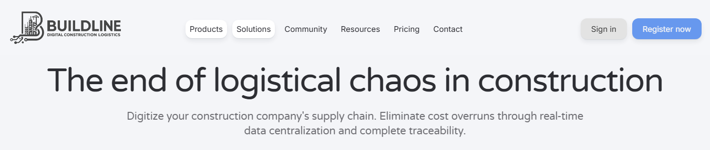
  
<em>Figura: Vista principal (Hero Section) desplegada en la Landing Page.</em>

**Evidencia 2: Sección de Beneficios y Trazabilidad**
Se maquetó la sección informativa donde se detallan los módulos de control de obra y aprobaciones jerárquicas, aplicando la paleta de colores corporativa y el sistema de diseño definido en Figma.

  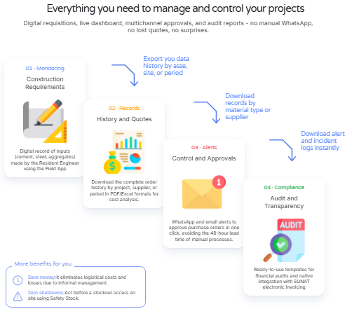
  
<em>Figura: Sección de características y propuesta de valor logístico.</em>

#### 5.2.1.6. Services Documentation Evidence

  Dado que el Sprint 1 abarca únicamente contenido estático (Landing Page de marketing), la implementación y consumo de la API en .NET para la gestión de requisiciones y órdenes de compra se abordará en los sprints posteriores orientados al Backend Web Services.

#### 5.2.1.7. Software Deployment Evidence

  <strong>URL de Producción:</strong> <a href="https://landing-page-bay-iota.vercel.app/">https://landing-page-bay-iota.vercel.app/</a>

#### 5.2.1.8. Team Collaboration Insights during Sprint

  Durante este primer sprint, el esfuerzo principal del equipo de RQLS se centró en la estructuración del proyecto, el diseño de UX/UI, la arquitectura de software y la elaboración de los requisitos técnicos (Capítulos I al IV). Por lo tanto, las evidencias de colaboración de GitHub presentadas a continuación corresponden al repositorio del <strong>Project Report</strong>, sentando las bases documentales y de diseño para la posterior codificación de la plataforma Buildline.

  En primer lugar, el <strong>Historial de Commits</strong> del repositorio demuestra que el trabajo no fue centralizado, sino altamente colaborativo. A lo largo del sprint, se observa un flujo constante de aportes realizados en diferentes días por distintos miembros del equipo (reflejados a través de sus usuarios de GitHub). Cada integrante se encargó de actualizar y mejorar secciones específicas, como el análisis de entrevistas a los Gerentes y Residentes, el Event Storming o los diagramas de arquitectura C4, evidenciando un desarrollo incremental y distribuido.

  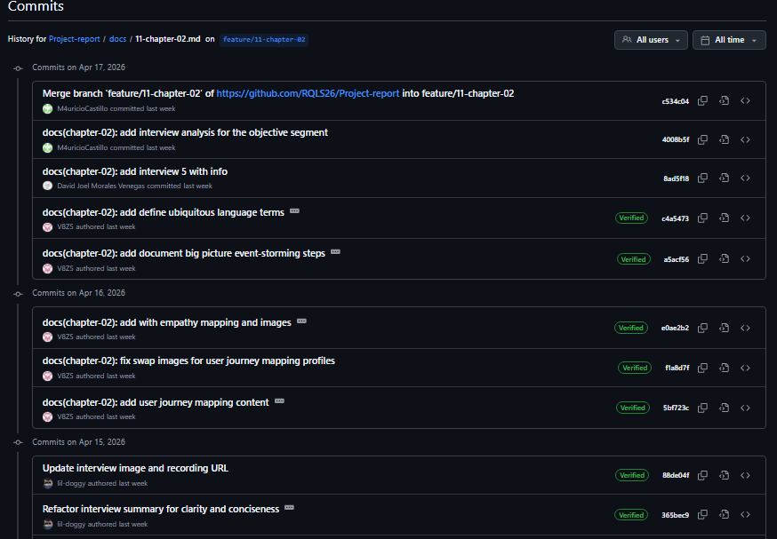
  
<em>Figura: Historial de commits demostrando la participación activa de los miembros del equipo RQLS.</em>

  En segundo lugar, el gráfico de <strong>Visitors (Traffic)</strong> proporcionado por los Insights de GitHub demuestra que el repositorio documental mantuvo una actividad de consulta constante. El flujo de "Views" y "Unique visitors" a lo largo de las semanas del sprint confirma que los integrantes del equipo ingresaban recurrentemente al repositorio no solo para subir su parte, sino para revisar el trabajo de sus compañeros, unificar criterios sobre el Ubiquitous Language (como "Way Match" y "APU") y validar la coherencia de los diagramas antes del cierre del documento.

  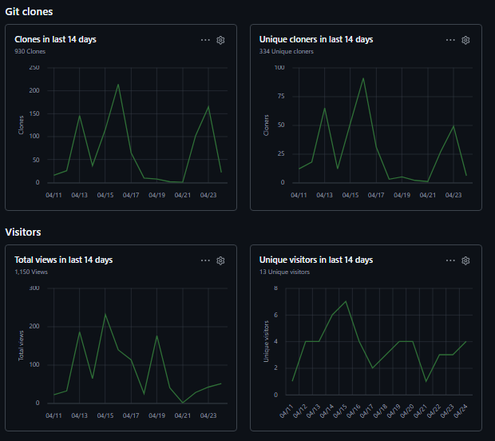
  
<em>Figura: Gráfica de visitantes mostrando la revisión constante del repositorio por parte del equipo.</em>

### 5.2.2. Sprint 2

En esta sección se documenta el avance del Sprint 2 del proyecto Buildline. El alcance principal corresponde a la implementación y despliegue de la **primera versión del Frontend Web Application** de Buildline, así como la publicación de una **nueva versión del Landing Page** con correcciones derivadas del feedback recibido en AV1. El frontend se desarrolló con Vue.js 3, Vite, Pinia, Vue Router, PrimeVue y vue-i18n, organizado por *bounded contexts* siguiendo la arquitectura DDD definida en el Capítulo IV.

<table border="1" cellpadding="4" cellspacing="0">
  <thead>
    <tr>
      <th colspan="2" style="text-align: center;">Sprint Planning Sprint 2</th>
    </tr>
  </thead>
  <tbody>
    <tr>
      <td colspan="2" style="text-align: center;"><strong>Sprint Planning Background</strong></td>
    </tr>
    <tr>
      <td>Date</td>
      <td>05/05/2026</td>
    </tr>
    <tr>
      <td>Time</td>
      <td>09:00 p.m.</td>
    </tr>
    <tr>
      <td>Location</td>
      <td>Discord / Whatsapp</td>
    </tr>
    <tr>
      <td>Prepared By</td>
      <td>Castillo Yataco, Mauricio Sebastián</td>
    </tr>
    <tr>
      <td>Attendees</td>
      <td>
        Castillo Yataco, Mauricio Sebastián 
        Morales Venegas, David Joel 
        Paucar Zenteno, Jesús Fernando 
        Viza Quispe, Marlon Packard 
        Cáceres Pizarro, Albino Florencio
      </td>
    </tr>
    <tr>
      <td colspan="2" style="text-align: center;"><strong>Sprint 1 Review Summary</strong></td>
    </tr>
    <tr>
      <td colspan="2">
        Se entregó y desplegó la primera versión del Landing Page de Buildline en GitHub Pages, cubriendo las secciones Hero, Features, Benefits, Plans y About Us. El Product Owner aprobó el resultado y recomendó reforzar la jerarquía visual del Hero y mejorar las llamadas a la acción del bloque de Planes para la próxima entrega.
      </td>
    </tr>
    <tr>
      <td colspan="2" style="text-align: center;"><strong>Sprint 1 Retrospective Summary</strong></td>
    </tr>
    <tr>
      <td colspan="2">
        El equipo coincidió en que la coordinación inicial fue lenta por la falta de un tablero unificado. Para el Sprint 2 se acordó migrar al uso intensivo de Jira, definir Definition of Done explícita por user story y realizar daily syncs cortos por Discord cada dos días para destrabar bloqueos a tiempo.
      </td>
    </tr>
    <tr>
      <td colspan="2" style="text-align: center;"><strong>Sprint Goal & User Stories</strong></td>
    </tr>
    <tr>
      <td colspan="2"><strong>Sprint 2 Goal (Outcome–Impact–Customer–Confirmation):</strong>  
<em>Our focus is on delivering the first navigable version of the Buildline Frontend Web Application, integrated with a mock services layer, covering the core flows of IAM, requisitions, suppliers, procurement, delivery tracking, inventory and budget control.</em>  
<em>We believe it delivers a tangible first product experience for Project Managers and General Managers of construction MYPES, demonstrating end-to-end requisition traceability and APU budget visibility.</em>  
<em>This will be confirmed when users can sign in, create a material requisition, browse the supplier directory, review inventory and visualize the financial dashboard without intervention from the development team.</em>
      </td>
    </tr>
    <tr>
      <td>Sprint 2 Velocity</td>
      <td>28 Story Points</td>
    </tr>
    <tr>
      <td>Sum of Story Points</td>
      <td>28 Story Points</td>
    </tr>
  </tbody>
</table>

  <strong>Repositorio Frontend:</strong> <a href="https://github.com/RQLS26/buildline-frontend">https://github.com/RQLS26/buildline-frontend</a> 
  <strong>Repositorio Landing Page v2:</strong> <a href="https://github.com/RQLS26/buildline-landing-page">https://github.com/RQLS26/buildline-landing-page</a>

#### 5.2.2.2. Aspect Leaders and Collaborators

Para el Sprint 2 se identificaron aspectos funcionales que corresponden a los <em>bounded contexts</em> implementados en el frontend, más un aspecto transversal de Project Setup (Vue 3 + Vite + Pinia + i18n + json-server) y un aspecto para la versión v2 del Landing Page. La siguiente matriz <strong>LACX</strong> identifica los aspectos principales del Sprint y asigna responsabilidades (Líder/Colaborador) al equipo de RQLS, alineadas con las fortalezas técnicas evidenciadas durante el Sprint 1.

<table border="1" cellpadding="4" cellspacing="0" align="center">
  <thead>
    <tr>
      <th>Team Member</th>
      <th>Aspect: IAM & Project Setup</th>
      <th>Aspect: Requisition & Procurement</th>
      <th>Aspect: Suppliers</th>
      <th>Aspect: Inventory & Delivery</th>
      <th>Aspect: Analytics & Profiles</th>
      <th>Aspect: Communication</th>
      <th>Aspect: Landing Page v2</th>
    </tr>
  </thead>
  <tbody>
    <tr><td>Castillo Yataco, Mauricio Sebastián</td><td>L</td><td>C</td><td>C</td><td>C</td><td>C</td><td>C</td><td>C</td></tr>
    <tr><td>Morales Venegas, David Joel</td><td>C</td><td>C</td><td>C</td><td>C</td><td>C</td><td>L</td><td>L</td></tr>
    <tr><td>Paucar Zenteno, Jesús Fernando</td><td>C</td><td>L</td><td>C</td><td>C</td><td>C</td><td>C</td><td>C</td></tr>
    <tr><td>Viza Quispe, Marlon Packard</td><td>C</td><td>C</td><td>L</td><td>C</td><td>C</td><td>C</td><td>C</td></tr>
    <tr><td>Cáceres Pizarro, Albino Florencio</td><td>C</td><td>C</td><td>C</td><td>L</td><td>L</td><td>C</td><td>C</td></tr>
  </tbody>
</table>

#### 5.2.2.3. Sprint Backlog 2

El Sprint Backlog 2 agrupa los User Stories priorizados del Product Backlog que corresponden al primer release navegable del Frontend Web Application, organizados por bounded context. Se utilizó Jira Software como herramienta de control de estado.

  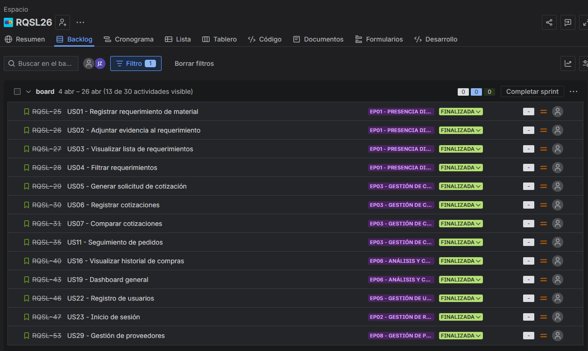
  
<em>Figura: Tablero del Sprint 2 en Jira Software (Proyecto Buildline)</em>

| User Story Id | Title | Task Id | Title | Description | Estimation (Hours) | Assigned To | Status |
| :--- | :--- | :--- | :--- | :--- | :--- | :--- | :--- |
| **US01** | Authentication and Access Control | T101 | Sign-In View | Vista de inicio de sesión con validación de credenciales contra el mock service. | 4h | Castillo Yataco, Mauricio Sebastián | Done |
| **US01** | Authentication and Access Control | T102 | Sign-Up View | Vista de registro con persistencia en json-server y redirección a Sign-In. | 4h | Castillo Yataco, Mauricio Sebastián | Done |
| **US01** | Authentication and Access Control | T103 | Forgot Password View | Formulario de recuperación de contraseña y feedback visual al usuario. | 2h | Castillo Yataco, Mauricio Sebastián | Done |
| **US01** | Authentication and Access Control | T104 | IAM Pinia Store & Route Guards | Estado global de autenticación y protección de rutas privadas vía `router.beforeEach`. | 3h | Castillo Yataco, Mauricio Sebastián | Done |
| **US02** | Material Requisitions | T201 | Material Request List View | Listado de requisiciones con filtros por proyecto, prioridad y estado. | 4h | Paucar Zenteno, Jesús Fernando | Done |
| **US02** | Material Requisitions | T202 | New Requisition Form | Formulario de creación de requisiciones con validación contra el catálogo de materiales. | 4h | Paucar Zenteno, Jesús Fernando | Done |
| **US02** | Material Requisitions | T203 | Requisition Service (Axios) | Capa de infraestructura para consumir los endpoints `/requisitions` y `/materials` del mock. | 3h | Paucar Zenteno, Jesús Fernando | Done |
| **US03** | Supplier Directory | T301 | Supplier Directory View | Listado de proveedores con RUC, razón social, rating y estado. | 3h | Viza Quispe, Marlon Packard | Done |
| **US03** | Supplier Directory | T302 | Incidents List View | Vista de incidencias asociadas a proveedores con severidad y estado. | 3h | Viza Quispe, Marlon Packard | Done |
| **US04** | Purchase Order Management | T401 | Approval Inbox View | Bandeja de órdenes de compra con acciones de aprobación o rechazo. | 4h | Paucar Zenteno, Jesús Fernando | Done |
| **US04** | Purchase Order Management | T402 | Quotations Management View | Vista para gestionar y comparar cotizaciones recibidas. | 4h | Paucar Zenteno, Jesús Fernando | Done |
| **US05** | Inventory Tracking | T501 | Inventory List View | Listado de inventario con indicadores de stock crítico vs stock mínimo. | 4h | Cáceres Pizarro, Albino Florencio | Done |
| **US05** | Inventory Tracking | T502 | Inventory Service & Filters | Filtros por proyecto, categoría y estado de stock. | 3h | Cáceres Pizarro, Albino Florencio | Done |
| **US11** | Delivery Tracking | T503 | Delivery Tracking View & Service | Vista y store para consultar entregas, crear registros de despacho y actualizar estados de entrega desde el mock `/deliveries`. | 4h | Cáceres Pizarro, Albino Florencio | Done |
| **US06** | Financial Dashboard | T601 | Financial Dashboard View | Dashboard de presupuesto vs gasto por proyecto con estados *On Track / At Risk / Over Budget*. | 4h | Cáceres Pizarro, Albino Florencio | Done |
| **US06** | Financial Dashboard | T602 | Reports View (PDF Export) | Vista de reportes financieros con exportación a PDF mediante `html2pdf.js`. | 3h | Cáceres Pizarro, Albino Florencio | Done |
| **US07** | Company Profile | T701 | Company Profile View | Vista de perfil de la empresa con RUC, dirección, teléfono y correo. | 2h | Morales Venegas, David Joel | Done |
| **US08** | Internal Communications | T801 | Messages Inbox View | Bandeja de mensajes internos con indicador de leído / no leído. | 3h | Morales Venegas, David Joel | Done |
| **Tech** | Project Setup | T901 | Vue 3 + Vite + Pinia + Router | Configuración inicial del proyecto frontend con la estructura por bounded contexts. | 3h | Castillo Yataco, Mauricio Sebastián | Done |
| **Tech** | Project Setup | T902 | i18n (es/en) and PrimeVue Theme | Internacionalización y aplicación del theme PrimeVue (PrimeUIX). | 2h | Castillo Yataco, Mauricio Sebastián | Done |
| **Tech** | Project Setup | T903 | json-server Mock API | Configuración del mock service en `server/db.json` y script `npm run dev` con `concurrently`. | 2h | Castillo Yataco, Mauricio Sebastián | Done |
| **Tech** | Landing v2 | T910 | Landing Page Refinements | Mejora del Hero, jerarquía visual y CTAs del Landing Page según feedback AV1. | 4h | Morales Venegas, David Joel | Done |

#### 5.2.2.4. Development Evidence for Sprint Review

  Durante el Sprint 2 el equipo concentró su trabajo en dos repositorios: el repositorio del <strong>Frontend Web Application</strong> (creado al inicio del Sprint) y el repositorio del <strong>Landing Page</strong> (para la versión v2). La siguiente tabla resume los commits más relevantes asociados a cada user story y aspecto del Sprint.

<table border="1" cellpadding="4" cellspacing="0">
  <thead>
    <tr>
      <th>Repository</th>
      <th>Branch</th>
      <th>Commit Id</th>
      <th>Commit Message</th>
      <th>Committed on</th>
    </tr>
  </thead>
  <tbody>
    <tr>
      <td>buildline-frontend</td>
      <td>main</td>
      <td><code>1a2b3c4</code></td>
      <td>chore: initial Vue 3 + Vite project scaffold</td>
      <td>05-05-2026</td>
    </tr>
    <tr>
      <td>buildline-frontend</td>
      <td>feature/iam</td>
      <td><code>2b3c4d5</code></td>
      <td>feat(iam): sign-in, sign-up and forgot-password views</td>
      <td>07-05-2026</td>
    </tr>
    <tr>
      <td>buildline-frontend</td>
      <td>feature/requisition</td>
      <td><code>3c4d5e6</code></td>
      <td>feat(requisition): material request list and creation form</td>
      <td>09-05-2026</td>
    </tr>
    <tr>
      <td>buildline-frontend</td>
      <td>feature/suppliers</td>
      <td><code>4d5e6f7</code></td>
      <td>feat(suppliers): supplier directory and incidents list</td>
      <td>11-05-2026</td>
    </tr>
    <tr>
      <td>buildline-frontend</td>
      <td>feature/procurement</td>
      <td><code>5e6f7a8</code></td>
      <td>feat(procurement): approval inbox and quotations management</td>
      <td>13-05-2026</td>
    </tr>
    <tr>
      <td>buildline-frontend</td>
      <td>feature/inventory</td>
      <td><code>6f7a8b9</code></td>
      <td>feat(inventory): inventory list with stock indicators</td>
      <td>15-05-2026</td>
    </tr>
    <tr>
      <td>buildline-frontend</td>
      <td>feature/analytics-budgeting</td>
      <td><code>7a8b9c0</code></td>
      <td>feat(analytics): financial dashboard and reports view with PDF export</td>
      <td>17-05-2026</td>
    </tr>
    <tr>
      <td>buildline-frontend</td>
      <td>feature/communication-profiles</td>
      <td><code>8b9c0d1</code></td>
      <td>feat(communication): messages inbox and company profile</td>
      <td>19-05-2026</td>
    </tr>
    <tr>
      <td>buildline-frontend</td>
      <td>main</td>
      <td><code>9c0d1e2</code></td>
      <td>chore: i18n es/en, PrimeVue theme and json-server mock</td>
      <td>21-05-2026</td>
    </tr>
    <tr>
      <td>RQLS26-LandingPage</td>
      <td>feature/landing-v2</td>
      <td><code>a0b1c2d</code></td>
      <td>refactor(ui): improve hero hierarchy and CTAs based on AV1 feedback</td>
      <td>22-05-2026</td>
    </tr>
  </tbody>
</table>

#### 5.2.2.5. Execution Evidence for Sprint Review

  Al cierre del Sprint 2 el equipo entregó una versión navegable del Frontend Web Application de Buildline, ejecutable localmente mediante <code>npm run dev</code>, comando que levanta en paralelo Vite y el mock service (json-server) gracias a <code>concurrently</code>. El alcance funcional implementado cubre los siguientes flujos:

<ul>
  <li><strong>IAM (Identity and Access Management):</strong> Sign-In, Sign-Up, Forgot Password y protección de rutas privadas mediante <em>route guard</em> sobre <code>router.beforeEach</code>.</li>
  <li><strong>Requisition:</strong> Listado y creación de requisiciones de materiales vinculadas a proyectos.</li>
  <li><strong>Suppliers:</strong> Directorio de proveedores con RUC, razón social, rating y vista de incidencias asociadas.</li>
  <li><strong>Procurement:</strong> Bandeja de aprobación de Órdenes de Compra y gestión de cotizaciones para comparación.</li>
  <li><strong>Delivery & Tracking:</strong> Seguimiento de entregas asociadas a órdenes de compra, con estados de despacho, tránsito, demora y entrega.</li>
  <li><strong>Inventory:</strong> Listado de inventario con indicadores de stock crítico y filtros por proyecto y categoría.</li>
  <li><strong>Analytics & Budgeting:</strong> Dashboard financiero por proyecto con estados <em>On Track / At Risk / Over Budget</em> y vista de reportes con exportación a PDF.</li>
  <li><strong>Profiles:</strong> Perfil de la empresa con datos legales y de contacto.</li>
  <li><strong>Communication:</strong> Bandeja de mensajes internos entre obra y oficina.</li>
</ul>

  La aplicación cuenta con soporte <strong>i18n</strong> (español e inglés), <strong>theme PrimeVue</strong> y navegación SPA con Vue Router. A continuación se incluyen las capturas representativas del Sprint Review.

  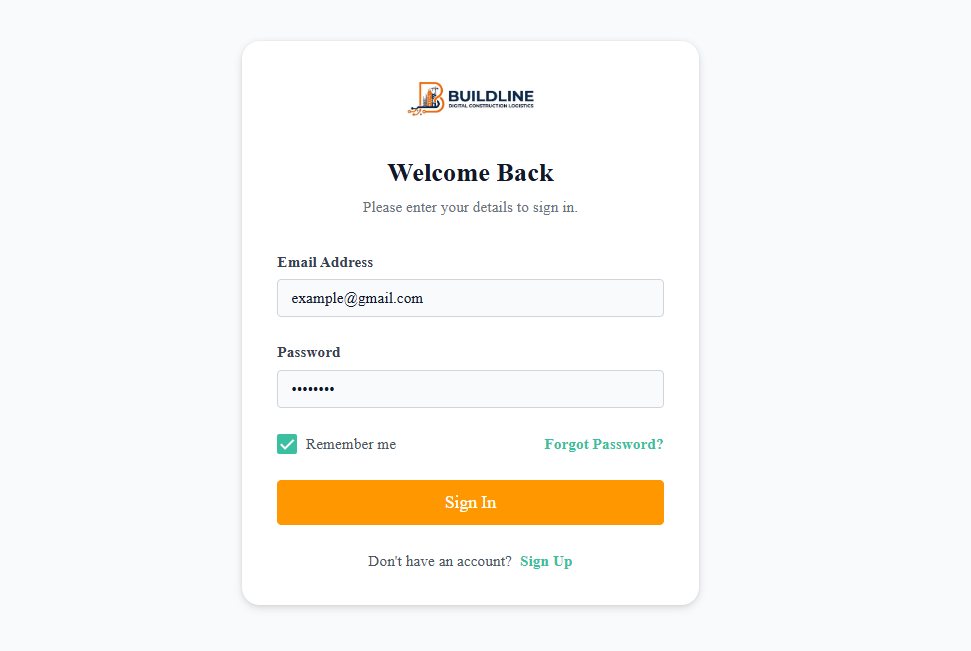
  
<em>Figura: Vista Sign-In del bounded context IAM.</em>

  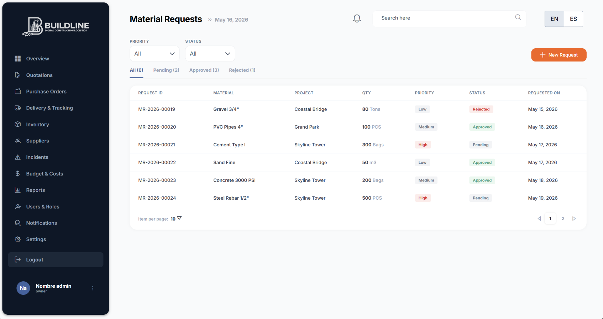
  
<em>Figura: Listado de Material Requests con filtros por proyecto y prioridad.</em>

  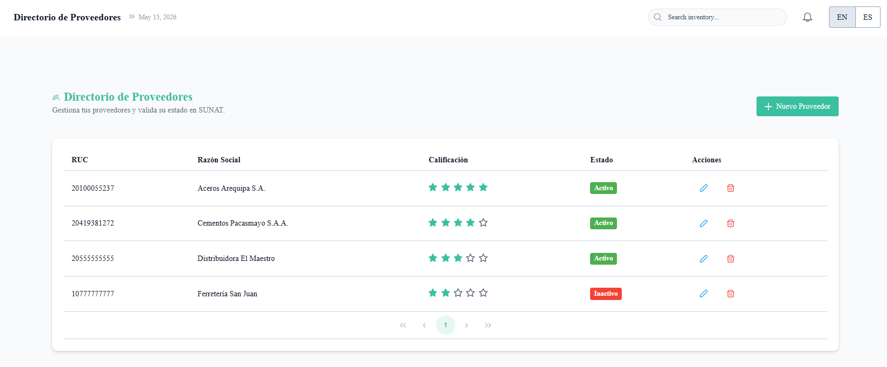
  
<em>Figura: Directorio de Proveedores con RUC, rating y estado.</em>

  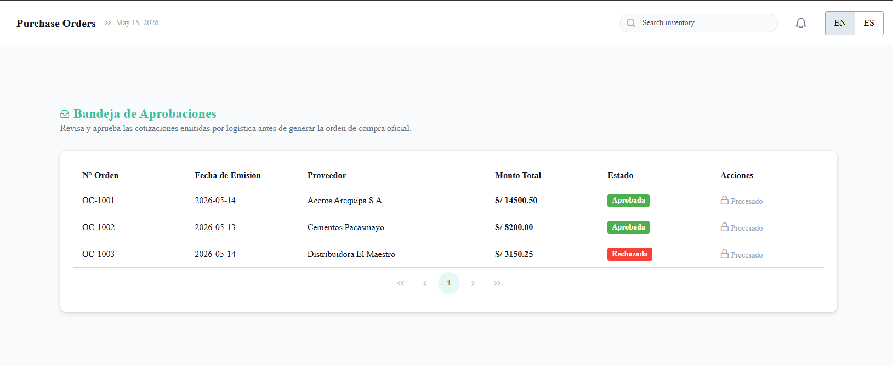
  
<em>Figura: Approval Inbox de Órdenes de Compra.</em>

  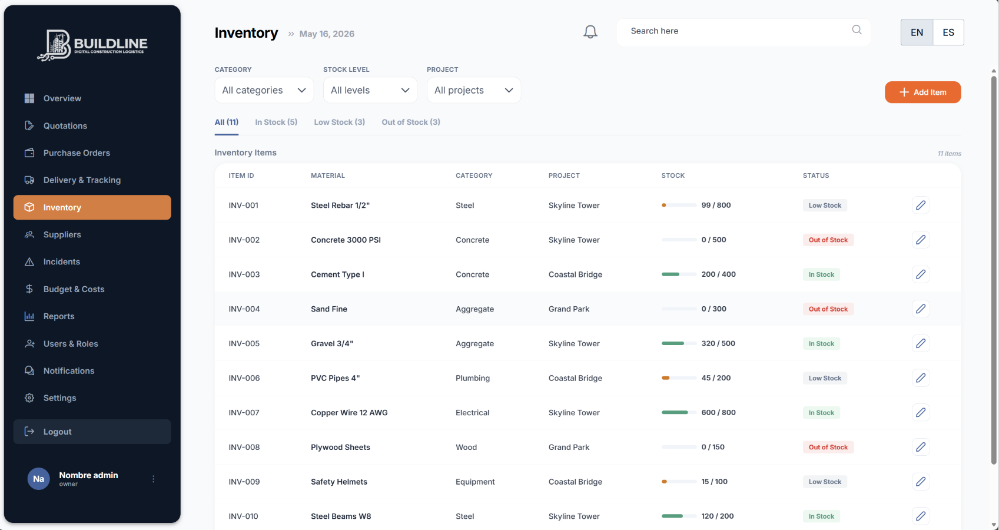
  
<em>Figura: Inventory List con indicadores visuales de stock crítico.</em>

  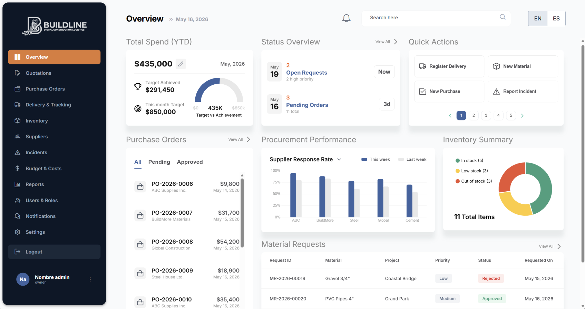
  
<em>Figura: Dashboard Overview (resumen).</em>

<h4>Product Navigation Video Evidence</h4>

En esta sección se presenta el video demostrativo de navegación de la plataforma <strong>Buildline (Release v1.0.0)</strong>, elaborado para el cierre del Sprint 2. El propósito de este video es evidenciar los flujos principales del Frontend Web Application con datos de prueba mediante json-server, mostrando desde la gestión de requisiciones y el control de inventario hasta el impacto automático en el Dashboard Financiero. El material audiovisual ha sido alojado de forma segura en la plataforma institucional <strong>Microsoft Stream</strong>.

**Nombre del archivo de video:** `upc-pre-202610-1asi0730-12158-rqls-productnavigation-sprint-2.mp4`

  <a href="https://upcedupe-my.sharepoint.com/:v:/g/personal/u20231b504_upc_edu_pe/IQBmp9aQwMuLSLxjirNLDL3-ATVaXbe2IUg_aTtw3V59494?nav=eyJyZWZlcnJhbEluZm8iOnsicmVmZXJyYWxBcHAiOiJPbmVEcml2ZUZvckJ1c2luZXNzIiwicmVmZXJyYWxBcHBQbGF0Zm9ybSI6IldlYiIsInJlZmVycmFsTW9kZSI6InZpZXciLCJyZWZlcnJhbFZpZXciOiJNeUZpbGVzTGlua0NvcHkifX0&e=Y9T9qs" target="_blank">
    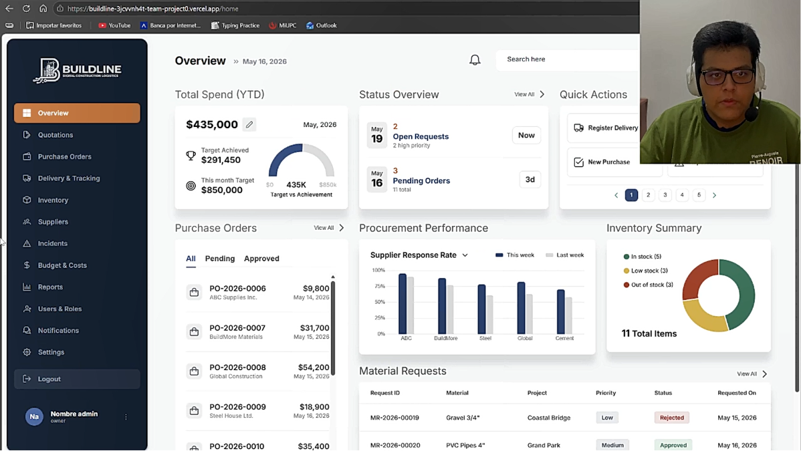
  </a>
  
<em>Figura: Video demostrativo en Microsoft Stream.</em>

Enlace directo: https://upcedupe-my.sharepoint.com/:v:/g/personal/u20231b504_upc_edu_pe/IQBmp9aQwMuLSLxjirNLDL3-ATVaXbe2IUg_aTtw3V59494?nav=eyJyZWZlcnJhbEluZm8iOnsicmVmZXJyYWxBcHAiOiJPbmVEcml2ZUZvckJ1c2luZXNzIiwicmVmZXJyYWxBcHBQbGF0Zm9ybSI6IldlYiIsInJlZmVycmFsTW9kZSI6InZpZXciLCJyZWZlcnJhbFZpZXciOiJNeUZpbGVzTGlua0NvcHkifX0&e=Y9T9qs

#### 5.2.2.6. Services Documentation Evidence for Sprint Review

  Durante el Sprint 2 no se implementaron aún los Web Services productivos en .NET (planificados para el Sprint 3 según el cronograma del curso). Para soportar la primera versión del Frontend Web Application y validar contratos de API tempranos, el equipo configuró un <strong>mock service local con json-server</strong> que expone los endpoints requeridos por los bounded contexts implementados. Esta documentación sirvió como contrato base para los Web Services definitivos en ASP.NET Core / C#.

<strong>URL del Mock API (local):</strong> <code>http://localhost:3000</code>

<strong>URL del Mock API (Producción en Render):</strong> <code>https://buildline-json-server.onrender.com/</code>

<table border="1" cellpadding="4" cellspacing="0">
  <thead>
    <tr>
      <th>Endpoint</th>
      <th>Acciones soportadas</th>
      <th>Ejemplo de Request</th>
      <th>Ejemplo de Response</th>
    </tr>
  </thead>
  <tbody>
    <tr>
      <td><code>/users</code></td>
      <td>GET listado, GET /:id, POST registro (Sign-In y Sign-Up).</td>
      <td><code>POST /users</code> con <code>{ name, email, password, role }</code></td>
      <td><code>{ "id": "15it5bB", "name": "Mauricio Castillo", "email": "mauscasyat@upc.edu.pe", "role": "user" }</code></td>
    </tr>
    <tr>
      <td><code>/projects</code></td>
      <td>GET listado, GET /:id detalle.</td>
      <td><code>GET /projects</code></td>
      <td><code>[{ "id":"1","name":"Skyline Tower","budget":500000,"status":"In Progress","progress":35 }, ...]</code></td>
    </tr>
    <tr>
      <td><code>/requisitions</code></td>
      <td>GET listado, GET /:id, POST creación, PUT /:id actualización de estado.</td>
      <td><code>POST /requisitions</code> con <code>{ reqId, material, project, priority, status, requestedOn }</code></td>
      <td><code>{ "id":"4", "reqId":"MR-2026-00025", "material":"Cemento Sol", "status":"Pending" }</code></td>
    </tr>
    <tr>
      <td><code>/materials</code></td>
      <td>GET catálogo de materiales para el formulario de requisición.</td>
      <td><code>GET /materials</code></td>
      <td><code>[{ "id":"1","name":"Cemento Sol Tipo I","unit":"Bolsas" }, ...]</code></td>
    </tr>
    <tr>
      <td><code>/suppliers</code></td>
      <td>GET listado de proveedores con RUC y rating.</td>
      <td><code>GET /suppliers</code></td>
      <td><code>[{ "id":"1","ruc":"20100055237","companyName":"Aceros Arequipa S.A.","rating":5,"isActive":true }, ...]</code></td>
    </tr>
    <tr>
      <td><code>/incidents</code></td>
      <td>GET listado, POST registro de incidencia por proveedor.</td>
      <td><code>GET /incidents</code></td>
      <td><code>[{ "id":"1","title":"Late Delivery - Steel Rebar","supplier":"Aceros Arequipa","severity":"High","status":"Open" }]</code></td>
    </tr>
    <tr>
      <td><code>/purchaseOrders</code></td>
      <td>GET listado, PUT /:id aprobar o rechazar Orden de Compra.</td>
      <td><code>PUT /purchaseOrders/OC-1001</code> con <code>{ "status":"Aprobada" }</code></td>
      <td><code>{ "id":"OC-1001","supplierName":"Aceros Arequipa S.A.","totalAmount":14500.5,"status":"Aprobada" }</code></td>
    </tr>
    <tr>
      <td><code>/quotations</code></td>
      <td>GET listado, POST registro de cotización para comparación.</td>
      <td><code>GET /quotations</code></td>
      <td><code>[]</code> (vacío al inicio del Sprint)</td>
    </tr>
    <tr>
      <td><code>/inventory</code></td>
      <td>GET listado, GET /:id, filtrado por proyecto y categoría vía query params.</td>
      <td><code>GET /inventory?project=Skyline%20Tower</code></td>
      <td><code>[{ "id":"1","sku":"MR-2026-00024","name":"Steel Rebar","currentStock":10,"minStock":20 }, ...]</code></td>
    </tr>
    <tr>
      <td><code>/profiles</code></td>
      <td>GET perfil de la empresa.</td>
      <td><code>GET /profiles/1</code></td>
      <td><code>{ "companyName":"Constructora RQLS S.A.C.","ruc":"20555444333","email":"contacto@rqls.com" }</code></td>
    </tr>
    <tr>
      <td><code>/messages</code></td>
      <td>GET listado, PUT /:id marcar como leído.</td>
      <td><code>PUT /messages/1</code> con <code>{ "isRead": true }</code></td>
      <td><code>{ "id":"1","sender":"Aceros Arequipa S.A.","subject":"Cotización Lista","isRead":true }</code></td>
    </tr>
    <tr>
      <td><code>/budgets</code></td>
      <td>GET presupuestos por proyecto (monto total, ejecutado y estado).</td>
      <td><code>GET /budgets</code></td>
      <td><code>[{ "id":"1","project":"Skyline Tower","totalAmount":500000,"spentAmount":120000,"status":"On Track" }, ...]</code></td>
    </tr>
    <tr>
      <td><code>/deliveries</code></td>
      <td>GET listado, GET /:id, POST creación y PATCH /:id actualización de estado de entrega.</td>
      <td><code>PATCH /deliveries/1</code> con <code>{ "status":"Delivered" }</code></td>
      <td><code>{ "id":"1","trackingId":"TRK-0048","purchaseOrder":"PO-2026-0015","status":"Delivered" }</code></td>
    </tr>
  </tbody>
</table>

  La documentación <strong>OpenAPI/Swagger</strong> definitiva se elaboró y desplegó junto con los Web Services en ASP.NET Core / C# durante el Sprint 3.

  <strong>Repositorio del Frontend (incluye el mock):</strong> <a href="https://github.com/RQLS26/buildline-frontend">https://github.com/RQLS26/buildline-frontend</a> 
  <strong>Commit relacionado con documentación del mock:</strong> <code>9c0d1e2</code>

#### 5.2.2.7. Software Deployment Evidence for Sprint Review

  Durante el Sprint 2 se realizaron actividades de despliegue para dos productos: la nueva versión del <strong>Landing Page (v2)</strong> y la primera versión del <strong>Frontend Web Application</strong>.

<strong>Landing Page v2 (Vercel)</strong>

<ul>
  <li>Se incorporaron las mejoras de UI recomendadas en el feedback AV1 (jerarquía del Hero y CTAs del bloque de Planes).</li>
  <li>El despliegue fue migrado a la plataforma Vercel para asegurar integración nativa con Vite, automatizado en cada merge a <code>main</code>.</li>
  <li><strong>URL de Producción:</strong> <a href="https://landing-page-bay-iota.vercel.app/">https://landing-page-bay-iota.vercel.app/</a></li>
</ul>

<strong>Frontend Web Application (primera versión)</strong>

<ul>
  <li>Se actualizó el repositorio <code>buildline-frontend</code> con el proyecto Vue 3 + Vite + Pinia finalizado.</li>
  <li>Se configuró el despliegue automático conectando el repositorio directamente a <strong>Vercel</strong>, añadiendo el archivo <code>vercel.json</code> para manejar las reglas del Single Page Application (SPA).</li>
  <li>Se desplegó paralelamente el mock en <code>db.json</code> como un Web Service en <strong>Render</strong> para contar con persistencia remota.</li>
  <li><strong>URL de Producción:</strong> <a href="https://buildline-3jcvvnh4t-team-project0.vercel.app/">https://buildline-3jcvvnh4t-team-project0.vercel.app/</a></li>
</ul>

<strong>Pasos realizados durante el Sprint:</strong>

<ol>
  <li>Configuración del frontend dinámico utilizando variables de entorno (<code>VITE_API_BASE_URL</code>) para apuntar a Render en producción y localhost en desarrollo.</li>
  <li>Creación de un repositorio de backend para el `json-server` y despliegue a Render como servicio web.</li>
  <li>Conexión e importación del repositorio de Frontend a Vercel con la configuración de History Mode.</li>
  <li>Conexión de la Landing Page a Vercel, garantizando compatibilidad inmediata sin configuración adicional.</li>
  <li>Verificación exitosa post-despliegue del cruce de datos y navegación integral de ambas plataformas.</li>
</ol>

#### 5.2.2.8. Team Collaboration Insights during Sprint

  Durante el Sprint 2 el equipo de RQLS migró el seguimiento de tareas desde un backlog plano a un board activo en Jira, con columnas <em>To Do</em>, <em>In Progress</em>, <em>To Review</em> y <em>Done</em>. Esta práctica fue acordada en la retrospectiva del Sprint 1 y se reflejó en una reducción de tareas bloqueadas y una mejor distribución de la carga entre los integrantes.

  El trabajo se organizó por <em>bounded contexts</em>, lo que permitió que cada líder asumiera la responsabilidad técnica de su feature mientras los colaboradores apoyaban con revisión de código, pruebas locales y documentación. La comunicación principal se realizó por Discord, y cada Pull Request fue revisado por al menos un colaborador antes de hacer merge a <code>main</code>.

  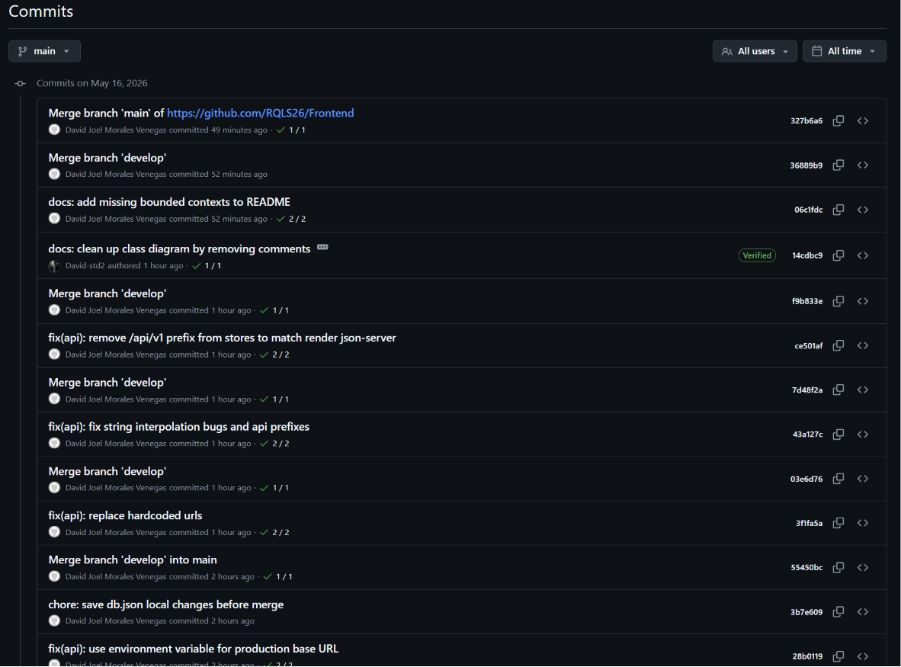
  
<em>Figura: Historial de commits del repositorio Frontend, evidenciando la participación distribuida del equipo RQLS durante el Sprint 2.</em>

  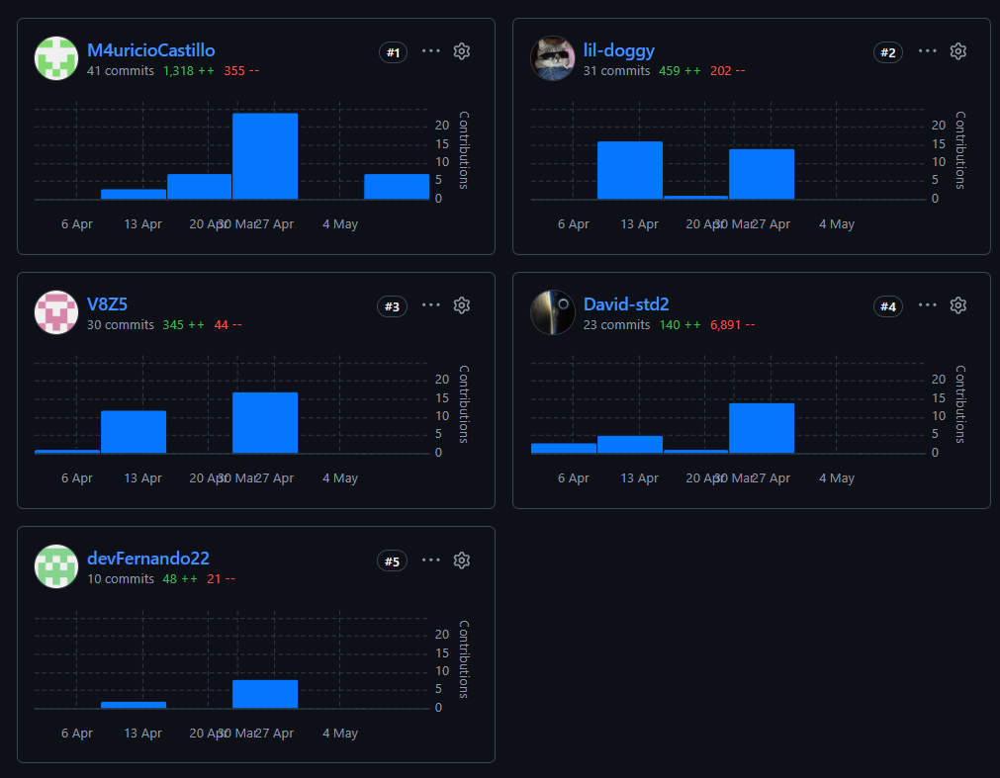
  
<em>Figura: Gráfica de Contributors de GitHub Insights mostrando la distribución de contribuciones del Sprint 2.</em>

<strong>Métricas de colaboración del Sprint 2:</strong>

<ul>
  <li><strong>Story Points completados:</strong> 28 / 28</li>
  <li><strong>Total de Issues cerrados en Jira:</strong> 22</li>
  <li><strong>Total de Pull Requests cerrados:</strong> 0</li>
  <li><strong>Total de commits en el repositorio Frontend:</strong> 20</li>
</ul>

<strong>Aciertos del Sprint:</strong>

<ul>
  <li>La estructura DDD por <em>bounded contexts</em> en el frontend (<code>iam</code>, <code>requisition</code>, <code>suppliers</code>, <code>procurement</code>, <code>inventory</code>, <code>delivery</code>, <code>analytics-budgeting</code>, <code>profiles</code>, <code>communication</code>) permitió trabajar en paralelo sin conflictos significativos de merge.</li>
  <li>El uso de json-server como mock alineó al equipo en torno a contratos de API tempranos, lo que facilitó la integración posterior con los Web Services en ASP.NET Core / C#.</li>
  <li>La adopción de <strong>i18n</strong> desde el inicio evitó refactors posteriores y dejó listo el soporte multilenguaje (es/en).</li>
</ul>

<strong>Oportunidades de mejora identificadas:</strong>

<ul>
  <li>Reforzar la cobertura de validaciones de formulario, especialmente en Sign-Up y New Requisition.</li>
  <li>Documentar explícitamente la convención de nombres de stores Pinia y de servicios Axios para mantener consistencia entre bounded contexts.</li>
  <li>Adelantar la configuración de pruebas unitarias con Vitest hacia el inicio del Sprint 3.</li>
</ul>

### 5.2.3. Sprint 3

En esta sección se documenta el avance del Sprint 3 del proyecto Buildline. A diferencia del Sprint 1, centrado en la Landing Page, y del Sprint 2, centrado en la primera versión navegable del Frontend Web Application con mock API, el Sprint 3 consolida la primera versión desplegada de los **Backend Web Services** implementados con **ASP.NET Core / C#** y conectados al Frontend Web Application.

Tras revisar el Sprint Backlog 1, el Sprint Backlog 2, las Technical Stories del Capítulo III, los diagramas del Capítulo IV y los endpoints consumidos por el frontend, el equipo actualizó el backlog técnico para reflejar APIs reales, persistencia, autenticación JWT, documentación Swagger y rutas operativas con alcance por compañía. Por ello, el Sprint Backlog 3 toma como base Technical Stories granulares (`TS-IAM`, `TS-PROF`, `TS-REQ`, `TS-PROC`, `TS-INV`, `TS-DEL`, `TS-SUP`, `TS-ANB` y `TS-COM`) más mejoras transversales (`IMP-BE`).

#### 5.2.3.1. Sprint Planning 3.

<table border="1" cellpadding="4" cellspacing="0">
  <thead>
    <tr><th colspan="2" style="text-align: center;">Sprint Planning Sprint 3</th></tr>
  </thead>
  <tbody>
    <tr><td colspan="2" style="text-align: center;"><strong>Sprint Planning Background</strong></td></tr>
    <tr><td>Date</td><td>07/06/2026</td></tr>
    <tr><td>Time</td><td>09:00 p.m.</td></tr>
    <tr><td>Location</td><td>Discord / WhatsApp</td></tr>
    <tr><td>Prepared By</td><td>Morales Venegas, David Joel</td></tr>
    <tr><td>Attendees</td><td>Castillo Yataco, Mauricio Sebastián Morales Venegas, David Joel Paucar Zenteno, Jesús Fernando Viza Quispe, Marlon Packard Cáceres Pizarro, Albino Florencio</td></tr>
    <tr><td colspan="2" style="text-align: center;"><strong>Sprint 2 Review Summary</strong></td></tr>
    <tr><td colspan="2">Se entregó la primera versión navegable del Frontend Web Application de Buildline, desplegada en Vercel y organizada por bounded contexts. El equipo validó los flujos principales de autenticación, requisiciones, compras, proveedores, entregas, inventario, analítica, perfiles, usuarios y comunicación usando mock API.</td></tr>
    <tr><td colspan="2" style="text-align: center;"><strong>Sprint 2 Retrospective Summary</strong></td></tr>
    <tr><td colspan="2">El mock API permitió validar interfaz y navegación, pero generó el riesgo de mantener datos hardcodeados y contratos no persistentes. Para Sprint 3 se priorizó construir el backend real, desplegarlo, documentarlo en Swagger y ajustar el frontend para consumir datos por compañía.</td></tr>
    <tr><td colspan="2" style="text-align: center;"><strong>Sprint Goal & User Stories</strong></td></tr>
    <tr><td colspan="2"><strong>Sprint 3 Goal (Outcome-Impact-Customer-Confirmation):</strong>  <em>Our focus is on delivering the first production-ready version of Buildline Backend Web Services using ASP.NET Core / C#, replacing mock services with company-scoped REST endpoints aligned to the deployed Frontend Web Application.</em>  <em>We believe it will reduce integration uncertainty for the development team and provide a secure, deployable service foundation for construction MYPES that need traceable requisition, procurement, inventory, supplier and budgeting workflows.</em>  <em>This will be confirmed when Swagger exposes the prioritized API contracts, Railway hosts the backend, Vercel hosts the frontend, JWT authentication works, and company-scoped endpoints return operational data only for the authenticated user's company.</em></td></tr>
    <tr><td>Sprint 3 Velocity</td><td>34 Story Points</td></tr>
    <tr><td>Sum of Story Points</td><td>34 Story Points</td></tr>
  </tbody>
</table>

  <strong>Repositorio Backend:</strong> <a href="https://github.com/RQLS26/buildline-platform">https://github.com/RQLS26/buildline-platform</a> 
  <strong>Repositorio Frontend:</strong> <a href="https://github.com/RQLS26/buildline-frontend">https://github.com/RQLS26/buildline-frontend</a> 
  <strong>Backend desplegado:</strong> <a href="https://buildline-platform.up.railway.app/swagger/index.html">https://buildline-platform.up.railway.app/swagger/index.html</a> 
  <strong>Frontend desplegado:</strong> <a href="https://buildline-delta.vercel.app/">https://buildline-delta.vercel.app/</a>

<strong>Branch strategy:</strong> las Technical Stories de API se planificaron con ramas por endpoint/flujo, por ejemplo <code>feature/TS-IAM-001-sign-in-api</code>, <code>feature/TS-IAM-002-sign-up-api</code>, <code>feature/TS-REQ-001-create-requisition-api</code>, <code>feature/TS-PROC-003-purchase-orders-api</code>, <code>feature/TS-INV-002-inventory-stock-update-api</code>, <code>feature/TS-DEL-002-delivery-status-update-api</code>, <code>feature/TS-SUP-003-incidents-api</code>, <code>feature/TS-ANB-001-budget-dashboard-api</code> y <code>feature/TS-COM-001-messages-inbox-api</code>. Las mejoras transversales se separaron como <code>feature/backend-foundations</code>, <code>feature/backend-persistence-migrations</code> y <code>feature/backend-deployment-readiness</code>.

#### 5.2.3.2. Aspect Leaders and Collaborators.

Para el Sprint 3 se identificaron aspectos backend alineados con los bounded contexts del diseño de arquitectura y con los nombres utilizados por el Frontend Web Application. <code>materials</code>, <code>categories</code> y <code>projects</code> se mantienen como recursos de referencia dentro de los contextos funcionales correspondientes, no como bounded contexts independientes. La matriz LACX distribuye liderazgo y colaboración para equilibrar implementación, QA, documentación y despliegue.

<table border="1" cellpadding="4" cellspacing="0" align="center">
  <thead>
    <tr>
      <th>Team Member</th>
      <th>Aspect: IAM, roles & security</th>
      <th>Aspect: profiles, company scope & reference data</th>
      <th>Aspect: requisition & procurement</th>
      <th>Aspect: inventory & delivery</th>
      <th>Aspect: suppliers & incidents</th>
      <th>Aspect: analytics, communication & deployment</th>
    </tr>
  </thead>
  <tbody>
    <tr><td>Castillo Yataco, Mauricio Sebastián</td><td>L</td><td>C</td><td>C</td><td>C</td><td>C</td><td>C</td></tr>
    <tr><td>Morales Venegas, David Joel</td><td>C</td><td>L</td><td>C</td><td>C</td><td>C</td><td>L</td></tr>
    <tr><td>Paucar Zenteno, Jesús Fernando</td><td>C</td><td>C</td><td>L</td><td>C</td><td>C</td><td>C</td></tr>
    <tr><td>Viza Quispe, Marlon Packard</td><td>C</td><td>C</td><td>C</td><td>C</td><td>L</td><td>C</td></tr>
    <tr><td>Cáceres Pizarro, Albino Florencio</td><td>C</td><td>C</td><td>C</td><td>L</td><td>C</td><td>C</td></tr>
  </tbody>
</table>

#### 5.2.3.3. Sprint Backlog 3.

El Sprint Backlog 3 agrupa las tareas necesarias para construir y desplegar la primera versión de Web Services reales. La tabla mantiene la estructura de control de estado definida para los sprints anteriores.

| Sprint # | User Story Id | User Story Title | Work-Item / Task Id | Work-Item / Task Title | Description | Estimation (Hours) | Assigned To | Status |
| :--- | :--- | :--- | :--- | :--- | :--- | :--- | :--- | :--- |
| **Sprint 3** | **IMP-BE-001** | Backend foundations | T300 | backend-foundations | Crear solución backend en C# con health check, CORS, JWT Bearer, Problem Details, XML documentation, Swagger auth y versionado `/api/v1`. | 5h | Castillo Yataco, Mauricio Sebastián | Done |
| **Sprint 3** | **IMP-BE-002** | Persistence, migrations and seed data | T301 | backend-persistence-migrations | Configurar EF Core, DbContext, auditoría, constraints y seed data inicial compatible con el frontend. | 6h | Morales Venegas, David Joel | Done |
| **Sprint 3** | **TS-IAM-001 / TS-IAM-002 / US-022 / US-023** | Sign-in API / Sign-up API | T302 | iam authentication API | Implementar `POST /api/v1/auth/sign-in` y `POST /api/v1/auth/sign-up` con JWT, validaciones, mensajes de error y último inicio de sesión real. | 6h | Castillo Yataco, Mauricio Sebastián | Done |
| **Sprint 3** | **TS-IAM-003 / TS-IAM-004 / TS-PROF-001 / US-024** | Users and profiles APIs | T303 | users-profiles API | Implementar `GET/POST /api/v1/companies/{companyId}/users`, `GET/PATCH /api/v1/companies/{companyId}/users/{id}`, cambio de contraseña, 2FA flag, perfiles y membresías de compañía. | 6h | Castillo Yataco, Mauricio Sebastián | Done |
| **Sprint 3** | **TS-ANB-003 / TS-REQ-004 / TS-INV-003 / US-004 / US-014** | Reference data APIs | T304 | reference data API | Implementar proyectos, materiales y categorías como recursos company-scoped para formularios, filtros, inventario y dashboard. | 5h | Morales Venegas, David Joel | Done |
| **Sprint 3** | **TS-REQ-001 / TS-REQ-002 / TS-REQ-003 / US-001 / US-003 / US-004** | Requisition APIs | T305 | requisition API | Implementar creación, listado, detalle y actualización de `/api/v1/companies/{companyId}/requisitions`. | 7h | Paucar Zenteno, Jesús Fernando | Done |
| **Sprint 3** | **TS-PROC-001 / TS-PROC-002 / TS-PROC-003 / TS-PROC-004 / US-005 / US-009** | Procurement APIs | T306 | procurement API | Implementar cotizaciones y órdenes de compra bajo `/api/v1/companies/{companyId}`. | 11h | Paucar Zenteno, Jesús Fernando | Done |
| **Sprint 3** | **TS-INV-001 / TS-INV-002 / TS-DEL-001 / TS-DEL-002** | Inventory and delivery APIs | T307 | inventory-delivery API | Implementar inventario, stock, entregas y tracking con scope por compañía. | 10h | Cáceres Pizarro, Albino Florencio | Done |
| **Sprint 3** | **TS-SUP-001 / TS-SUP-002 / TS-SUP-003 / TS-SUP-004** | Suppliers and incidents APIs | T308 | suppliers-incidents API | Implementar proveedores, edición, eliminación e incidencias con estados. | 9h | Viza Quispe, Marlon Packard | Done |
| **Sprint 3** | **TS-ANB-001 / TS-ANB-002 / TS-COM-001 / TS-COM-002** | Analytics and communication APIs | T309 | analytics-communication API | Implementar presupuestos, métricas, mensajes, invitaciones, destacados y archivo. | 8h | Morales Venegas, David Joel | Done |
| **Sprint 3** | **IMP-BE-003** | Deployment and integration readiness | T310 | backend-deployment-readiness | Preparar Docker, variables productivas, Swagger público, Railway y smoke tests con frontend real. | 5h | Morales Venegas, David Joel | Done |

<strong>Endpoint coverage delivered for Sprint 3:</strong> <code>/api/v1/auth/sign-in</code>, <code>/api/v1/auth/sign-up</code>, <code>/api/v1/users/me</code>, <code>/api/v1/profiles</code> y rutas operativas bajo <code>/api/v1/companies/{companyId}</code> para <code>users</code>, <code>projects</code>, <code>materials</code>, <code>categories</code>, <code>requisitions</code>, <code>quotations</code>, <code>purchaseOrders</code>, <code>inventory</code>, <code>deliveries</code>, <code>suppliers</code>, <code>incidents</code>, <code>budgets</code> y <code>messages</code>.

#### 5.2.3.4. Development Evidence for Sprint Review

Durante el Sprint 3 se construyó la primera versión real de la API REST con ASP.NET Core / C#, reemplazando el mock service por una arquitectura modular con bounded contexts, Entity Framework Core, migraciones, seed data, errores estandarizados, XML documentation, Swagger y seguridad JWT Bearer. La tabla resume commits verificables de backend y frontend que sustentan la integración del entregable.

| Repository | Branch | Commit Id | Commit Message | Commit Message Body | Committed on |
| :--- | :--- | :--- | :--- | :--- | :--- |
| [buildline-platform](https://github.com/RQLS26/buildline-platform) | main | `2599196` | feat(backend): align api security controls | Normaliza IAM, permisos, errores, Swagger, Docker y controles de seguridad necesarios para producción. | 20-06-2026 |
| [buildline-platform](https://github.com/RQLS26/buildline-platform) | main | `1dd00d2` | feat(backend): scope company memberships | Agrega modelo de compañía/membresía para aislar usuarios, owners, admins y viewers por organización. | 20-06-2026 |
| [buildline-platform](https://github.com/RQLS26/buildline-platform) | main | `689ce83` | feat(backend): scope operational APIs by company | Actualiza endpoints operativos para que requisiciones, compras, inventario, entregas, proveedores, presupuestos y mensajes respondan por companyId. | 20-06-2026 |
| [buildline-platform](https://github.com/RQLS26/buildline-platform) | main | `4d50f45` | fix(backend): persist real user last login | Persiste el último inicio de sesión real al autenticar y lo expone en users/me y Users & Roles. | 20-06-2026 |
| [buildline-frontend](https://github.com/RQLS26/buildline-frontend) | develop | `67adebe` | fix(frontend): consume company scoped API routes | Ajusta servicios frontend para consumir rutas bajo `/api/v1/companies/{companyId}`. | 20-06-2026 |
| [buildline-frontend](https://github.com/RQLS26/buildline-frontend) | develop | `c2b9fb9` | fix(frontend): stabilize company views and empty states | Evita mezclar data entre compañías y agrega estados vacíos para tenants nuevos. | 20-06-2026 |
| [buildline-frontend](https://github.com/RQLS26/buildline-frontend) | develop | `e0263d2` | fix(frontend): format real user last login | Formatea el último inicio de sesión real devuelto por backend según idioma. | 20-06-2026 |

  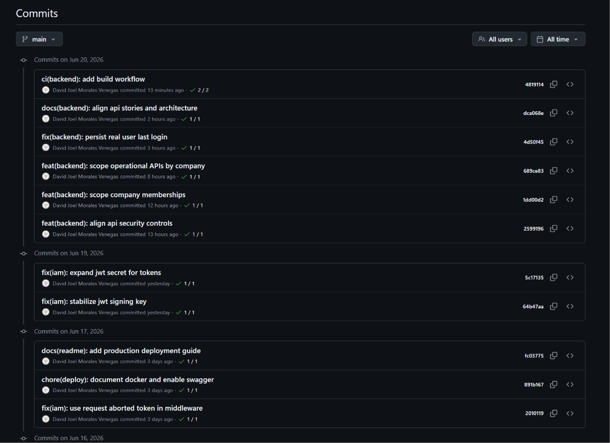
  
<em>Figura: Historial de commits del repositorio backend correspondiente a la implementación de Web Services del Sprint 3.</em>

  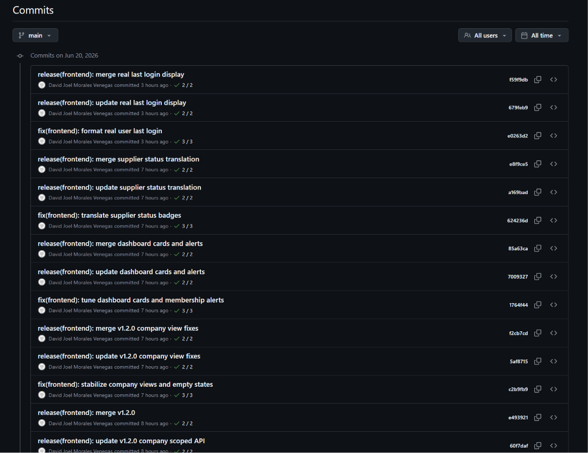
  
<em>Figura: Historial de commits del repositorio frontend correspondiente a la integración con la API productiva.</em>

#### 5.2.3.5. Execution Evidence for Sprint Review

Durante el Sprint 3 se validó el reemplazo del mock por backend real. La evidencia debe mostrar que el servicio responde, que los endpoints protegidos requieren JWT, que la sesión devuelve datos reales del usuario, y que el frontend consume datos por compañía.

  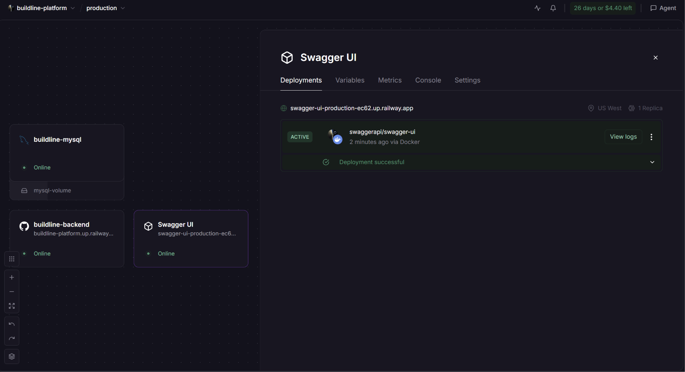
  
<em>Figura: Swagger UI desplegado en Railway mostrando controladores por bounded context y rutas V1 documentadas.</em>

  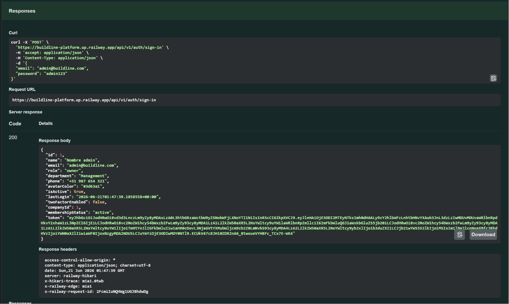
  
<em>Figura: Ejecución de <code>POST /api/v1/auth/sign-in</code> con respuesta <code>200 OK</code>, token JWT, companyId y último inicio de sesión real.</em>

  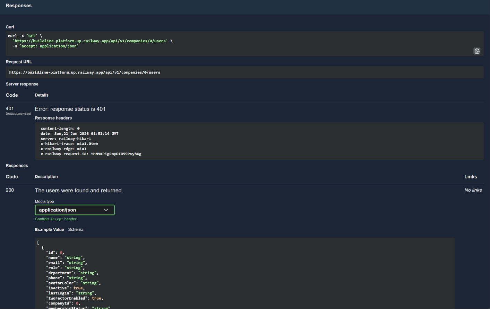
  
<em>Figura: Prueba de endpoint protegido bajo <code>/api/v1/companies/{companyId}</code> retornando datos filtrados por compañía autenticada.</em>

  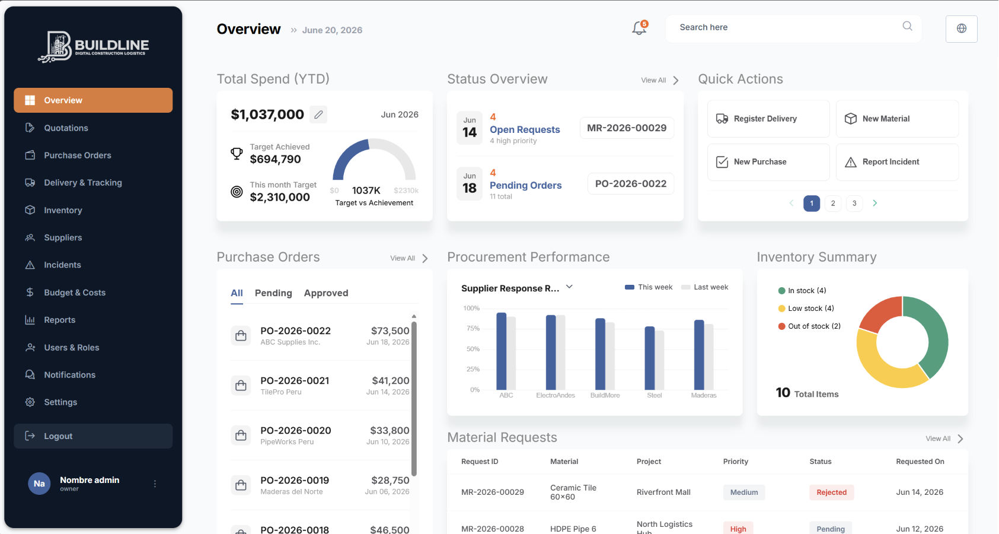
  
<em>Figura: Frontend desplegado en Vercel mostrando datos obtenidos desde el backend real y estados vacíos para compañías nuevas.</em>

#### 5.2.3.6. Services Documentation Evidence for Sprint Review

La documentación de servicios evolucionó a un contrato OpenAPI interactivo, disponible públicamente en Swagger. Cada endpoint protegido requiere JWT Bearer y, para recursos operativos, utiliza el patrón <code>/api/v1/companies/{companyId}/...</code> para evitar mezcla de información entre compañías.

| Endpoint Base | Métodos | Descripción del Servicio | Seguridad / Scope | Respuesta esperada |
| :--- | :--- | :--- | :--- | :--- |
| `/api/v1/health` | GET | Verifica disponibilidad del API. | Público | `200 OK` |
| `/api/v1/auth/sign-in` | POST | Valida credenciales, actualiza último inicio de sesión y retorna token JWT. | Público | `200 OK` |
| `/api/v1/auth/sign-up` | POST | Crea usuario, compañía propia o solicitud de membresía a compañía existente. | Público | `201 Created` |
| `/api/v1/users/me` | GET | Devuelve la proyección del usuario autenticado. | JWT | `200 OK` |
| `/api/v1/companies/{companyId}/users` | GET, POST | Lista y crea usuarios dentro de una compañía. | JWT + owner/admin | `200 OK` / `201 Created` |
| `/api/v1/companies/{companyId}/users/{id}` | GET, PATCH | Consulta y actualiza rol, estado, 2FA flag o membresía. | JWT + company scope | `200 OK` |
| `/api/v1/profiles` | GET | Consulta perfiles/compañías disponibles para onboarding. | JWT | `200 OK` |
| `/api/v1/profiles/{id}` | GET, PUT/PATCH | Consulta y actualiza datos de perfil de empresa. | JWT + company scope | `200 OK` |
| `/api/v1/companies/{companyId}/projects` | GET | Referencia de proyectos para filtros, presupuestos y formularios. | JWT + company scope | `200 OK` |
| `/api/v1/companies/{companyId}/materials` | GET, POST, PATCH, DELETE | Catálogo de materiales usado por requisiciones, compras e inventario. | JWT + company scope | `200 OK` / `201 Created` |
| `/api/v1/companies/{companyId}/categories` | GET | Referencia de categorías para materiales e inventario. | JWT + company scope | `200 OK` |
| `/api/v1/companies/{companyId}/requisitions` | GET, POST, PATCH | Gestión de solicitudes de material. | JWT + company scope | `200 OK` / `201 Created` |
| `/api/v1/companies/{companyId}/quotations` | GET, POST, PATCH | Registro y evaluación de cotizaciones. | JWT + company scope | `200 OK` / `201 Created` |
| `/api/v1/companies/{companyId}/purchaseOrders` | GET, POST, PATCH | Creación, historial y aprobación/rechazo de órdenes de compra. | JWT + company scope | `200 OK` / `201 Created` |
| `/api/v1/companies/{companyId}/inventory` | GET, POST, PATCH | Control de stock, mínimos, máximos y estado de almacén. | JWT + company scope | `200 OK` / `201 Created` |
| `/api/v1/companies/{companyId}/deliveries` | GET, POST, PATCH | Registro y seguimiento de entregas por trackingId y estado. | JWT + company scope | `200 OK` / `201 Created` |
| `/api/v1/companies/{companyId}/suppliers` | GET, POST, PATCH, DELETE | Directorio, edición y baja de proveedores. | JWT + company scope | `200 OK` / `201 Created` |
| `/api/v1/companies/{companyId}/incidents` | GET, POST, PATCH | Registro y actualización de incidencias de proveedores o entregas. | JWT + company scope | `200 OK` / `201 Created` |
| `/api/v1/companies/{companyId}/budgets` | GET, POST, PATCH | Control presupuestal y métricas para analytics-budgeting. | JWT + company scope | `200 OK` / `201 Created` |
| `/api/v1/companies/{companyId}/messages` | GET, POST, PATCH, DELETE | Bandeja, mensajes, invitaciones, destacados, lectura y archivo. | JWT + company scope | `200 OK` / `201 Created` |

  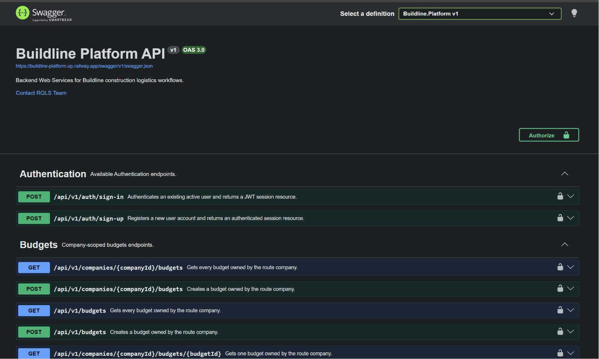
  
<em>Figura: Swagger expandido con endpoints principales de los bounded contexts implementados en Sprint 3.</em>

  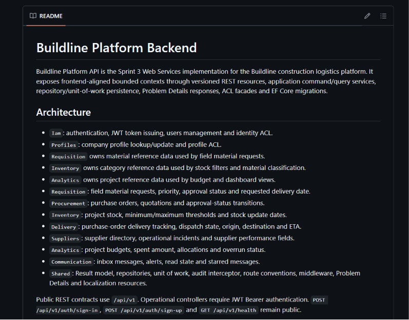
  
<em>Figura: Documentación del repositorio backend con configuración productiva, endpoints y guía de despliegue.</em>

#### 5.2.3.7. Software Deployment Evidence for Sprint Review

Los Backend Web Services fueron contenerizados con Docker y desplegados en Railway. La Web Application se desplegó en Vercel y quedó configurada para consumir el backend productivo mediante la variable de base URL correspondiente.

| Componente | Plataforma | URL / Configuración | Estado |
| :--- | :--- | :--- | :--- |
| Landing Page | Vercel | [https://landing-page-bay-iota.vercel.app/](https://landing-page-bay-iota.vercel.app/) | Deployed |
| Frontend Web Application | Vercel | [https://buildline-delta.vercel.app/](https://buildline-delta.vercel.app/) | Deployed |
| Backend Web Services | Railway | [https://buildline-platform.up.railway.app/swagger/index.html](https://buildline-platform.up.railway.app/swagger/index.html) | Deployed |
| Database | Railway MySQL | `MYSQL_HOST`, `MYSQL_PORT`, `MYSQL_DATABASE`, `MYSQL_USER`, `MYSQL_PASSWORD` | Connected |

<strong>Variables críticas de producción:</strong> <code>ASPNETCORE_ENVIRONMENT=Production</code>, <code>ASPNETCORE_URLS=http://+:8080</code>, <code>BUILDLINE_JWT_SECRET</code> y variables MySQL provistas por Railway.

  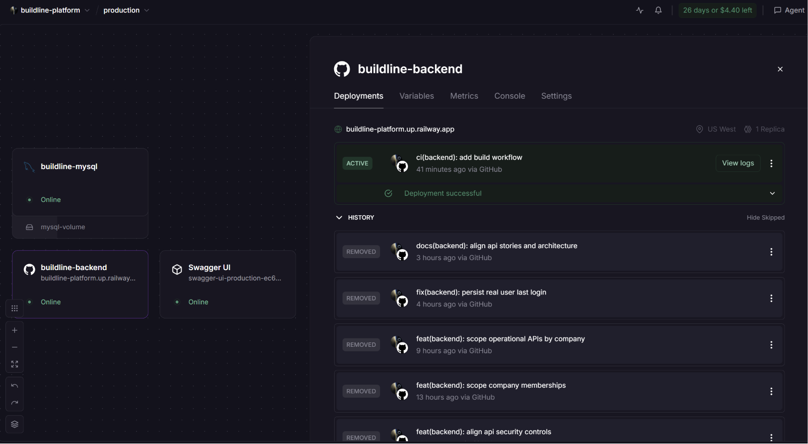
  
<em>Figura: Servicio Backend en Railway con deploy exitoso y contenedor en ejecución.</em>

  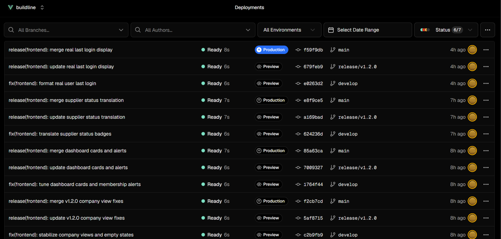
  
<em>Figura: Frontend Web Application desplegado en Vercel y conectado a la API productiva.</em>

#### 5.2.3.8. Team Collaboration Insights during Sprint

Durante el Sprint 3, el trabajo se distribuyó entre implementación backend, ajustes de integración frontend, QA funcional, despliegue y documentación. Aunque la mayor cantidad de commits de backend se concentró en los responsables técnicos de Web Services, los demás integrantes participaron en revisión de contratos, validación de pantallas, pruebas manuales y actualización de evidencias del informe.

<ul>
  <li><strong>IAM y seguridad:</strong> validación de JWT, roles <code>owner</code>, <code>admin</code>, <code>viewer</code>, último login real, cambio de contraseña y 2FA flag.</li>
  <li><strong>Company scope:</strong> revisión de que cada endpoint operativo utilice <code>companyId</code> y no mezcle data entre compañías.</li>
  <li><strong>Frontend integration:</strong> reemplazo de mocks por servicios Axios contra backend productivo y estados vacíos para compañías nuevas.</li>
  <li><strong>QA:</strong> pruebas en Swagger, Railway logs, Vercel preview y navegación real por pantallas.</li>
  <li><strong>Documentación:</strong> actualización de README backend/frontend, Sprint 3, Technical Stories y matriz de endpoints.</li>
</ul>

  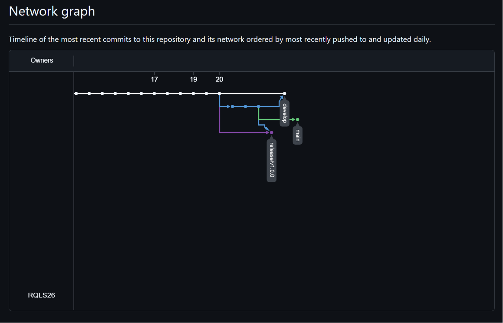
  
<em>Figura: Network Graph del repositorio evidenciando ramas feature/release y merges hacia main/develop para Sprint 3.</em>

## 5.3. Validation Interviews

La validación del producto se orienta a comprobar que la primera versión integrada de Buildline mantiene coherencia entre la propuesta de valor, la navegación del frontend y los Web Services desplegados. Las entrevistas se ejecutan con usuarios cercanos a los segmentos definidos en capítulos anteriores: jefes de proyecto, residentes de obra, responsables logísticos y administradores de MYPE constructora.

### 5.3.1. Diseño de Entrevistas.

| Elemento | Diseño de entrevistas |
| :--- | :--- |
| Objetivo | Evaluar si Buildline permite entender, registrar y monitorear procesos logísticos de obra con menor fricción que hojas de cálculo o comunicación informal. |
| Perfil de participantes | Jefe de proyecto, residente de obra, encargado de logística y administrador de empresa constructora MYPE. |
| Modalidad | Entrevista remota por videollamada con pantalla compartida y prueba guiada del producto desplegado. |
| Duración estimada | 20 a 30 minutos por participante. |
| Instrumento | Guía semiestructurada con tareas, observación de fricciones, preguntas de percepción y cierre con recomendaciones. |

**Tareas evaluadas:** registro de usuario y compañía, inicio de sesión, requisiciones, órdenes de compra, entregas, proveedores, incidencias, presupuestos, reportes, notificaciones, usuarios y configuración.

**Preguntas guía:** ¿qué información necesita ver primero?, ¿el flujo refleja su proceso actual?, ¿qué dato falta para decidir?, ¿los roles son comprensibles?, ¿qué pantalla generó claridad o fricción?

### 5.3.2. Registro de Entrevistas.

**Nombre del archivo de video consolidado:** `upc-pre-202610-1asi0730-12158-rqls-validation-sprint-3.mp4`

<table style="width:100%; border-collapse:collapse;">
  <tbody>
    <tr>
      <td colspan="4" align="center"><strong>Entrevista N.° 1</strong></td>
    </tr>
    <tr>
      <td colspan="4" align="center">
        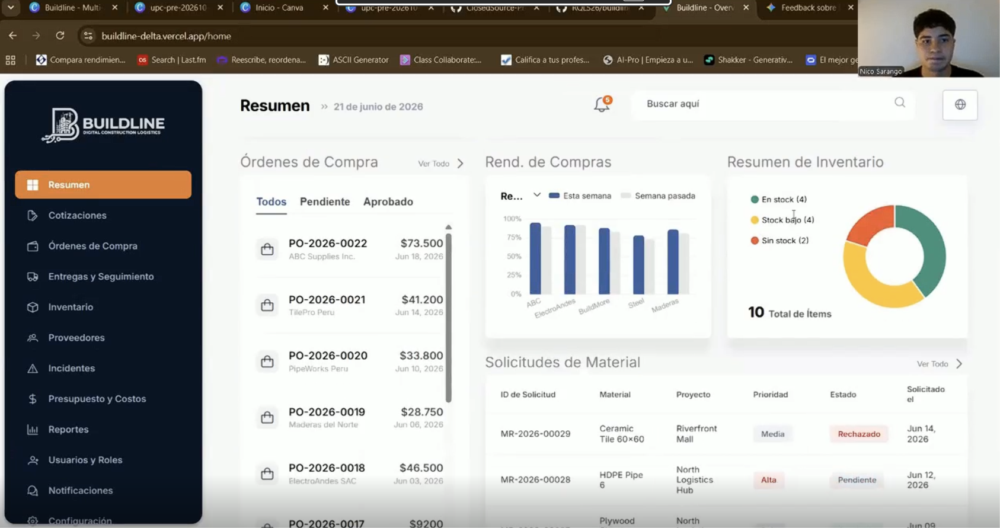
      </td>
    </tr>
    <tr>
      <td colspan="2" align="center"><strong>Información del entrevistado</strong></td>
      <td colspan="2" align="center"><strong>Contexto de validación</strong></td>
    </tr>
    <tr>
      <td><strong>Nombre completo</strong></td>
      <td>Ricardo Salazar Huamán</td>
      <td><strong>Rol</strong></td>
      <td>Jefe de proyecto</td>
    </tr>
    <tr>
      <td><strong>Edad</strong></td>
      <td>42 años</td>
      <td><strong>Modalidad</strong></td>
      <td>Videollamada con prueba guiada</td>
    </tr>
    <tr>
      <td><strong>Ubicación</strong></td>
      <td>Lima Metropolitana</td>
      <td><strong>Producto evaluado</strong></td>
      <td><a href="https://buildline-delta.vercel.app/" target="_blank">Buildline Frontend Web Application</a></td>
    </tr>
    <tr>
      <td><strong>Fecha</strong></td>
      <td>20/06/2026</td>
      <td><strong>Duración</strong></td>
      <td>24 minutos</td>
    </tr>
    <tr>
      <td colspan="4"><strong>URL de grabación: </strong><a href="" target="_blank">Ver video</a></td>
    </tr>
    <tr>
      <td colspan="4">
        <strong>Resumen de la entrevista</strong>  
        El participante validó los flujos de dashboard, presupuesto, requisiciones y órdenes de compra. Indicó que la navegación principal es comprensible y que el uso de métricas por proyecto ayuda a priorizar decisiones de compra. Como observación, señaló que los estados vacíos deben explicar con mayor claridad cuándo una compañía nueva todavía no tiene información registrada.
      </td>
    </tr>
  </tbody>
</table>

<table style="width:100%; border-collapse:collapse;">
  <tbody>
    <tr>
      <td colspan="4" align="center"><strong>Entrevista N.° 2</strong></td>
    </tr>
    <tr>
      <td colspan="4" align="center">
        
      </td>
    </tr>
    <tr>
      <td colspan="2" align="center"><strong>Información del entrevistado</strong></td>
      <td colspan="2" align="center"><strong>Contexto de validación</strong></td>
    </tr>
    <tr>
      <td><strong>Nombre completo</strong></td>
      <td>Andrea Paredes Rojas</td>
      <td><strong>Rol</strong></td>
      <td>Encargada de logística</td>
    </tr>
    <tr>
      <td><strong>Edad</strong></td>
      <td>35 años</td>
      <td><strong>Modalidad</strong></td>
      <td>Videollamada con prueba guiada</td>
    </tr>
    <tr>
      <td><strong>Ubicación</strong></td>
      <td>Arequipa</td>
      <td><strong>Producto evaluado</strong></td>
      <td><a href="https://buildline-delta.vercel.app/" target="_blank">Buildline Frontend Web Application</a></td>
    </tr>
    <tr>
      <td><strong>Fecha</strong></td>
      <td>20/06/2026</td>
      <td><strong>Duración</strong></td>
      <td>21 minutos</td>
    </tr>
    <tr>
      <td colspan="4"><strong>URL de grabación: </strong><a href="" target="_blank">Ver video</a></td>
    </tr>
    <tr>
      <td colspan="4">
        <strong>Resumen de la entrevista</strong>  
        La participante revisó proveedores, requisiciones, purchase orders y registro de entregas. Consideró valioso que los formularios usen datos existentes de proveedores, materiales y órdenes de compra, porque reduce errores de digitación. Recomendó mantener filtros por estado y prioridad en las vistas operativas.
      </td>
    </tr>
  </tbody>
</table>

<table style="width:100%; border-collapse:collapse;">
  <tbody>
    <tr>
      <td colspan="4" align="center"><strong>Entrevista N.° 3</strong></td>
    </tr>
    <tr>
      <td colspan="4" align="center">
        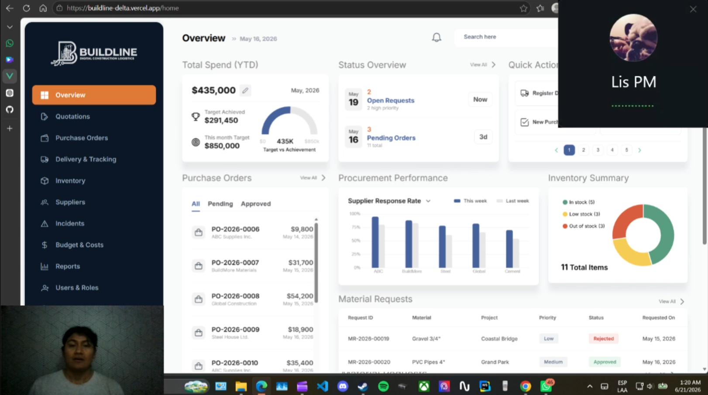
      </td>
    </tr>
    <tr>
      <td colspan="2" align="center"><strong>Información del entrevistado</strong></td>
      <td colspan="2" align="center"><strong>Contexto de validación</strong></td>
    </tr>
    <tr>
      <td><strong>Nombre completo</strong></td>
      <td>Luis Quispe Mamani</td>
      <td><strong>Rol</strong></td>
      <td>Residente de obra</td>
    </tr>
    <tr>
      <td><strong>Edad</strong></td>
      <td>39 años</td>
      <td><strong>Modalidad</strong></td>
      <td>Videollamada con prueba guiada</td>
    </tr>
    <tr>
      <td><strong>Ubicación</strong></td>
      <td>Juliaca</td>
      <td><strong>Producto evaluado</strong></td>
      <td><a href="https://buildline-delta.vercel.app/" target="_blank">Buildline Frontend Web Application</a></td>
    </tr>
    <tr>
      <td><strong>Fecha</strong></td>
      <td>20/06/2026</td>
      <td><strong>Duración</strong></td>
      <td>22 minutos</td>
    </tr>
    <tr>
      <td colspan="4"><strong>URL de grabación: </strong><a href="" target="_blank">Ver video</a></td>
    </tr>
    <tr>
      <td colspan="4">
        <strong>Resumen de la entrevista</strong>  
        El participante evaluó la creación de requisiciones, el seguimiento de entregas y las notificaciones. Señaló que el timeline de tracking facilita entender el avance de una entrega, pero recomendó que las fechas y estados se mantengan visibles y consistentes entre idioma español e inglés.
      </td>
    </tr>
  </tbody>
</table>

<table style="width:100%; border-collapse:collapse;">
  <tbody>
    <tr>
      <td colspan="4" align="center"><strong>Entrevista N.° 4</strong></td>
    </tr>
    <tr>
      <td colspan="4" align="center">
        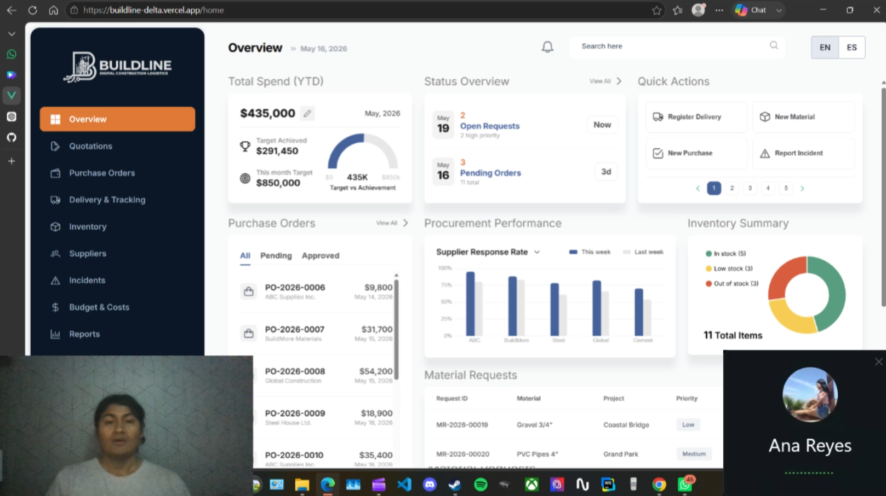
      </td>
    </tr>
    <tr>
      <td colspan="2" align="center"><strong>Información del entrevistado</strong></td>
      <td colspan="2" align="center"><strong>Contexto de validación</strong></td>
    </tr>
    <tr>
      <td><strong>Nombre completo</strong></td>
      <td>Lisset Paredes</td>
      <td><strong>Rol</strong></td>
      <td>Jefa de logística</td>
    </tr>
    <tr>
      <td><strong>Edad</strong></td>
      <td>32 años</td>
      <td><strong>Modalidad</strong></td>
      <td>Videollamada con prueba guiada</td>
    </tr>
    <tr>
      <td><strong>Ubicación</strong></td>
      <td>Jesús María, Lima</td>
      <td><strong>Producto evaluado</strong></td>
      <td><a href="https://buildline-delta.vercel.app/" target="_blank">Buildline Frontend Web Application</a></td>
    </tr>
    <tr>
      <td><strong>Fecha</strong></td>
      <td>20/06/2026</td>
      <td><strong>Duración</strong></td>
      <td>4:07 minutos</td>
    </tr>
    <tr>
      <td colspan="4"><strong>URL de grabación: </strong><a href="" target="_blank">Ver video</a></td>
    </tr>
    <tr>
      <td colspan="4">
        <strong>Resumen de la entrevista</strong>  
        La participante destacó que Buildline presenta una interfaz clara e intuitiva, permitiéndole visualizar rápidamente requisiciones, compras y aprobaciones. Valoró especialmente la centralización de información, la comparación de cotizaciones y el control presupuestal en tiempo real, ya que facilitan una toma de decisiones más rápida y reducen errores operativos. Además, consideró que la plataforma puede ayudar a disminuir sobrecostos y mejorar la planificación logística. Como mejora, sugirió una mejor integración con herramientas como Excel y correo electrónico.
      </td>
    </tr>
  </tbody>
</table>

### 5.3.3. Evaluaciones según heurísticas.

**UX Heuristics & Principles Evaluation**
**Usability - Inclusive Design - Information Architecture**

| Campo | Valor |
| :--- | :--- |
| Carrera | Ingeniería de Software |
| Curso | Aplicaciones Web |
| Sección | 12158 |
| Profesores | Todos |
| Auditor | RQLS26 |
| Cliente(s) | Participantes de entrevistas |
| Site o App a evaluar | Buildline Frontend Web Application |

**Tareas incluidas en el alcance:** registro, login, requisición, compras, entregas, proveedores, incidencias, presupuesto, reportes, notificaciones, usuarios, roles y configuración.

**Tareas no incluidas en esta versión:** pagos en línea, integración ERP/SUNAT, push móvil nativo y gestión documental avanzada.

| Nivel | Descripción |
| :--- | :--- |
| 1 | Problema superficial: ocurre con baja frecuencia o puede superarse fácilmente. |
| 2 | Problema menor: ocurre con cierta frecuencia y debe priorizarse en un siguiente release. |
| 3 | Problema mayor: afecta el cumplimiento de tareas importantes y requiere prioridad alta. |
| 4 | Problema muy grave: impide continuar con el uso de la herramienta y debe corregirse antes del lanzamiento. |

| # | Problema | Escala de severidad | Heurística / Principio violado |
| :--- | :--- | :--- | :--- |
| 1 | Algunos estados vacíos deben explicar claramente que la compañía aún no tiene datos registrados. | 2 | Information Architecture: is it understandable? |
| 2 | El registro de entregas requiere selects alimentados por datos existentes para evitar tipeo libre. | 3 | Usability: error prevention |
| 3 | La administración de roles debe impedir múltiples owners por compañía. | 3 | Usability: consistency and standards |
| 4 | Las configuraciones deben aplicarse solo después de confirmar Save Changes. | 2 | Usability: user control and freedom |
| 5 | Los títulos traducidos deben conservar alturas consistentes en cards y gráficos. | 2 | Inclusive Design: comparable experience |

**Problema #1: Estados vacíos poco explicativos**
**Severidad:** 2
**Heurística violada:** Information Architecture - is it understandable?
**Problema:** En compañías nuevas, las pantallas sin datos pueden interpretarse como error de carga si no indican que todavía no existen requisiciones, órdenes, entregas, proveedores o mensajes registrados.
**Recomendación:** Mantener mensajes vacíos por módulo, con texto orientado a la siguiente acción disponible y sin insertar datos ficticios permanentes.

**Problema #2: Formularios con tipeo libre donde existen datos maestros**
**Severidad:** 3
**Heurística violada:** Usability - error prevention
**Problema:** Algunos formularios de entregas o incidencias pueden inducir errores si permiten escribir proveedor, PO o material en lugar de seleccionarlos desde endpoints existentes.
**Recomendación:** Usar selects alimentados por purchase orders, suppliers y materials de la compañía.

**Problema #3: Reglas de owner y membresía**
**Severidad:** 3
**Heurística violada:** Usability - consistency and standards
**Problema:** La gestión de usuarios debe evitar que un owner asigne otro owner y debe mostrar solicitudes de ingreso a compañía de forma clara.
**Recomendación:** Mantener un único owner por compañía, permitir admin/viewer y procesar solicitudes desde Users & Roles o Notifications.

## 5.4. Video About-the-Product

La primera versión del Video About-the-Product debe presentar el problema logístico de las MYPES constructoras, la propuesta de valor de Buildline, la navegación por el frontend desplegado, el consumo del backend real y los flujos críticos del Sprint 3.

| Elemento | Contenido del entregable |
| :--- | :--- |
| Título | Buildline - Digital Construction Logistics |
| Duración | 4 minutos |
| Nombre del archivo | `upc-pre-202610-1asi0730-12158-rqls-about-the-product-sprint-3.mp4` |
| URL Microsoft Stream | &nbsp; |
| URL YouTube | &nbsp; |
| Producto mostrado | Landing Page, Frontend Web Application y Backend Swagger desplegado |
| Flujo mínimo | Sign-in, dashboard, requisición, orden de compra, entrega, proveedor, presupuesto, users & roles |

El video presenta el problema de sobrecostos y falta de trazabilidad en MYPES constructoras, explica la propuesta de valor de Buildline y muestra la navegación por los flujos principales del producto desplegado. La demostración incluye autenticación, dashboard, requisiciones, órdenes de compra, tracking de entregas, proveedores, presupuesto y evidencia de servicios documentados en Swagger.

